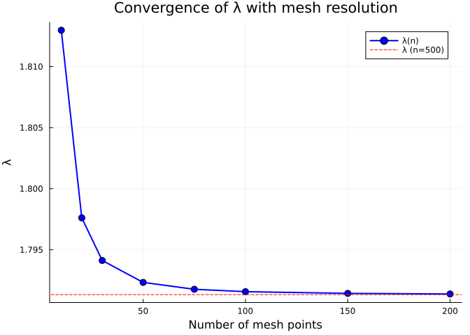
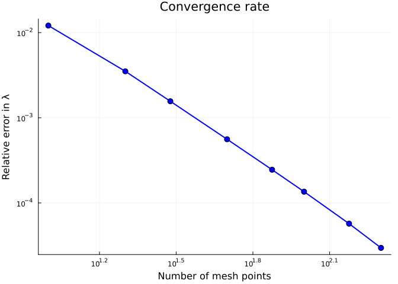
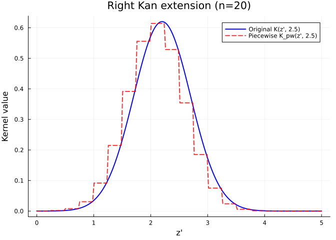
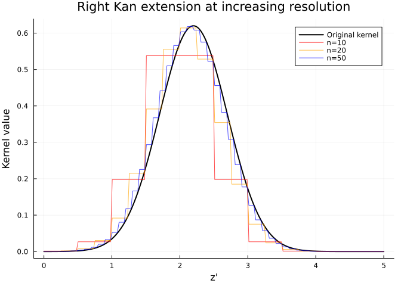
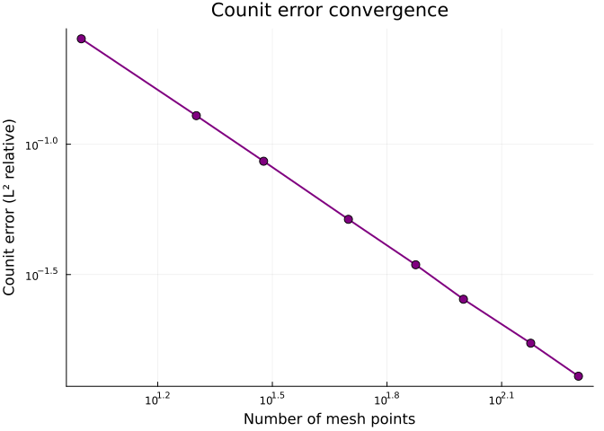
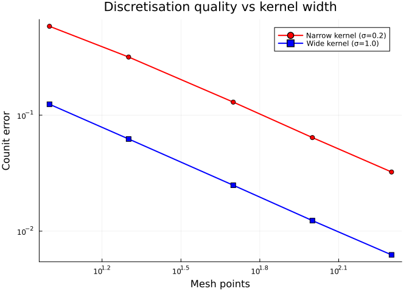

# Kan Extensions and the IPM-MPM Adjunction
Simon Frost

## Overview

The mathematical heart of CategoricalPopulationDynamics.jl is the
**adjunction chain** between continuous kernels (IPMs) and discrete
matrices (MPMs):

$$\text{Lan}_D \dashv D^* \dashv \text{Ran}_D$$

- **Left Kan extension** ($\text{Lan}_D$): discretise kernel → matrix
  (IPM → MPM)
- **Restriction** ($D^*$): evaluate a kernel at mesh points
- **Right Kan extension** ($\text{Ran}_D$): refine matrix → piecewise
  kernel (MPM → IPM)

This adjunction gives us **round-trip diagnostics**: the unit $\eta$ and
counit $\varepsilon$ measure how much information is lost when moving
between representations. This vignette explores convergence,
diagnostics, and the practical implications for choosing mesh
resolution.

## Setup

``` julia
using CategoricalPopulationDynamics
using LinearAlgebra
using StructuredPopulationCore: lambda
using Plots
```

## A Concrete Kernel

We use a well-studied perennial plant kernel for demonstrations:

``` julia
# Survival: logistic function of size
s(z) = 1.0 / (1.0 + exp(-(0.5 + 0.3 * z)))

# Growth: Gaussian transition kernel
g(z_new, z) = exp(-0.5 * ((z_new - (0.2 + 0.8 * z)) / 0.5)^2) / (0.5 * sqrt(2π))

# Fecundity
f_rate(z) = exp(0.1 + 0.2 * z)
recruit_dist(z_new) = exp(-0.5 * ((z_new - 0.5) / 0.3)^2) / (0.3 * sqrt(2π))

# Sub-kernels
P_kernel(z_new, z) = s(z) * g(z_new, z)
F_kernel(z_new, z) = f_rate(z) * recruit_dist(z_new)
full_kernel(z_new, z) = P_kernel(z_new, z) + F_kernel(z_new, z)
```

    full_kernel (generic function with 1 method)

## Left Kan Extension: Discretisation

The left Kan extension $\text{Lan}_D$ converts a continuous kernel to a
matrix via the midpoint rule:

$$A_{ij} = h \cdot K(z_i, z_j)$$

### Effect of Mesh Resolution

The quality of discretisation depends on the number of mesh points.
Let’s see how $\lambda$ converges:

``` julia
mesh_sizes = [10, 20, 30, 50, 75, 100, 150, 200]
lambdas = Float64[]

for n in mesh_sizes
    dom = ContinuousProjectionDomain(0.0, 5.0, n)
    A = left_kan_extension(full_kernel, dom)
    push!(lambdas, lambda(A))
end

# Reference value at high resolution
dom_ref = ContinuousProjectionDomain(0.0, 5.0, 500)
A_ref = left_kan_extension(full_kernel, dom_ref)
λ_ref = lambda(A_ref)

println("Reference λ (n=500): ", round(λ_ref, digits=8))
for (n, λ) in zip(mesh_sizes, lambdas)
    err = abs(λ - λ_ref) / λ_ref * 100
    println("  n=", lpad(n, 3), ": λ=", round(λ, digits=6),
        "  (", round(err, digits=4), "% error)")
end
```

    Reference λ (n=500): 1.79131842
      n= 10: λ=1.81298  (1.2093% error)
      n= 20: λ=1.797609  (0.3512% error)
      n= 30: λ=1.794116  (0.1562% error)
      n= 50: λ=1.79232  (0.0559% error)
      n= 75: λ=1.791758  (0.0245% error)
      n=100: λ=1.791561  (0.0136% error)
      n=150: λ=1.791421  (0.0057% error)
      n=200: λ=1.791372  (0.003% error)

``` julia
plot(mesh_sizes, lambdas,
    xlabel="Number of mesh points",
    ylabel="λ",
    title="Convergence of λ with mesh resolution",
    marker=:circle, markersize=5,
    label="λ(n)", linewidth=2, color=:blue)
hline!([λ_ref], label="λ (n=500)", linestyle=:dash, color=:red)
```



``` julia
errors = abs.(lambdas .- λ_ref) ./ λ_ref
plot(mesh_sizes, errors,
    xlabel="Number of mesh points",
    ylabel="Relative error in λ",
    title="Convergence rate",
    marker=:circle, markersize=5,
    label=false, linewidth=2, color=:blue,
    yscale=:log10, xscale=:log10)
```



The midpoint rule converges quadratically ($O(h^2)$) — doubling the mesh
points reduces the error by a factor of 4.

## Right Kan Extension: Refinement

The right Kan extension $\text{Ran}_D$ constructs a piecewise-constant
kernel from a matrix:

$$K_{pw}(z', z) = \frac{A_{ij}}{h} \quad \text{where } z \in B_j,\; z' \in B_i$$

``` julia
domain = ContinuousProjectionDomain(0.0, 5.0, 20)
A = left_kan_extension(P_kernel, domain)
K_pw = right_kan_extension(A, domain)

# Compare original and piecewise kernels along a slice
z_eval = range(0.0, 5.0; length=200)
z_fixed = 2.5

original = [P_kernel(z_new, z_fixed) for z_new in z_eval]
piecewise = [K_pw(z_new, z_fixed) for z_new in z_eval]

plot(z_eval, original, label="Original K(z', 2.5)", linewidth=2, color=:blue)
plot!(z_eval, piecewise, label="Piecewise K_pw(z', 2.5)", linewidth=2,
    color=:red, linestyle=:dash, alpha=0.8)
xlabel!("z'")
ylabel!("Kernel value")
title!("Right Kan extension (n=20)")
```



### Improving Resolution

``` julia
p = plot(z_eval, original, label="Original kernel", linewidth=2, color=:black)

for (n, c) in [(10, :red), (20, :orange), (50, :blue)]
    dom_n = ContinuousProjectionDomain(0.0, 5.0, n)
    A_n = left_kan_extension(P_kernel, dom_n)
    K_n = right_kan_extension(A_n, dom_n)
    pw_n = [K_n(z_new, z_fixed) for z_new in z_eval]
    plot!(p, z_eval, pw_n, label="n=$n", color=c, alpha=0.7)
end

xlabel!("z'")
ylabel!("Kernel value")
title!("Right Kan extension at increasing resolution")
p
```



The piecewise reconstruction converges to the original kernel as mesh
resolution increases.

## Adjunction Diagnostics

### Unit Error

The **unit** of the adjunction
$\eta: \text{Id} \Rightarrow \text{Lan}_D \circ \text{Ran}_D$ measures
whether discretising a piecewise-constant kernel recovers the original
matrix:

$$\eta_A: A \to \text{Lan}_D(\text{Ran}_D(A))$$

For self-consistent discretisation, this should be exactly zero (up to
floating-point precision):

``` julia
for n in [10, 20, 50, 100]
    dom = ContinuousProjectionDomain(0.0, 5.0, n)
    A = left_kan_extension(P_kernel, dom)
    ue = unit_error(A, dom)
    println("n=", lpad(n, 3), ": unit error = ", ue)
end
```

    n= 10: unit error = 0.0
    n= 20: unit error = 0.0
    n= 50: unit error = 0.0
    n=100: unit error = 0.0

The unit error is essentially zero because the midpoint rule exactly
inverts the piecewise-constant reconstruction at the mesh points.

### Counit Error

The **counit**
$\varepsilon: \text{Ran}_D \circ \text{Lan}_D \Rightarrow \text{Id}$
measures how well the piecewise reconstruction approximates the original
smooth kernel:

$$\varepsilon_K: \text{Ran}_D(\text{Lan}_D(K)) \to K$$

This error is positive for smooth kernels but decreases with mesh
refinement:

``` julia
counit_errors = Float64[]
ns = [10, 20, 30, 50, 75, 100, 150, 200]

for n in ns
    dom = ContinuousProjectionDomain(0.0, 5.0, n)
    ce = counit_error(P_kernel, dom; n_quad=500)
    push!(counit_errors, ce)
    println("n=", lpad(n, 3), ": counit error = ", round(ce, digits=6))
end
```

    n= 10: counit error = 0.2538
    n= 20: counit error = 0.128719
    n= 30: counit error = 0.086061
    n= 50: counit error = 0.051515
    n= 75: counit error = 0.034487
    n=100: counit error = 0.025432
    n=150: counit error = 0.017246
    n=200: counit error = 0.012886

``` julia
plot(ns, counit_errors,
    xlabel="Number of mesh points",
    ylabel="Counit error (L² relative)",
    title="Counit error convergence",
    marker=:circle, markersize=5,
    label=false, linewidth=2, color=:purple,
    yscale=:log10, xscale=:log10)
```



### Combined Diagnostics

The `adjunction_errors` function computes both errors plus $\lambda$
comparison in one call:

``` julia
domain = ContinuousProjectionDomain(0.0, 5.0, 50)
errs = adjunction_errors(full_kernel, domain; n_quad=500)

println("Unit error:     ", round(errs.unit, digits=15))
println("Counit error:   ", round(errs.counit, digits=6))
println("λ (from kernel): ", round(errs.lambda_kernel, digits=8))
println("λ (from matrix): ", round(errs.lambda_matrix, digits=8))
```

    Unit error:     0.0
    Counit error:   0.063184
    λ (from kernel): 1.79231987
    λ (from matrix): 1.79231987

## Kernel Shape and Discretisation Quality

Different kernel shapes discretise with different accuracy. Narrow
kernels (small $\sigma$) require finer meshes:

``` julia
# Narrow growth kernel (σ = 0.2)
g_narrow(z_new, z) = exp(-0.5 * ((z_new - (0.2 + 0.8*z)) / 0.2)^2) / (0.2 * sqrt(2π))
K_narrow(z_new, z) = s(z) * g_narrow(z_new, z)

# Wide growth kernel (σ = 1.0)
g_wide(z_new, z) = exp(-0.5 * ((z_new - (0.2 + 0.8*z)) / 1.0)^2) / (1.0 * sqrt(2π))
K_wide(z_new, z) = s(z) * g_wide(z_new, z)

ns = [10, 20, 50, 100, 200]
ce_narrow = Float64[]
ce_wide = Float64[]

for n in ns
    dom = ContinuousProjectionDomain(0.0, 5.0, n)
    push!(ce_narrow, counit_error(K_narrow, dom; n_quad=500))
    push!(ce_wide, counit_error(K_wide, dom; n_quad=500))
end

plot(ns, ce_narrow, label="Narrow kernel (σ=0.2)", marker=:circle,
    linewidth=2, color=:red, yscale=:log10, xscale=:log10)
plot!(ns, ce_wide, label="Wide kernel (σ=1.0)", marker=:square,
    linewidth=2, color=:blue)
xlabel!("Mesh points")
ylabel!("Counit error")
title!("Discretisation quality vs kernel width")
```



Narrow kernels require finer meshes because their sharp features are
poorly captured by piecewise-constant approximation.

## Practical Guidelines

Based on the convergence analysis:

``` julia
# Demonstrate recommended mesh sizes for different kernel widths
sigmas = [0.1, 0.2, 0.5, 1.0]
tolerance = 0.01  # 1% relative error in λ

for σ in sigmas
    g_test(z_new, z) = exp(-0.5 * ((z_new - (0.2 + 0.8*z)) / σ)^2) / (σ * sqrt(2π))
    K_test(z_new, z) = s(z) * g_test(z_new, z) + F_kernel(z_new, z)

    # Find minimum n for < 1% lambda error
    λ_ref = lambda(left_kan_extension(K_test, ContinuousProjectionDomain(0.0, 5.0, 500)))
    min_n = 0
    for n in [10, 20, 30, 50, 75, 100, 150, 200, 300]
        dom = ContinuousProjectionDomain(0.0, 5.0, n)
        λ_n = lambda(left_kan_extension(K_test, dom))
        if abs(λ_n - λ_ref) / λ_ref < tolerance
            min_n = n
            break
        end
    end
    println("σ = ", σ, ": minimum n for <1% λ error = ", min_n)
end
```

    σ = 0.1: minimum n for <1% λ error = 20
    σ = 0.2: minimum n for <1% λ error = 20
    σ = 0.5: minimum n for <1% λ error = 20
    σ = 1.0: minimum n for <1% λ error = 20

## Summary

In this vignette we explored the Kan extension adjunction in depth:

1.  **Left Kan extension** discretises kernels with $O(h^2)$ convergence
2.  **Right Kan extension** produces piecewise-constant kernel
    reconstruction
3.  **Unit error** ($\eta$) is exactly zero — the adjunction is
    self-consistent at mesh points
4.  **Counit error** ($\varepsilon$) decreases with mesh refinement —
    smooth kernels are progressively better approximated
5.  **Kernel width** determines the required mesh resolution — narrower
    kernels need finer meshes

The next vignette covers compositional model construction via UWDs and
ProjectionSharers.
