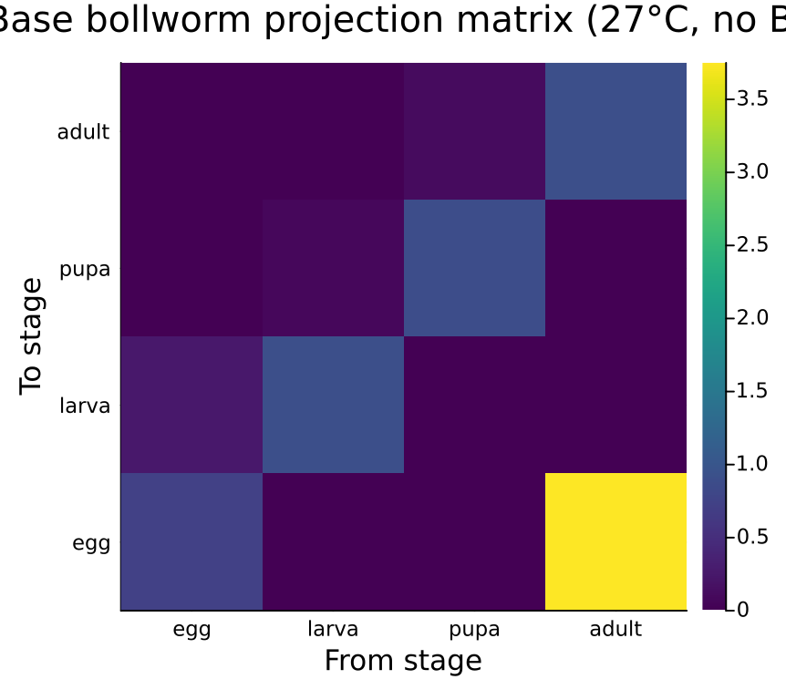
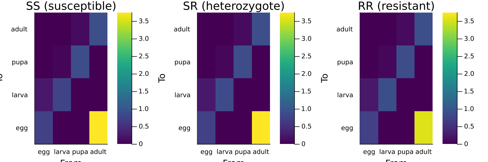
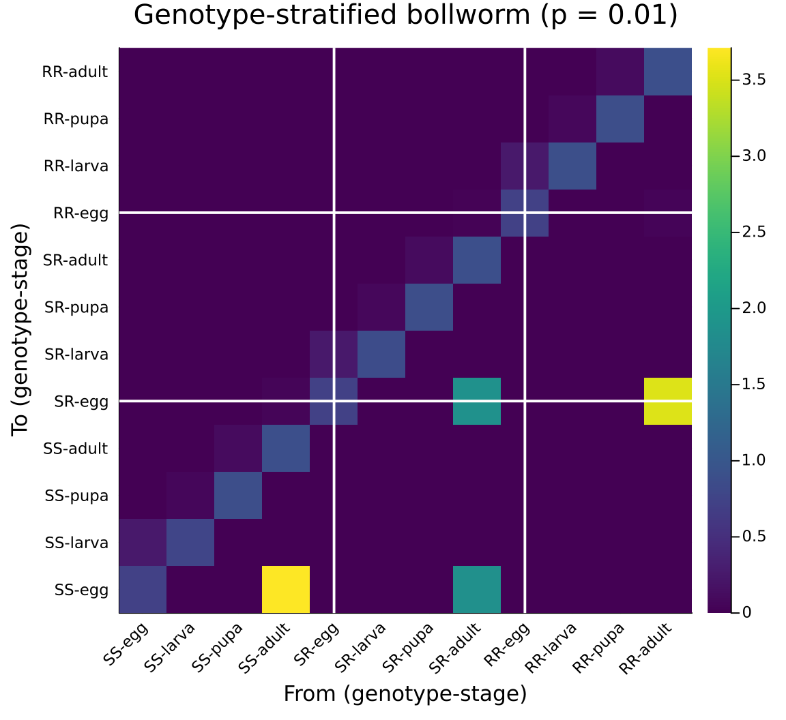
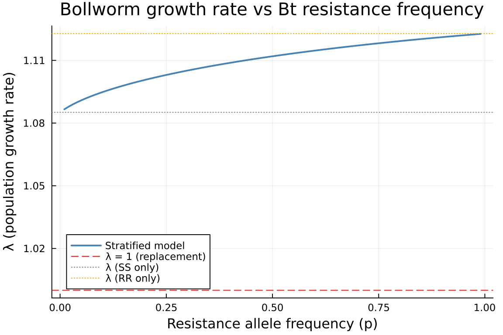
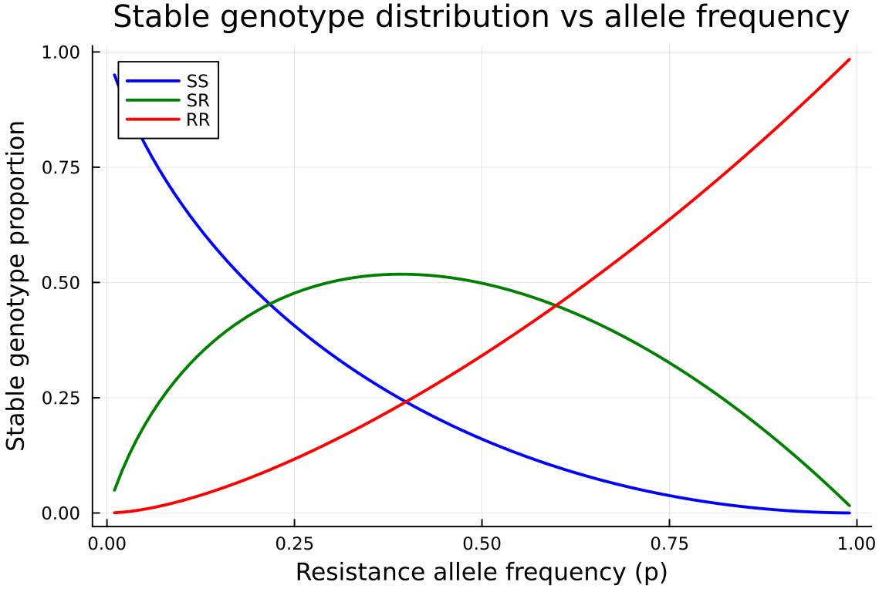
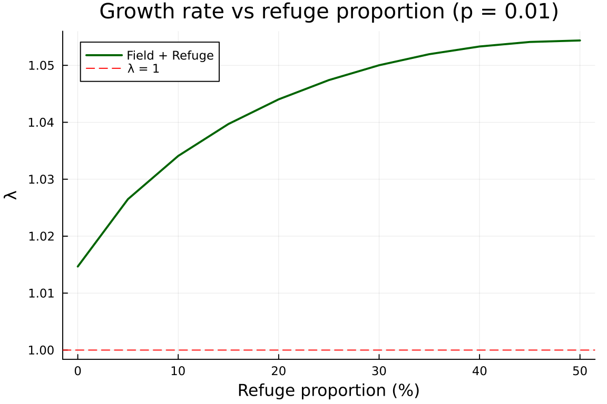
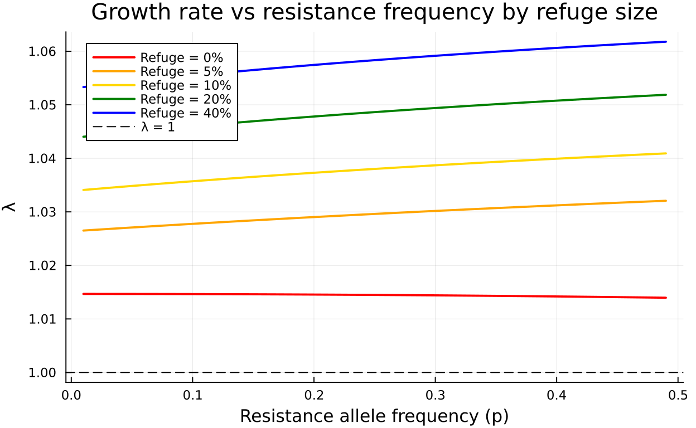

# Genotype Stratification: Bt Cotton Resistance Evolution

Author

Simon Frost

## Overview

Insect resistance to Bt (*Bacillus thuringiensis*) toxins in transgenic crops is a classic problem in evolutionary ecology. The cotton bollworm (*Helicoverpa armigera*) has a 4-stage lifecycle (egg → larva → pupa → adult), and a single diallelic gene controls Bt resistance with 3 genotypes (SS, SR, RR).

This vignette shows how **genotype stratification** — a discrete categorical stratum over a base lifecycle — enables modular analysis of resistance evolution. We:

1.  Build the base bollworm lifecycle as a `ValuedProjectionNet`
2.  Construct genotype-specific matrices with differential Bt mortality
3.  Show the compositional (P + F = A) structure via `compose_transitions`
4.  Assemble a 12×12 genotype-stratified model with Hardy-Weinberg mating
5.  Sweep allele frequency to track how resistance affects population growth
6.  Add spatial structure (Bt field + non-Bt refuge) as nested stratification

The categorical toolkit makes each layer — lifecycle, genotype, space — independently specified and composable.

## Setup

``` julia
using CategoricalPopulationDynamics
using CategoricalPopulationDynamics: ⊕, ⊘
using Catlab
using Catlab.CategoricalAlgebra
using LinearAlgebra
using ProjectionModels: lambda
using Plots
```

## Base Bollworm Lifecycle

We model *H. armigera* at a reference temperature of 27 °C, near optimal for development. Daily transition probabilities follow a stage-structured framework where individuals either remain in their current stage (stasis) or advance to the next (progression), subject to stage-specific mortality.

``` julia
# Daily development rates at 27°C (Brière-type approximation)
dev_egg   = 0.25   # ~4 day egg stage
dev_larva = 0.07   # ~14 day larval stage
dev_pupa  = 0.10   # ~10 day pupal stage
dev_adult = 0.05   # ~20 day adult longevity

# Base daily mortality (no Bt)
μ_egg   = 0.05
μ_larva = 0.04
μ_pupa  = 0.03
μ_adult = 0.06

# Fecundity: ~150 eggs per female over lifetime, sex ratio 0.5
fecundity = 0.5 * 150 * dev_adult   # daily per-capita egg production by adults
```

    3.75

Each stage has two survival fates — stasis (remain) and advancement (progress to next stage) — both conditional on surviving daily mortality. Using the `⊕` operator (`\oplus<TAB>`), we compose the lifecycle from two small, independently readable pieces:

``` julia
bollworm_survival = ValuedProjectionNet(
    [:egg, :larva, :pupa, :adult],
    :survival => [
        (:egg   => :egg)   => (1 - dev_egg)   * (1 - μ_egg),
        (:egg   => :larva) => dev_egg          * (1 - μ_egg),
        (:larva => :larva) => (1 - dev_larva)  * (1 - μ_larva),
        (:larva => :pupa)  => dev_larva        * (1 - μ_larva),
        (:pupa  => :pupa)  => (1 - dev_pupa)   * (1 - μ_pupa),
        (:pupa  => :adult) => dev_pupa         * (1 - μ_pupa),
        (:adult => :adult) => (1 - dev_adult)  * (1 - μ_adult)])

bollworm_fecundity = ValuedProjectionNet(
    [:egg, :larva, :pupa, :adult],
    :fecundity => [
        (:adult => :egg) => fecundity])

bollworm_base = bollworm_survival ⊕ bollworm_fecundity
```

    ValuedProjectionNet{Float64}(CategoricalPopulationDynamics.LabelledProjectionNet:
      S = 1:1
      T = 1:2
      Src = 1:2
      Tgt = 1:2
      Name = 1:0
      src_t : Src → T = [1, 2]
      src_s : Src → S = [1, 1]
      tgt_t : Tgt → T = [1, 2]
      tgt_s : Tgt → S = [1, 1]
      sname : S → Name = [:stage]
      tname : T → Name = [:survival, :fecundity], [:egg, :larva, :pupa, :adult], Dict(:survival => [(:egg => :egg) => 0.7124999999999999, (:egg => :larva) => 0.2375, (:larva => :larva) => 0.8927999999999999, (:larva => :pupa) => 0.06720000000000001, (:pupa => :pupa) => 0.873, (:pupa => :adult) => 0.097, (:adult => :adult) => 0.8929999999999999], :fecundity => [(:adult => :egg) => 3.75]))

Materialize the full projection matrix and compute the dominant eigenvalue:

``` julia
A_base = to_matrix(bollworm_base)
λ_base = lambda(A_base)
println("Base bollworm lifecycle (no Bt):")
println("  Matrix size: ", size(A_base))
println("  λ = ", round(λ_base, digits=4))
println("  Population ", λ_base > 1 ? "GROWING" : "DECLINING")
```

    Base bollworm lifecycle (no Bt):
      Matrix size: (4, 4)
      λ = 1.1274
      Population GROWING

``` julia
stage_labels = String.(stage_names(bollworm_base))
heatmap(stage_labels, stage_labels, A_base,
    title="Base bollworm projection matrix (27°C, no Bt)",
    xlabel="From stage", ylabel="To stage",
    color=:viridis, size=(450, 400))
```



## Genotype-Specific Matrices

On Bt cotton, larvae experience additional genotype-dependent mortality from the Cry toxin. We convert per-period Bt mortality to daily rates:

``` julia
# Per-larval-period Bt mortality by genotype
bt_period_SS = 0.90
bt_period_SR = 0.50
bt_period_RR = 0.05

larval_period = 1.0 / dev_larva   # ~14 days

# Daily Bt mortality: 1 - (1 - period_mort)^(1/period)
μ_bt_SS = 1 - (1 - bt_period_SS)^(1 / larval_period)
μ_bt_SR = 1 - (1 - bt_period_SR)^(1 / larval_period)
μ_bt_RR = 1 - (1 - bt_period_RR)^(1 / larval_period)

println("Daily Bt mortality:")
println("  SS: ", round(μ_bt_SS, digits=4))
println("  SR: ", round(μ_bt_SR, digits=4))
println("  RR: ", round(μ_bt_RR, digits=4))
```

    Daily Bt mortality:
      SS: 0.1489
      SR: 0.0474
      RR: 0.0036

The RR genotype also pays a fitness cost on non-Bt cotton: 5% reduced fecundity. Instead of rebuilding each lifecycle from scratch, we use the `⊘` operator (`\oslash<TAB>`) to selectively modify only the affected transitions — Bt mortality hits larval survival, and fitness cost hits fecundity:

``` julia
function make_bollworm_bt(base; μ_bt_larva, fecundity_multiplier=1.0)
    # ⊘ applies a function to a named transition's entries
    vnet = base ⊘ (:survival => ((from, _), val) ->
        from == :larva ? val * (1 - μ_bt_larva) : val)
    if fecundity_multiplier != 1.0
        vnet = vnet ⊘ (:fecundity => ((_, __), val) -> val * fecundity_multiplier)
    end
    return vnet
end

vnet_SS = make_bollworm_bt(bollworm_base, μ_bt_larva=μ_bt_SS)
vnet_SR = make_bollworm_bt(bollworm_base, μ_bt_larva=μ_bt_SR)
vnet_RR = make_bollworm_bt(bollworm_base, μ_bt_larva=μ_bt_RR, fecundity_multiplier=0.95)

A_SS = to_matrix(vnet_SS)
A_SR = to_matrix(vnet_SR)
A_RR = to_matrix(vnet_RR)

println("λ by genotype on Bt cotton:")
println("  SS: ", round(lambda(A_SS), digits=4), "  (highly susceptible)")
println("  SR: ", round(lambda(A_SR), digits=4), "  (heterozygote)")
println("  RR: ", round(lambda(A_RR), digits=4), "  (resistant)")
println("  Base (no Bt): ", round(λ_base, digits=4))
```

    λ by genotype on Bt cotton:
      SS: 1.0852  (highly susceptible)
      SR: 1.1128  (heterozygote)
      RR: 1.1228  (resistant)
      Base (no Bt): 1.1274

``` julia
p1 = heatmap(stage_labels, stage_labels, A_SS,
    title="SS (susceptible)", color=:viridis, clims=(0, maximum(A_base)),
    xlabel="From", ylabel="To")
p2 = heatmap(stage_labels, stage_labels, A_SR,
    title="SR (heterozygote)", color=:viridis, clims=(0, maximum(A_base)),
    xlabel="From", ylabel="To")
p3 = heatmap(stage_labels, stage_labels, A_RR,
    title="RR (resistant)", color=:viridis, clims=(0, maximum(A_base)),
    xlabel="From", ylabel="To")
plot(p1, p2, p3, layout=(1, 3), size=(900, 300))
```



## Compositional Construction

Each genotype’s matrix is the additive composition of survival and fecundity sub-kernels. We verify this using `compose_transitions`:

``` julia
for (label, vnet) in [("SS", vnet_SS), ("SR", vnet_SR), ("RR", vnet_RR)]
    U = transition_matrix(vnet, :survival)
    F = transition_matrix(vnet, :fecundity)
    A_composed = compose_transitions(Dict(:survival => U, :fecundity => F))
    A_direct = to_matrix(vnet)
    println("$label: compose_transitions(P, F) ≈ to_matrix? ", A_composed ≈ A_direct)
end
```

    SS: compose_transitions(P, F) ≈ to_matrix? true
    SR: compose_transitions(P, F) ≈ to_matrix? true
    RR: compose_transitions(P, F) ≈ to_matrix? true

This decomposition is essential for management analysis: Bt toxin affects only the survival sub-kernel (larval mortality), while fitness costs affect only the fecundity sub-kernel.

## Genotype Stratification

### Hardy-Weinberg Mating Matrix

Under random mating with resistance allele frequency <span class="math inline">\\p\\</span> and <span class="math inline">\\q = 1 - p\\</span>, offspring genotype frequencies depend on parental genotype through Mendelian segregation. The **mating matrix** <span class="math inline">\\M\\</span> has entries <span class="math inline">\\M\[\text{offspring}, \text{parent}\]\\</span> giving the probability that an offspring of a given genotype arises from a parent of a given genotype (weighted by allele contributions under random mating at the population level).

For a single diallelic locus:

<span class="math display">\\ M = \begin{pmatrix} q & q/2 & 0 \\ p & 1/2 & q \\ 0 & p/2 & p \end{pmatrix} \\</span>

### Heterogeneous Stratification

Each genotype has a *different* local transition matrix (different Bt mortality, fitness costs). CategoricalPopulationDynamics.jl provides a **heterogeneous** variant of `stratify` that accepts a vector of stratum-specific matrices:

<span class="math display">\\A\_{\text{strat}}\[(s\_{\text{to}}, i),\\ (s\_{\text{from}}, j)\] = D\[s\_{\text{to}}, s\_{\text{from}}\] \cdot A\_{s\_{\text{from}}}\[i, j\]\\</span>

The two demographic processes require *different* coupling structures:

- **Survival** — genotype is preserved during the lifecycle → identity coupling (block-diagonal)
- **Fecundity** — offspring genotype depends on parental genotype via mating → Hardy-Weinberg coupling

We combine these using `compose_transitions`, giving a clean separation of demography from genetics:

``` julia
function hw_mating_matrix(p)
    q = 1 - p
    return [q    q/2  0.0;     # offspring SS
            p    0.5  q;       # offspring SR
            0.0  p/2  p]       # offspring RR
end

function build_genotype_stratified(vnets, p)
    Us = [transition_matrix(v, :survival) for v in vnets]
    Fs = [transition_matrix(v, :fecundity) for v in vnets]

    # Survival: block-diagonal (identity coupling — genotype preserved)
    A_surv = stratify(Us, Matrix(1.0I, 3, 3))
    # Fecundity: cross-genotype coupling via Hardy-Weinberg mating
    A_fec  = stratify(Fs, hw_mating_matrix(p))

    return compose_transitions(Dict(:survival => A_surv, :fecundity => A_fec))
end
```

    build_genotype_stratified (generic function with 1 method)

### Stratified Model at Initial Resistance Frequency

``` julia
vnets_bt = [vnet_SS, vnet_SR, vnet_RR]
p0 = 0.01   # initial resistance allele frequency
A_strat = build_genotype_stratified(vnets_bt, p0)

println("Genotype-stratified model (p = $p0):")
println("  Matrix size: ", size(A_strat))
println("  λ = ", round(lambda(A_strat), digits=4))
```

    Genotype-stratified model (p = 0.01):
      Matrix size: (12, 12)
      λ = 1.0866

``` julia
# Visualise block structure
geno_labels = ["SS", "SR", "RR"]
full_labels = [string(g, "-", s) for g in geno_labels for s in stage_labels]

heatmap(full_labels, full_labels, A_strat,
    title="Genotype-stratified bollworm (p = $p0)",
    xlabel="From (genotype-stage)", ylabel="To (genotype-stage)",
    color=:viridis, size=(600, 550), xrotation=45)
n = 4
vline!([n + 0.5, 2n + 0.5], color=:white, linewidth=2, label=false)
hline!([n + 0.5, 2n + 0.5], color=:white, linewidth=2, label=false)
```



The off-diagonal blocks represent cross-genotype transitions through the Hardy-Weinberg mating system — only fecundity connects different genotypes.

### Comparison: Stratified vs Isolated Genotypes

``` julia
println("Growth rates:")
println("  λ (stratified, p=$p0): ", round(lambda(A_strat), digits=4))
println("  λ (SS alone):          ", round(lambda(A_SS), digits=4))
println("  λ (SR alone):          ", round(lambda(A_SR), digits=4))
println("  λ (RR alone):          ", round(lambda(A_RR), digits=4))
println("  λ (no Bt):             ", round(λ_base, digits=4))
```

    Growth rates:
      λ (stratified, p=0.01): 1.0866
      λ (SS alone):          1.0852
      λ (SR alone):          1.1128
      λ (RR alone):          1.1228
      λ (no Bt):             1.1274

## Resistance Evolution Analysis

As resistance allele frequency increases (through selection by Bt), the population growth rate changes. We sweep <span class="math inline">\\p\\</span> from 0.01 to 0.99:

``` julia
p_range = 0.01:0.01:0.99
λ_sweep = [lambda(build_genotype_stratified(vnets_bt, p)) for p in p_range]
```

    99-element Vector{Float64}:
     1.086592648105586
     1.0878375914999452
     1.0889503600291084
     1.0899651463308422
     1.090903366947175
     1.091779507052286
     1.0926039164077168
     1.0933843015310616
     1.0941265885472464
     1.0948354538219116
     ⋮
     1.1213103937295104
     1.1214874987881782
     1.121662625740985
     1.121835795417962
     1.1220070279624215
     1.1221763428507459
     1.122343758911246
     1.1225092943419304
     1.1226729667274842

``` julia
plot(Base.collect(p_range), λ_sweep,
    xlabel="Resistance allele frequency (p)",
    ylabel="λ (population growth rate)",
    title="Bollworm growth rate vs Bt resistance frequency",
    label="Stratified model",
    linewidth=2, color=:steelblue,
    size=(600, 400))
hline!([1.0], linestyle=:dash, color=:red, label="λ = 1 (replacement)")
hline!([lambda(A_SS)], linestyle=:dot, color=:gray, label="λ (SS only)")
hline!([lambda(A_RR)], linestyle=:dot, color=:orange, label="λ (RR only)")
```



At low resistance frequency the population is dominated by susceptible individuals and Bt is effective (low λ). As the resistance allele spreads, λ rises toward the RR value — the population recovers and Bt loses efficacy.

### Genotype Composition at Stable Structure

The right eigenvector of the stratified matrix gives the stable genotype-stage distribution:

``` julia
function stable_genotype_freq(A_strat, n_stages)
    ev = eigen(A_strat)
    idx_max = argmax(real.(ev.values))
    w = real.(ev.vectors[:, idx_max])
    w = w ./ sum(w)

    # Sum across stages within each genotype
    n_geno = size(A_strat, 1) ÷ n_stages
    geno_freq = [sum(w[((g-1)*n_stages+1):(g*n_stages)]) for g in 1:n_geno]
    return geno_freq
end

p_sample = [0.01, 0.05, 0.10, 0.30, 0.50, 0.90]
println("Stable genotype frequencies:")
println(rpad("p", 8), rpad("SS", 10), rpad("SR", 10), "RR")
println("-"^38)
for p in p_sample
    A_p = build_genotype_stratified(vnets_bt, p)
    gf = stable_genotype_freq(A_p, 4)
    println(rpad(p, 8),
        rpad(round(gf[1], digits=4), 10),
        rpad(round(gf[2], digits=4), 10),
        round(gf[3], digits=4))
end
```

    Stable genotype frequencies:
    p       SS        SR        RR
    --------------------------------------
    0.01    0.9502    0.0494    0.0004
    0.05    0.8019    0.1899    0.0082
    0.1     0.669     0.3043    0.0267
    0.3     0.3431    0.5015    0.1554
    0.5     0.1603    0.4984    0.3413
    0.9     0.0059    0.148     0.8461

``` julia
geno_SS = Float64[]
geno_SR = Float64[]
geno_RR = Float64[]
for p in p_range
    A_p = build_genotype_stratified(vnets_bt, p)
    gf = stable_genotype_freq(A_p, 4)
    push!(geno_SS, gf[1])
    push!(geno_SR, gf[2])
    push!(geno_RR, gf[3])
end

plot(Base.collect(p_range), geno_SS, label="SS", linewidth=2, color=:blue)
plot!(Base.collect(p_range), geno_SR, label="SR", linewidth=2, color=:green)
plot!(Base.collect(p_range), geno_RR, label="RR", linewidth=2, color=:red,
    xlabel="Resistance allele frequency (p)",
    ylabel="Stable genotype proportion",
    title="Stable genotype distribution vs allele frequency",
    size=(600, 400))
```



## Refuge Strategy

The insect resistance management (IRM) strategy mandates planting a proportion of non-Bt cotton as a **refuge** to maintain susceptible alleles in the population. This is naturally modeled as **nested stratification**: genotype stratification within each spatial patch.

### Two-Patch Model: Bt Field + Refuge

In the Bt field, larvae experience genotype-specific Bt mortality. In the refuge (non-Bt cotton), there is no Bt mortality, but the RR genotype still pays its fitness cost. Using `map_values` on the base lifecycle makes this clean:

``` julia
# Refuge genotype matrices (no Bt mortality, but RR still pays fitness cost)
vnet_SS_ref = make_bollworm_bt(bollworm_base, μ_bt_larva=0.0)
vnet_SR_ref = make_bollworm_bt(bollworm_base, μ_bt_larva=0.0)
vnet_RR_ref = make_bollworm_bt(bollworm_base, μ_bt_larva=0.0, fecundity_multiplier=0.95)

A_SS_ref = to_matrix(vnet_SS_ref)
A_SR_ref = to_matrix(vnet_SR_ref)
A_RR_ref = to_matrix(vnet_RR_ref)

println("λ in refuge:")
println("  SS: ", round(lambda(A_SS_ref), digits=4))
println("  SR: ", round(lambda(A_SR_ref), digits=4))
println("  RR: ", round(lambda(A_RR_ref), digits=4))
```

    λ in refuge:
      SS: 1.1274
      SR: 1.1274
      RR: 1.124

### Building the Nested Stratification

The full model has 24 states: 4 stages × 3 genotypes × 2 patches. Using heterogeneous `stratify` at both levels, the construction is clean:

1.  **Inner level** — genotype stratification within each patch via `stratify([U_SS, U_SR, U_RR], I₃) + stratify([F_SS, F_SR, F_RR], M)`
2.  **Outer level** — spatial stratification across patches via `stratify([A_bt, A_ref], D_spatial)`

``` julia
vnets_ref = [vnet_SS_ref, vnet_SR_ref, vnet_RR_ref]

function build_field_refuge_model(p, refuge_frac, dispersal_rate)
    # Genotype-stratified matrices for each patch
    A_bt  = build_genotype_stratified(vnets_bt,  p)
    A_ref = build_genotype_stratified(vnets_ref, p)

    # Spatial dispersal between Bt field (patch 1) and refuge (patch 2)
    bt_frac = 1 - refuge_frac
    d = dispersal_rate
    D = [(1-d)           d*bt_frac;
         d*refuge_frac   (1-d)]

    # Heterogeneous spatial stratification: different matrices per patch
    return stratify([A_bt, A_ref], D)
end
```

    build_field_refuge_model (generic function with 1 method)

### Effect of Refuge Proportion

``` julia
p_test = 0.01
d_rate = 0.1   # 10% daily dispersal rate

refuge_fracs = 0.0:0.05:0.50
λ_refuge = [lambda(build_field_refuge_model(p_test, r, d_rate)) for r in refuge_fracs]

plot(Base.collect(refuge_fracs) .* 100, λ_refuge,
    xlabel="Refuge proportion (%)",
    ylabel="λ",
    title="Growth rate vs refuge proportion (p = $p_test)",
    linewidth=2, color=:darkgreen, label="Field + Refuge",
    size=(600, 400))
hline!([1.0], linestyle=:dash, color=:red, label="λ = 1")
```



### Refuge Effect Across Resistance Frequencies

The crucial question: does a refuge keep λ below replacement across a range of allele frequencies?

``` julia
p_range_coarse = 0.01:0.02:0.50
refuge_levels = [0.0, 0.05, 0.10, 0.20, 0.40]

plot(title="Growth rate vs resistance frequency by refuge size",
    xlabel="Resistance allele frequency (p)",
    ylabel="λ", size=(650, 400), legend=:topleft)

colors = [:red, :orange, :gold, :green, :blue]
for (i, r) in enumerate(refuge_levels)
    λ_vals = [lambda(build_field_refuge_model(p, r, d_rate)) for p in p_range_coarse]
    plot!(Base.collect(p_range_coarse), λ_vals,
        label="Refuge = $(Int(r*100))%",
        linewidth=2, color=colors[i])
end
hline!([1.0], linestyle=:dash, color=:black, label="λ = 1", linewidth=1)
```



With no refuge, even moderate resistance allele frequencies allow the population to recover. A 20% refuge substantially delays the point at which λ exceeds 1, extending the useful life of Bt technology.

### Dominant Genotype by Patch

``` julia
function patch_genotype_freqs(A_full, n_stages, n_geno)
    ev = eigen(A_full)
    idx_max = argmax(real.(ev.values))
    w = real.(ev.vectors[:, idx_max])
    w = w ./ sum(w)

    n_per_patch = n_stages * n_geno
    n_patches = size(A_full, 1) ÷ n_per_patch

    result = zeros(n_patches, n_geno)
    for patch in 1:n_patches
        for g in 1:n_geno
            start_idx = (patch-1)*n_per_patch + (g-1)*n_stages + 1
            end_idx = start_idx + n_stages - 1
            result[patch, g] = sum(w[start_idx:end_idx])
        end
        result[patch, :] ./= sum(result[patch, :])
    end
    return result
end

println("Stable genotype distribution by patch (p=$p_test, 20% refuge):")
A_fr = build_field_refuge_model(p_test, 0.20, d_rate)
freqs = patch_genotype_freqs(A_fr, 4, 3)
println(rpad("", 12), rpad("SS", 10), rpad("SR", 10), "RR")
for (i, patch) in enumerate(["Bt field", "Refuge"])
    println(rpad(patch, 12),
        rpad(round(freqs[i, 1], digits=4), 10),
        rpad(round(freqs[i, 2], digits=4), 10),
        round(freqs[i, 3], digits=4))
end
```

    Stable genotype distribution by patch (p=0.01, 20% refuge):
                SS        SR        RR
    Bt field    0.9715    0.0283    0.0002
    Refuge      0.9762    0.0236    0.0001

## Summary

This vignette demonstrated how categorical composition and stratification enable modular analysis of Bt resistance evolution:

1.  **`⊕` (merge)** — the base bollworm lifecycle is composed from separate survival and fecundity `ValuedProjectionNet` objects via `survival ⊕ fecundity`, keeping each sub-kernel readable and independently verifiable
2.  **`⊘` (map_values)** — genotype-specific Bt mortality and fitness costs are applied as targeted modifications via `base ⊘ (:survival => f)`, avoiding redundant specification of unchanged transitions
3.  **`compose_transitions`** — verifies the additive decomposition A = P + F, clarifying that Bt affects only the survival sub-kernel
4.  **Heterogeneous stratification** — `stratify([U_SS, U_SR, U_RR], I₃)` for genotype-preserving survival + `stratify([F_SS, F_SR, F_RR], M)` for Hardy-Weinberg mating coupling, combined via `compose_transitions`
5.  **Nested stratification** — spatial dispersal between Bt field and refuge via `stratify([A_bt, A_ref], D)` yields a 24×24 model from composable building blocks
6.  **Management insight** — sweeping allele frequency and refuge proportion reveals that a 20% non-Bt refuge substantially delays resistance evolution by maintaining susceptible genotypes in the population

The categorical framework makes each modelling layer — lifecycle topology, genotype-specific rates, mating system, and spatial structure — independently specified and composable. Adding a new genotype, a fitness cost, or a third patch requires modifying only the relevant layer without rewriting the full model.
