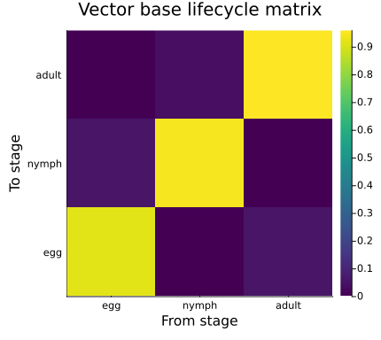
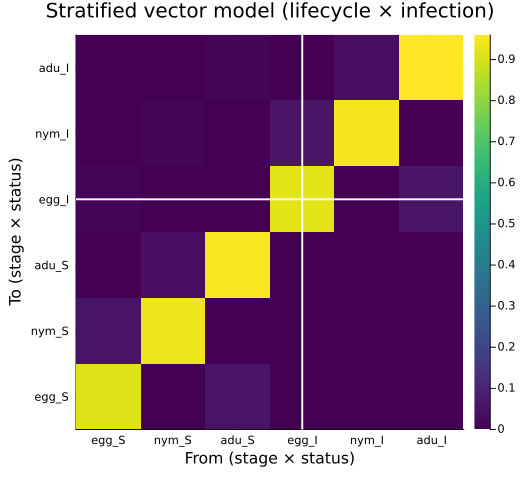
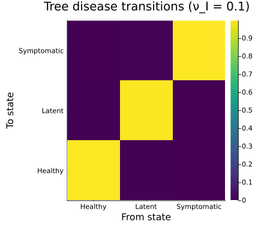
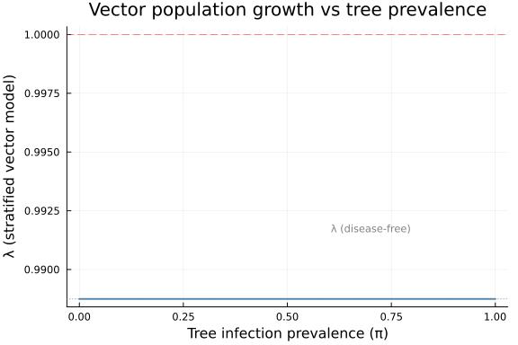
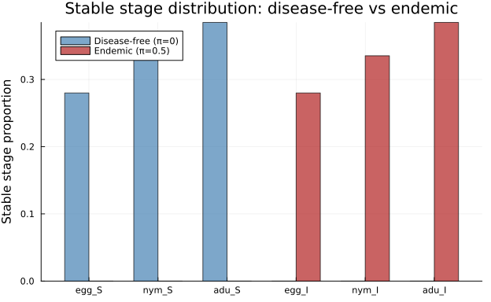
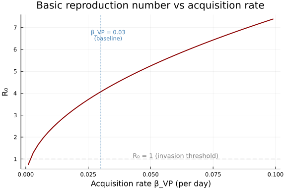

# Vector-Borne Disease Stratification

Categorical Construction of Eco-Epidemiological Models

Author

Simon Frost

## Overview

Eco-epidemiological models couple demographic processes with disease transmission, yielding large coupled systems that are difficult to build and analyze monolithically. A categorical perspective reveals that many such models are **products** of simpler structures:

1.  A **demographic lifecycle** — survival, development, and reproduction
2.  An **epidemiological coupling** — infection status transitions

The `stratify` function from `CategoricalPopulationDynamics` implements exactly this product construction. In vignette 04 we applied it to *spatial* patches; here we apply the same operation to *disease status*, demonstrating that spatial metapopulation structure and epidemiological structure are categorically identical.

We illustrate this with a model of *Xylella fastidiosa*, a bacterial plant pathogen vectored by the meadow spittlebug (*Philaenus spumarius*) in European olive groves. The model is based on the eco-epidemiological framework from PhysiologicallyBasedDemographicModels.jl vignette 48.

## Setup

``` julia
using CategoricalPopulationDynamics
using Catlab
using Catlab.CategoricalAlgebra
using Catlab.WiringDiagrams
using Catlab.Programs: @relation
using LinearAlgebra
using StructuredPopulationCore: lambda
using Plots
```

## Vector Lifecycle

The meadow spittlebug (*P. spumarius*) has a simple univoltine lifecycle with three discrete stages: **egg**, **nymph**, and **adult**. At a representative summer temperature of 25 °C, the daily demographic rates are:

``` julia
# Daily rates at 25°C
dev_egg   = 0.05    # egg → nymph development (~20 day egg stage)
dev_nymph = 0.033   # nymph → adult development (~30 day nymphal stage)
dev_adult = 0.02    # adult turnover rate (~50 day adult longevity)
μ_egg     = 0.03    # egg mortality
μ_nymph   = 0.02    # nymph mortality
μ_adult   = 0.04    # adult mortality
fecundity = 0.5 * 5.0 * dev_adult  # sex ratio × eggs/day × turnover
```

    0.05

We encode this as a `ValuedProjectionNet` — the categorical representation of a life cycle graph with named stages and sparse transition values:

``` julia
vector_base = ValuedProjectionNet(
    [:egg, :nymph, :adult],
    :survival => [
        (:egg   => :egg)   => (1.0 - dev_egg - μ_egg),     # egg stasis
        (:egg   => :nymph) => dev_egg,                       # egg → nymph
        (:nymph => :nymph) => (1.0 - dev_nymph - μ_nymph),  # nymph stasis
        (:nymph => :adult) => dev_nymph,                     # nymph → adult
        (:adult => :adult) => (1.0 - μ_adult),               # adult survival
    ],
    :fecundity => [
        (:adult => :egg) => fecundity,                       # reproduction
    ]
)

println("Stage names:      ", stage_names(vector_base))
println("Transition names: ", transition_names(vector_base))
```

    Stage names:      [:egg, :nymph, :adult]
    Transition names: [:survival, :fecundity]

Materializing the projection matrix and computing the dominant eigenvalue:

``` julia
A_vector = to_matrix(vector_base)
λ_vector = lambda(A_vector)

println("Vector lifecycle matrix (3×3):")
display(round.(A_vector, digits=4))
println("\nλ (vector base) = ", round(λ_vector, digits=4))
println("Population ", λ_vector > 1.0 ? "GROWING" : "DECLINING")
```

    Vector lifecycle matrix (3×3):

    λ (vector base) = 0.9887
    Population DECLINING

    3×3 Matrix{Float64}:
     0.92  0.0    0.05
     0.05  0.947  0.0
     0.0   0.033  0.96

``` julia
heatmap(["egg", "nymph", "adult"], ["egg", "nymph", "adult"],
    A_vector,
    title="Vector base lifecycle matrix",
    xlabel="From stage", ylabel="To stage",
    color=:viridis, size=(450, 400))
```



## Infection Coupling Matrix

*Xylella fastidiosa* is transmitted in a **persistent, non-circulative** manner: bacteria colonize the vector’s foregut and persist through the adult stage (but are lost at moult, so only adults transmit). Once an adult vector acquires the pathogen by feeding on an infected tree, it remains infective for life.

For a given tree infection prevalence <span class="math inline">\\\pi\\</span> (fraction of trees that are infectious), the 2×2 infection transition matrix for adult vectors is:

<span class="math display">\\ \mathbf{T}\_{\text{inf}} = \begin{pmatrix} 1 - \beta\_{VP} \pi & 0 \\ \beta\_{VP} \pi & 1 \end{pmatrix} \\</span>

where columns are \[S, I\] (from) and rows are \[S, I\] (to). The zero in position (1,2) reflects persistent infection: once infective, a vector cannot return to susceptible.

``` julia
β_VP = 0.03  # acquisition rate per day (feeding on infected tree)

function infection_matrix(π)
    return [1.0 - β_VP * π   0.0;
            β_VP * π          1.0]
end

# At 30% tree prevalence
π_example = 0.3
T_inf = infection_matrix(π_example)

println("Infection transition matrix at π = $π_example:")
display(round.(T_inf, digits=4))
println("\nS → S: ", round(T_inf[1,1], digits=4), "  (remain susceptible)")
println("S → I: ", round(T_inf[2,1], digits=4), "  (acquire infection)")
println("I → I: ", round(T_inf[2,2], digits=4), "  (persistent infection)")
```

    Infection transition matrix at π = 0.3:

    S → S: 0.991  (remain susceptible)
    S → I: 0.009  (acquire infection)
    I → I: 1.0  (persistent infection)

    2×2 Matrix{Float64}:
     0.991  0.0
     0.009  1.0

## Vector × Infection Stratification

The full vector model, tracking both lifecycle stage *and* infection status, is the **categorical product** of the base lifecycle with the infection coupling. This is implemented by `stratify` — the same function used for spatial metapopulations in vignette 04, but now applied to epidemiological states instead of spatial patches.

The stratified matrix has dimension <span class="math inline">\\n\_{\text{stages}} \times n\_{\text{infection}} = 3 \times 2 = 6\\</span>, with block structure:

<span class="math display">\\ \mathbf{A}\_{\text{strat}}\[(s\_{\text{to}}, i), (s\_{\text{from}}, j)\] = \mathbf{T}\_{\text{inf}}\[s\_{\text{to}}, s\_{\text{from}}\] \cdot \mathbf{A}\_{\text{demo}}\[i, j\] \\</span>

where <span class="math inline">\\s\\</span> indexes infection status (S, I) and <span class="math inline">\\i,j\\</span> index lifecycle stages (egg, nymph, adult).

``` julia
A_stratified = stratify(A_vector, T_inf)
λ_strat = lambda(A_stratified)

println("Stratified matrix: ", size(A_stratified))
println("States: egg_S, nymph_S, adult_S, egg_I, nymph_I, adult_I")
println("\nλ (stratified) = ", round(λ_strat, digits=4))
println("λ (base)       = ", round(λ_vector, digits=4))
```

    Stratified matrix: (6, 6)
    States: egg_S, nymph_S, adult_S, egg_I, nymph_I, adult_I

    λ (stratified) = 0.9887
    λ (base)       = 0.9887

### Visualizing the Block Structure

The 6×6 matrix has 2×2 blocks (one per infection status pair), each containing a 3×3 lifecycle transition:

``` julia
state_labels = ["egg_S", "nym_S", "adu_S", "egg_I", "nym_I", "adu_I"]
n = size(A_vector, 1)

heatmap(state_labels, state_labels, A_stratified,
    title="Stratified vector model (lifecycle × infection)",
    xlabel="From (stage × status)", ylabel="To (stage × status)",
    color=:viridis, size=(550, 500))
vline!([n + 0.5], color=:white, linewidth=2, label=false)
hline!([n + 0.5], color=:white, linewidth=2, label=false)
```



The **diagonal blocks** (S→S and I→I) contain the lifecycle dynamics weighted by the probability of remaining in the same infection state. The **off-diagonal block** (S→I, lower-left) contains lifecycle dynamics weighted by the acquisition probability — this is the infection pathway. The I→S block (upper-right) is zero because infection is persistent.

## Tree Disease Dynamics

Trees have three disease states: **healthy** (H), **latently infected** (L), and **symptomatic** (I). Disease dynamics depend on the fraction of infective vectors.

``` julia
β_PV = 0.03        # inoculation rate per infective vector per day
σ = 1.0 / 180.0    # latent → symptomatic rate (6-month latency)
r_recovery = 0.002  # recovery rate (latent → healthy)
d_disease = 0.001   # disease-induced mortality (symptomatic)

function tree_transition_matrix(ν_I)
    # ν_I = fraction of vectors that are infective
    inoculation = β_PV * ν_I
    return [
        1.0 - inoculation           r_recovery              0.0        ;
        inoculation                 1.0 - σ - r_recovery    0.0        ;
        0.0                         σ                        1.0 - d_disease
    ]
end

# At 10% infective vector fraction
ν_example = 0.1
T_tree = tree_transition_matrix(ν_example)

println("Tree disease transition matrix at ν_I = $ν_example:")
println("  States: Healthy, Latent, Symptomatic")
display(round.(T_tree, digits=5))
```

    Tree disease transition matrix at ν_I = 0.1:
      States: Healthy, Latent, Symptomatic

    3×3 Matrix{Float64}:
     0.997  0.002    0.0
     0.003  0.99244  0.0
     0.0    0.00556  0.999

``` julia
tree_labels = ["Healthy", "Latent", "Symptomatic"]
heatmap(tree_labels, tree_labels, T_tree,
    title="Tree disease transitions (ν_I = $ν_example)",
    xlabel="From state", ylabel="To state",
    color=:viridis, size=(450, 400))
```



## Full System via Composition

The complete eco-epidemiological model couples the stratified vector dynamics with the tree disease dynamics. We compose these two subsystems using an undirected wiring diagram (UWD), where the shared junction represents the **epidemiological coupling** — vector infection status drives tree inoculation, and tree disease prevalence drives vector acquisition.

``` julia
# Define the composition pattern
epi_uwd = @relation (epi_state,) begin
    vector_dynamics(epi_state)
    tree_dynamics(epi_state)
end

# Display the UWD structure
println("UWD boxes: ", nparts(epi_uwd, :Box))
println("UWD junctions: ", nparts(epi_uwd, :Junction))
```

    UWD boxes: 2
    UWD junctions: 1

For a concrete coupling at given prevalences, we build both subsystems and compose:

``` julia
# Scenario: 20% tree prevalence, 5% infective vectors
π_trees = 0.2
ν_infective = 0.05

# Vector subsystem: stratified lifecycle × infection
A_vec_strat = stratify(A_vector, infection_matrix(π_trees))

# Tree subsystem: disease transitions
A_tree = tree_transition_matrix(ν_infective)

# Create projection sharers
vec_sharer = ProjectionSharer(A_vec_strat)
tree_sharer = ProjectionSharer(A_tree)

println("Vector subsystem: ", size(A_vec_strat), " matrix (3 stages × 2 infection states)")
println("Tree subsystem:   ", size(A_tree), " matrix (3 disease states)")
println("\nVector λ (stratified): ", round(lambda(A_vec_strat), digits=4))
println("Tree λ (disease):      ", round(lambda(A_tree), digits=6))
```

    Vector subsystem: (6, 6) matrix (3 stages × 2 infection states)
    Tree subsystem:   (3, 3) matrix (3 disease states)

    Vector λ (stratified): 0.9887
    Tree λ (disease):      0.999

The tree transition matrix has <span class="math inline">\\\lambda \approx 1\\</span> because trees neither reproduce nor die rapidly at these parameter values — the dominant eigenvalue deviates from 1 only through disease-induced mortality.

## Basic Reproduction Number

The basic reproduction number <span class="math inline">\\R_0\\</span> quantifies whether the pathogen can invade a fully susceptible population. We compute it using the **next-generation matrix** (NGM) approach. For the vector-tree system, the infected compartments are: infective vectors and infected trees (latent + symptomatic).

The NGM decomposes the infection dynamics into a **transmission matrix** <span class="math inline">\\\mathbf{F}\\</span> (new infections) and a **transition matrix** <span class="math inline">\\\mathbf{V}\\</span> (changes in state among infected compartments). Then <span class="math inline">\\R_0 = \rho(\mathbf{F}\mathbf{V}^{-1})\\</span>.

``` julia
function compute_R0(β_VP, β_PV, σ, r_recovery, d_disease, μ_adult)
    # Infected compartments: V_I (infective vector), P_L (latent tree), P_I (symptomatic tree)
    # At disease-free equilibrium: all vectors susceptible, all trees healthy

    # F = new infection rate matrix (linearized at DFE)
    # Only two infection pathways:
    #   V_S → V_I via acquisition from infected trees (rate β_VP × prevalence)
    #   P_H → P_L via inoculation from infective vectors (rate β_PV × vector fraction)

    # Transmission matrix F (new infections entering each infected class)
    # Rows/cols: [V_I, P_L, P_I]
    F = [0.0     0.0        β_VP;    # V_I gains from P_I (and κ P_L, simplified)
         β_PV    0.0        0.0;     # P_L gains from V_I
         0.0     0.0        0.0]     # P_I gains no new infections directly

    # Transition matrix V (rates of leaving each infected class)
    V = [μ_adult          0.0              0.0;
         0.0              σ + r_recovery   0.0;
         0.0              -σ               d_disease]

    # Next-generation matrix
    NGM = F * inv(V)
    R0 = maximum(abs.(eigvals(NGM)))
    return R0, NGM
end

R0, NGM = compute_R0(β_VP, β_PV, σ, r_recovery, d_disease, μ_adult)

println("Next-generation matrix:")
display(round.(NGM, digits=4))
println("\nR₀ = ", round(R0, digits=4))
println("Pathogen can ", R0 > 1.0 ? "INVADE" : "NOT invade", " the disease-free equilibrium")
```

    Next-generation matrix:

    R₀ = 4.0674
    Pathogen can INVADE the disease-free equilibrium

    3×3 Matrix{Float64}:
     0.0   22.0588  30.0
     0.75   0.0      0.0
     0.0    0.0      0.0

## Prevalence Sweep

A key advantage of the product structure is that we can efficiently sweep epidemiological parameters while keeping the demographic model fixed. Here we vary tree prevalence <span class="math inline">\\\pi\\</span> from 0 to 1 and examine how the dominant eigenvalue of the stratified vector model changes:

``` julia
π_range = 0.0:0.01:1.0
λ_sweep = [lambda(stratify(A_vector, infection_matrix(π))) for π in π_range]

plot(π_range, λ_sweep,
    xlabel="Tree infection prevalence (π)",
    ylabel="λ (stratified vector model)",
    title="Vector population growth vs tree prevalence",
    linewidth=2, color=:steelblue,
    legend=false, size=(600, 400))
hline!([1.0], linestyle=:dash, color=:red, alpha=0.5)
hline!([λ_vector], linestyle=:dot, color=:gray, alpha=0.7)
annotate!(0.7, λ_vector + 0.003, text("λ (disease-free)", 8, :gray))
annotate!(0.7, 1.003, text("λ = 1 (replacement)", 8, :red))
```



The growth rate of the overall vector+infection system remains essentially unchanged by prevalence because infection does not kill vectors — they survive at the same rate whether susceptible or infective. The stratification simply redistributes the population between S and I states without affecting total growth. This is a direct consequence of the infection coupling matrix having column sums equal to 1 (a *stochastic* matrix), which preserves the dominant eigenvalue — a fact that is immediately visible from the product structure.

## Disease-Free vs Endemic Equilibrium

Let us compare the eigenstructure at the disease-free equilibrium (<span class="math inline">\\\pi = 0\\</span>) and at an endemic level (<span class="math inline">\\\pi = 0.5\\</span>):

``` julia
A_dfe = stratify(A_vector, infection_matrix(0.0))
A_endemic = stratify(A_vector, infection_matrix(0.5))

ev_dfe = sort(abs.(eigvals(A_dfe)), rev=true)
ev_endemic = sort(abs.(eigvals(A_endemic)), rev=true)

println("Eigenvalue magnitudes:")
println(rpad("", 8), rpad("Disease-free", 14), "Endemic (π=0.5)")
println("-"^37)
for i in 1:6
    println(rpad("λ_$i", 8),
        rpad(round(ev_dfe[i], digits=6), 14),
        round(ev_endemic[i], digits=6))
end
```

    Eigenvalue magnitudes:
            Disease-free  Endemic (π=0.5)
    -------------------------------------
    λ_1     0.988746      0.988746
    λ_2     0.988746      0.973915
    λ_3     0.919779      0.919779
    λ_4     0.919779      0.919779
    λ_5     0.919779      0.905982
    λ_6     0.919779      0.905982

At the disease-free equilibrium, the infection coupling is the identity, so the stratified model has **doubly degenerate** eigenvalues (each eigenvalue of the base model appears twice — once for S, once for I). At endemic prevalence, the degeneracy is broken: the infection dynamics split each pair into distinct eigenvalues, reflecting the different dynamics of susceptible vs infective cohorts.

``` julia
# Stable stage distribution comparison
v_dfe = real.(eigvecs(A_dfe)[:, argmax(abs.(eigvals(A_dfe)))])
v_dfe = v_dfe / sum(v_dfe)

v_endemic = real.(eigvecs(A_endemic)[:, argmax(abs.(eigvals(A_endemic)))])
v_endemic = v_endemic / sum(v_endemic)

state_labels_short = ["egg_S", "nym_S", "adu_S", "egg_I", "nym_I", "adu_I"]
x = 1:6
w = 0.35

bar(x .- w/2, abs.(v_dfe), bar_width=w, label="Disease-free (π=0)",
    color=:steelblue, alpha=0.7, size=(650, 400))
bar!(x .+ w/2, abs.(v_endemic), bar_width=w, label="Endemic (π=0.5)",
    color=:firebrick, alpha=0.7)
xticks!(x, state_labels_short)
ylabel!("Stable stage proportion")
title!("Stable stage distribution: disease-free vs endemic")
```



In the endemic scenario, a fraction of each stage shifts from the susceptible to the infective compartment, reflecting the ongoing transmission from trees to vectors.

## Sensitivity: Transmission Rate Sweep

We can also sweep the transmission rate <span class="math inline">\\\beta\_{VP}\\</span> to find how it influences <span class="math inline">\\R_0\\</span>:

``` julia
β_range = 0.001:0.002:0.1
R0_sweep = [compute_R0(β, β_PV, σ, r_recovery, d_disease, μ_adult)[1] for β in β_range]

plot(β_range, R0_sweep,
    xlabel="Acquisition rate β_VP (per day)",
    ylabel="R₀",
    title="Basic reproduction number vs acquisition rate",
    linewidth=2, color=:darkred,
    legend=false, size=(600, 400))
hline!([1.0], linestyle=:dash, color=:gray, alpha=0.7)
annotate!(0.06, 1.15, text("R₀ = 1 (invasion threshold)", 9, :gray))
vline!([β_VP], linestyle=:dot, color=:steelblue, alpha=0.7)
annotate!(β_VP + 0.003, maximum(R0_sweep) * 0.9,
    text("β_VP = $β_VP\n(baseline)", 8, :steelblue))
```



## Summary

This vignette demonstrated that eco-epidemiological models for vector-borne diseases have a natural **product structure** that can be constructed categorically:

1.  **Vector lifecycle** — encoded as a `ValuedProjectionNet` with 3 stages (egg, nymph, adult) and transitions for survival/development and fecundity
2.  **Infection coupling** — a 2×2 stochastic matrix describing S→I acquisition dynamics
3.  **Disease stratification** — `stratify(A_vector, T_infection)` produces the full 6×6 vector model tracking both lifecycle stage and infection status
4.  **Tree disease dynamics** — a separate 3×3 transition matrix for healthy/latent/symptomatic trees
5.  **Composition via UWD** — the vector and tree subsystems are composed through shared epidemiological state

The key insight is that `stratify` is agnostic to the *interpretation* of its second argument: spatial dispersal (vignette 04), resistance genotypes (vignette 11), or infection status (this vignette) all use the same categorical construction. This separation of concerns enables:

- **Modular model building**: change the vector lifecycle without touching the epidemiology, and vice versa
- **Efficient parameter sweeps**: the product structure avoids rebuilding the full model for each parameter combination
- **Transparent block structure**: the stratified matrix clearly shows which transitions couple demography with disease
- **Next-generation matrix**: <span class="math inline">\\R_0\\</span> follows naturally from the product decomposition into transmission and transition components

The categorical framework makes explicit what is often implicit in eco-epidemiological models: the full system is not a monolithic coupled ODE, but a structured product of simpler subsystems connected through well-defined interfaces.
