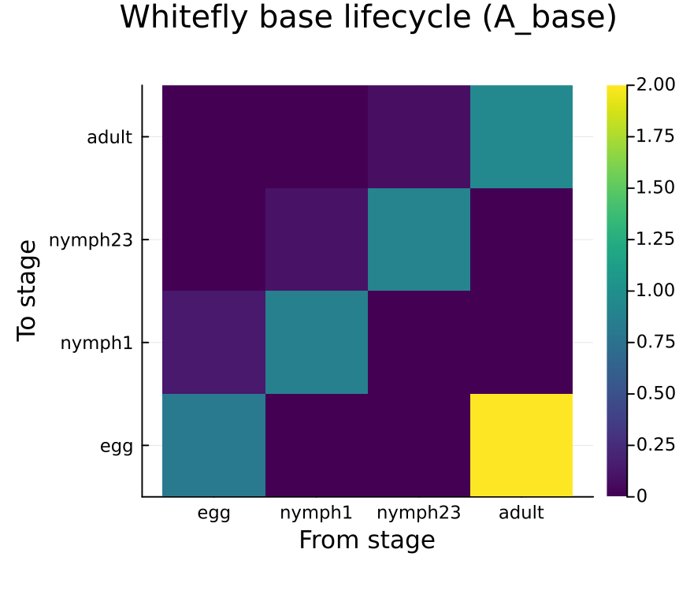
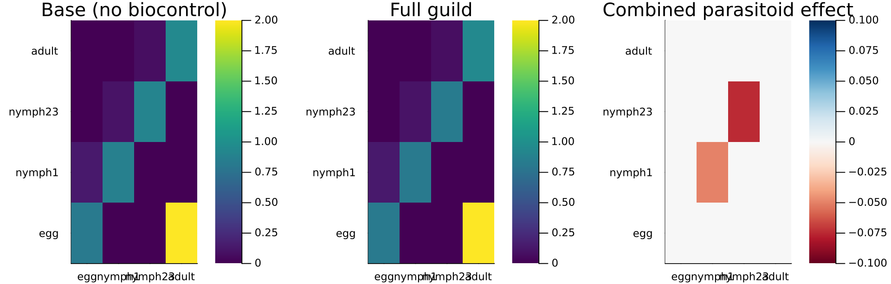
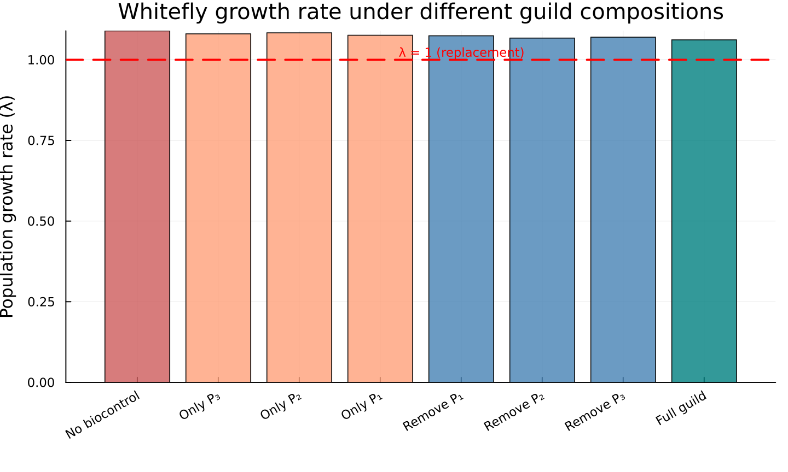
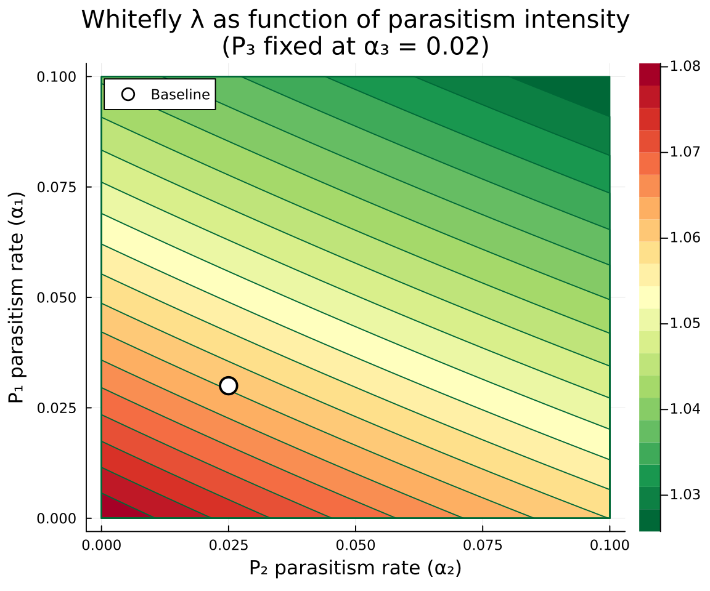
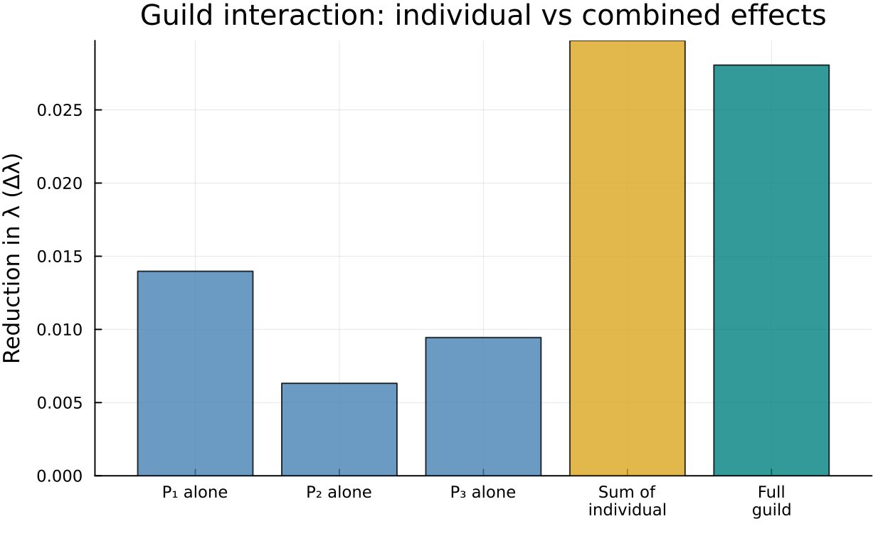
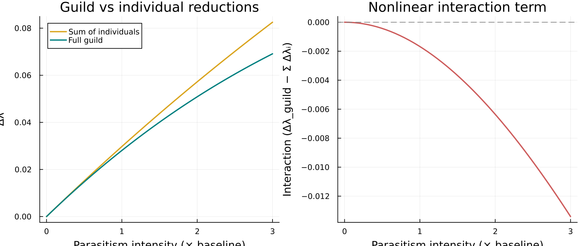

# Enemy Guild Composition

Categorical Assembly of Multi-Parasitoid Biocontrol Models

Author

Simon Frost

## Overview

Biological control of crop pests typically involves **guilds** of natural enemies — multiple parasitoid or predator species that jointly suppress pest populations. Modeling the joint effect of an enemy guild is a natural compositional problem: the pest lifecycle forms a **base model**, and each natural enemy adds a **negative transition** (additional mortality) to specific pest stages.

This vignette demonstrates how CategoricalPopulationDynamics.jl’s additive composition framework handles multi-species biocontrol. We model a cotton–whitefly–parasitoid system inspired by Schreiber et al. (2001), where three parasitoid species with different reproductive strategies attack different stages of the whitefly *Bemisia tabaci*.

The categorical insight is that the full model decomposes as:

<span class="math display">\\ \mathbf{A}\_{\text{full}} = \mathbf{A}\_{\text{whitefly}} + \Delta\mathbf{A}\_{P_1} + \Delta\mathbf{A}\_{P_2} + \Delta\mathbf{A}\_{P_3} \\</span>

where each <span class="math inline">\\\Delta\mathbf{A}\_{P_i}\\</span> is a **sparse, negative** perturbation capturing the mortality imposed by parasitoid <span class="math inline">\\i\\</span> on specific whitefly stages. This is exactly the additive kernel composition that `compose_transitions` and `oapply` implement.

## Setup

``` julia
using CategoricalPopulationDynamics
using CategoricalPopulationDynamics: ⊕, ⊘
using Catlab
using Catlab.CategoricalAlgebra
using Catlab.WiringDiagrams
using Catlab.Programs: @relation
using LinearAlgebra
using StructuredPopulationCore: lambda
using Plots
```

## Whitefly Base Lifecycle

The whitefly (*Bemisia tabaci*) has four developmental stages: **egg**, **early nymph** (1st instar), **late nymph** (2nd–3rd instars), and **adult**. At 27°C during the cotton growing season, daily demographic rates are:

``` julia
# Daily development rates (probability of advancing per day)
dev_egg     = 0.14    # ~7 day egg stage
dev_nymph1  = 0.10    # ~10 day early nymph
dev_nymph23 = 0.07    # ~14 day late nymph
dev_adult   = 0.05    # adult senescence rate

# Daily natural mortality rates
μ_egg      = 0.05
μ_nymph1   = 0.04
μ_nymph23  = 0.03
μ_adult    = 0.06

# Fecundity: eggs per adult female per day × sex ratio
fecundity  = 0.5 * 4.0  # = 2.0 female eggs/day
```

    2.0

From these rates, we compute daily stage-specific survival probabilities and transition rates:

``` julia
# Survival probabilities
σ_egg     = 1 - μ_egg       # 0.95
σ_nymph1  = 1 - μ_nymph1    # 0.96
σ_nymph23 = 1 - μ_nymph23   # 0.97
σ_adult   = 1 - μ_adult     # 0.94

# Stasis: survive AND remain in current stage
stasis_egg     = σ_egg     * (1 - dev_egg)      # 0.817
stasis_nymph1  = σ_nymph1  * (1 - dev_nymph1)   # 0.864
stasis_nymph23 = σ_nymph23 * (1 - dev_nymph23)  # 0.9021
stasis_adult   = σ_adult                          # 0.94

# Progression: survive AND advance to next stage
prog_egg_to_n1   = σ_egg     * dev_egg      # 0.133
prog_n1_to_n23   = σ_nymph1  * dev_nymph1   # 0.096
prog_n23_to_ad   = σ_nymph23 * dev_nymph23  # 0.0679

println("Stasis: egg=$(round(stasis_egg, digits=4)), n1=$(round(stasis_nymph1, digits=4)), ",
        "n23=$(round(stasis_nymph23, digits=4)), adult=$(round(stasis_adult, digits=4))")
println("Progression: egg→n1=$(round(prog_egg_to_n1, digits=4)), ",
        "n1→n23=$(round(prog_n1_to_n23, digits=4)), n23→ad=$(round(prog_n23_to_ad, digits=4))")
```

    Stasis: egg=0.817, n1=0.864, n23=0.9021, adult=0.94
    Progression: egg→n1=0.133, n1→n23=0.096, n23→ad=0.0679

### Building the ValuedProjectionNet

We encode the whitefly lifecycle as three separate `ValuedProjectionNet` components — development (stage advancement), stasis (survival within stage), and fecundity (reproduction) — and merge them with the `⊕` operator. Because all three share the same stage set but have disjoint transition names, `⊕` cleanly combines them into a single net:

``` julia
stages = [:egg, :nymph1, :nymph23, :adult]

whitefly_dev = ValuedProjectionNet(stages,
    :development => [
        (:egg     => :nymph1)  => prog_egg_to_n1,
        (:nymph1  => :nymph23) => prog_n1_to_n23,
        (:nymph23 => :adult)   => prog_n23_to_ad])

whitefly_stasis = ValuedProjectionNet(stages,
    :stasis => [
        (:egg     => :egg)     => stasis_egg,
        (:nymph1  => :nymph1)  => stasis_nymph1,
        (:nymph23 => :nymph23) => stasis_nymph23,
        (:adult   => :adult)   => stasis_adult])

whitefly_fecundity = ValuedProjectionNet(stages,
    :fecundity => [
        (:adult => :egg) => fecundity])

whitefly = whitefly_dev ⊕ whitefly_stasis ⊕ whitefly_fecundity

println("Stages:      ", stage_names(whitefly))
println("Transitions: ", transition_names(whitefly))
```

    Stages:      [:egg, :nymph1, :nymph23, :adult]
    Transitions: [:stasis, :development, :fecundity]

### Base projection matrix and growth rate

``` julia
A_base = to_matrix(whitefly)
λ_base = lambda(A_base)

println("Whitefly base projection matrix:")
display(A_base)
println()
println("λ_base = ", round(λ_base, digits=6))
println("Without biocontrol, the pest population is ",
        λ_base > 1 ? "GROWING (λ > 1)" : "stable or declining")
```

    Whitefly base projection matrix:

    λ_base = 1.089855
    Without biocontrol, the pest population is GROWING (λ > 1)

    4×4 Matrix{Float64}:
     0.817  0.0    0.0     2.0
     0.133  0.864  0.0     0.0
     0.0    0.096  0.9021  0.0
     0.0    0.0    0.0679  0.94

``` julia
stages = String.(stage_names(whitefly))
heatmap(stages, stages, A_base,
    title="Whitefly base lifecycle (A_base)",
    xlabel="From stage", ylabel="To stage",
    color=:viridis, aspect_ratio=1, size=(450, 400))
```



## Parasitoid Effects

Three parasitoid species attack the whitefly, each with a different host-stage preference and parasitism rate:

<table class="caption-top table" style="width:97%;">
<colgroup>
<col style="width: 16%" />
<col style="width: 27%" />
<col style="width: 18%" />
<col style="width: 16%" />
<col style="width: 20%" />
</colgroup>
<thead>
<tr class="header">
<th>Species</th>
<th>Model organism</th>
<th>Strategy</th>
<th>Attacks</th>
<th>Rate (α)</th>
</tr>
</thead>
<tbody>
<tr class="odd">
<td>P₁</td>
<td><em>Eretmocerus</em> sp.</td>
<td>Primary parasitoid</td>
<td>nymph1, nymph23</td>
<td>0.03/day</td>
</tr>
<tr class="even">
<td>P₂</td>
<td><em>Encarsia</em> (obligate)</td>
<td>Obligate autoparasitoid</td>
<td>nymph23 only</td>
<td>0.025/day</td>
</tr>
<tr class="odd">
<td>P₃</td>
<td><em>Encarsia</em> (facultative)</td>
<td>Facultative autoparasitoid</td>
<td>nymph1, nymph23</td>
<td>0.02/day</td>
</tr>
</tbody>
</table>

Each parasitoid imposes **additional daily mortality** on the stages it attacks, reducing the stasis (within-stage survival) entries. We model each as a sparse matrix <span class="math inline">\\\Delta\mathbf{A}\_{P_i}\\</span> with negative entries only at the attacked stages:

``` julia
α₁ = 0.03   # P₁ parasitism rate
α₂ = 0.025  # P₂ parasitism rate
α₃ = 0.02   # P₃ parasitism rate

n = length(stage_names(whitefly))
stage_idx = Dict(s => i for (i, s) in enumerate(stage_names(whitefly)))

# P₁ (Eretmocerus): attacks nymph1 and nymph23
ΔA_P1 = zeros(n, n)
ΔA_P1[stage_idx[:nymph1],  stage_idx[:nymph1]]  = -α₁
ΔA_P1[stage_idx[:nymph23], stage_idx[:nymph23]] = -α₁

# P₂ (Encarsia obligate): attacks nymph23 only
ΔA_P2 = zeros(n, n)
ΔA_P2[stage_idx[:nymph23], stage_idx[:nymph23]] = -α₂

# P₃ (Encarsia facultative): attacks nymph1 and nymph23
ΔA_P3 = zeros(n, n)
ΔA_P3[stage_idx[:nymph1],  stage_idx[:nymph1]]  = -α₃
ΔA_P3[stage_idx[:nymph23], stage_idx[:nymph23]] = -α₃

println("ΔA_P1 (Eretmocerus — nymph1, nymph23):"); display(ΔA_P1); println()
println("ΔA_P2 (Encarsia obligate — nymph23):"); display(ΔA_P2); println()
println("ΔA_P3 (Encarsia facultative — nymph1, nymph23):"); display(ΔA_P3)
```

    ΔA_P1 (Eretmocerus — nymph1, nymph23):

    ΔA_P2 (Encarsia obligate — nymph23):

    ΔA_P3 (Encarsia facultative — nymph1, nymph23):

    4×4 Matrix{Float64}:
     0.0   0.0    0.0   0.0
     0.0  -0.03   0.0   0.0
     0.0   0.0   -0.03  0.0
     0.0   0.0    0.0   0.0

    4×4 Matrix{Float64}:
     0.0  0.0   0.0    0.0
     0.0  0.0   0.0    0.0
     0.0  0.0  -0.025  0.0
     0.0  0.0   0.0    0.0

    4×4 Matrix{Float64}:
     0.0   0.0    0.0   0.0
     0.0  -0.02   0.0   0.0
     0.0   0.0   -0.02  0.0
     0.0   0.0    0.0   0.0

## Compositional Assembly

### Method 1: `compose_transitions` (Catlab-free)

The simplest approach — additively sum the base matrix and all parasitoid effects:

``` julia
A_full_ct = compose_transitions(Dict(
    :whitefly_base => A_base,
    :parasitoid_P1 => ΔA_P1,
    :parasitoid_P2 => ΔA_P2,
    :parasitoid_P3 => ΔA_P3))

λ_full_ct = lambda(A_full_ct)
println("λ(compose_transitions) = ", round(λ_full_ct, digits=6))
```

    λ(compose_transitions) = 1.061794

### Method 2: `oapply` with UWD

An **undirected wiring diagram** (UWD) formally specifies the composition pattern. Each box is a demographic process, and shared junctions identify common state variables:

``` julia
uwd = @relation (stage,) begin
    whitefly_base(stage,)
    parasitoid_P1(stage,)
    parasitoid_P2(stage,)
    parasitoid_P3(stage,)
end
```

<span class="c-set-summary">Catlab.WiringDiagrams.RelationDiagrams.UntypedUnnamedRelationDiagram{Symbol, Symbol} {Box:4, Port:4, OuterPort:1, Junction:1, Name:0, VarName:0}</span>

<table class="caption-top table table-sm table-striped small">
<thead>
<tr class="header headerLastRow">
<th class="rowLabel" data-quarto-table-cell-role="th" style="text-align: right; font-weight: bold;">Box</th>
<th style="text-align: right;" data-quarto-table-cell-role="th">name</th>
</tr>
</thead>
<tbody>
<tr class="odd">
<td class="rowLabel" style="text-align: right; font-weight: bold;">1</td>
<td style="text-align: right;">whitefly_base</td>
</tr>
<tr class="even">
<td class="rowLabel" style="text-align: right; font-weight: bold;">2</td>
<td style="text-align: right;">parasitoid_P1</td>
</tr>
<tr class="odd">
<td class="rowLabel" style="text-align: right; font-weight: bold;">3</td>
<td style="text-align: right;">parasitoid_P2</td>
</tr>
<tr class="even">
<td class="rowLabel" style="text-align: right; font-weight: bold;">4</td>
<td style="text-align: right;">parasitoid_P3</td>
</tr>
</tbody>
</table>

<table class="caption-top table table-sm table-striped small">
<thead>
<tr class="header headerLastRow">
<th class="rowLabel" data-quarto-table-cell-role="th" style="text-align: right; font-weight: bold;">Port</th>
<th style="text-align: right;" data-quarto-table-cell-role="th">box</th>
<th style="text-align: right;" data-quarto-table-cell-role="th">junction</th>
</tr>
</thead>
<tbody>
<tr class="odd">
<td class="rowLabel" style="text-align: right; font-weight: bold;">1</td>
<td style="text-align: right;">1</td>
<td style="text-align: right;">1</td>
</tr>
<tr class="even">
<td class="rowLabel" style="text-align: right; font-weight: bold;">2</td>
<td style="text-align: right;">2</td>
<td style="text-align: right;">1</td>
</tr>
<tr class="odd">
<td class="rowLabel" style="text-align: right; font-weight: bold;">3</td>
<td style="text-align: right;">3</td>
<td style="text-align: right;">1</td>
</tr>
<tr class="even">
<td class="rowLabel" style="text-align: right; font-weight: bold;">4</td>
<td style="text-align: right;">4</td>
<td style="text-align: right;">1</td>
</tr>
</tbody>
</table>

<table class="caption-top table table-sm table-striped small">
<thead>
<tr class="header headerLastRow">
<th class="rowLabel" data-quarto-table-cell-role="th" style="text-align: right; font-weight: bold;">OuterPort</th>
<th style="text-align: right;" data-quarto-table-cell-role="th">outer_junction</th>
</tr>
</thead>
<tbody>
<tr class="odd">
<td class="rowLabel" style="text-align: right; font-weight: bold;">1</td>
<td style="text-align: right;">1</td>
</tr>
</tbody>
</table>

<table class="caption-top table table-sm table-striped small">
<thead>
<tr class="header headerLastRow">
<th class="rowLabel" data-quarto-table-cell-role="th" style="text-align: right; font-weight: bold;">Junction</th>
<th style="text-align: right;" data-quarto-table-cell-role="th">variable</th>
</tr>
</thead>
<tbody>
<tr class="odd">
<td class="rowLabel" style="text-align: right; font-weight: bold;">1</td>
<td style="text-align: right;">stage</td>
</tr>
</tbody>
</table>

Wrap each matrix as a `ProjectionSharer` and compose via `oapply`:

``` julia
sharers = Dict(
    :whitefly_base => ProjectionSharer(A_base),
    :parasitoid_P1 => ProjectionSharer(ΔA_P1),
    :parasitoid_P2 => ProjectionSharer(ΔA_P2),
    :parasitoid_P3 => ProjectionSharer(ΔA_P3))

result = oapply(uwd, sharers)
A_full_uwd = result.matrix
λ_full_uwd = lambda(A_full_uwd)
println("λ(oapply)              = ", round(λ_full_uwd, digits=6))
```

    λ(oapply)              = 1.061794

### Equivalence

Both methods produce identical results — the UWD provides formal specification while `compose_transitions` provides a lightweight alternative:

``` julia
println("compose_transitions: λ = ", round(λ_full_ct, digits=8))
println("oapply (UWD):        λ = ", round(λ_full_uwd, digits=8))
println("Direct sum:          λ = ", round(lambda(A_base + ΔA_P1 + ΔA_P2 + ΔA_P3), digits=8))
println("All agree: ", A_full_ct ≈ A_full_uwd ≈ (A_base + ΔA_P1 + ΔA_P2 + ΔA_P3))
```

    compose_transitions: λ = 1.06179436
    oapply (UWD):        λ = 1.06179436
    Direct sum:          λ = 1.06179436
    All agree: true

``` julia
p1 = heatmap(stages, stages, A_base,
    title="Base (no biocontrol)", color=:viridis, clims=(minimum(A_full_ct), maximum(A_base)))
p2 = heatmap(stages, stages, A_full_ct,
    title="Full guild", color=:viridis, clims=(minimum(A_full_ct), maximum(A_base)))
p3 = heatmap(stages, stages, A_full_ct - A_base,
    title="Combined parasitoid effect", color=:RdBu,
    clims=(-0.1, 0.1))
plot(p1, p2, p3, layout=(1, 3), size=(1000, 320))
```



## Guild Contribution Analysis

The compositional framework makes it easy to ask: **what happens when each parasitoid is removed?** We evaluate eight scenarios — the full guild, each species removed, each species alone, and no biocontrol:

``` julia
scenarios = Dict(
    "Full guild"    => A_base + ΔA_P1 + ΔA_P2 + ΔA_P3,
    "Remove P₁"     => A_base + ΔA_P2 + ΔA_P3,
    "Remove P₂"     => A_base + ΔA_P1 + ΔA_P3,
    "Remove P₃"     => A_base + ΔA_P1 + ΔA_P2,
    "Only P₁"       => A_base + ΔA_P1,
    "Only P₂"       => A_base + ΔA_P2,
    "Only P₃"       => A_base + ΔA_P3,
    "No biocontrol" => A_base)

# Compute λ for each scenario, maintaining display order
scenario_order = ["No biocontrol", "Only P₃", "Only P₂", "Only P₁",
                  "Remove P₁", "Remove P₂", "Remove P₃", "Full guild"]

λ_values = [lambda(scenarios[s]) for s in scenario_order]

println("Guild composition analysis:")
println("─" ^ 45)
for (s, λ) in zip(scenario_order, λ_values)
    status = λ > 1.0 ? "  ↑ growing" : "  ↓ declining"
    println(rpad(s, 20), "λ = ", rpad(round(λ, digits=6), 10), status)
end
```

    Guild composition analysis:
    ─────────────────────────────────────────────
    No biocontrol       λ = 1.089855    ↑ growing
    Only P₃             λ = 1.080408    ↑ growing
    Only P₂             λ = 1.083538    ↑ growing
    Only P₁             λ = 1.075881    ↑ growing
    Remove P₁           λ = 1.074454    ↑ growing
    Remove P₂           λ = 1.067216    ↑ growing
    Remove P₃           λ = 1.070106    ↑ growing
    Full guild          λ = 1.061794    ↑ growing

### Bar chart of growth rates

``` julia
colors = [:indianred, :lightsalmon, :lightsalmon, :lightsalmon,
          :steelblue, :steelblue, :steelblue, :teal]

bar(scenario_order, λ_values,
    ylabel="Population growth rate (λ)",
    title="Whitefly growth rate under different guild compositions",
    legend=false, color=colors, alpha=0.8,
    xrotation=30, size=(750, 450), bottom_margin=10Plots.mm)
hline!([1.0], linestyle=:dash, color=:red, linewidth=2, label="λ = 1")
annotate!(4.5, 1.001, text("λ = 1 (replacement)", :red, 8, :bottom))
```



## Parasitism Intensity Sweep

How sensitive is whitefly control to parasitism intensity? We sweep the parasitism rates of P₁ and P₂ (keeping P₃ at its baseline) and plot the resulting <span class="math inline">\\\lambda\\</span> surface:

``` julia
α₁_range = range(0.0, 0.10, length=40)
α₂_range = range(0.0, 0.10, length=40)

λ_surface = zeros(length(α₁_range), length(α₂_range))

for (i, a1) in enumerate(α₁_range)
    for (j, a2) in enumerate(α₂_range)
        Δ1 = zeros(n, n)
        Δ1[stage_idx[:nymph1],  stage_idx[:nymph1]]  = -a1
        Δ1[stage_idx[:nymph23], stage_idx[:nymph23]] = -a1

        Δ2 = zeros(n, n)
        Δ2[stage_idx[:nymph23], stage_idx[:nymph23]] = -a2

        A_sweep = A_base + Δ1 + Δ2 + ΔA_P3
        λ_surface[i, j] = lambda(A_sweep)
    end
end

contourf(α₂_range, α₁_range, λ_surface,
    xlabel="P₂ parasitism rate (α₂)",
    ylabel="P₁ parasitism rate (α₁)",
    title="Whitefly λ as function of parasitism intensity\n(P₃ fixed at α₃ = $(α₃))",
    color=cgrad(:RdYlGn, rev=true), levels=20,
    size=(600, 500))
contour!(α₂_range, α₁_range, λ_surface,
    levels=[1.0], linecolor=:black, linewidth=2, label="λ = 1")
scatter!([α₂], [α₁], markersize=8, color=:white, markerstrokecolor=:black,
    markerstrokewidth=2, label="Baseline")
```



The black contour line shows the **critical parasitism boundary** where <span class="math inline">\\\lambda = 1\\</span>. Combinations above and to the right of this line achieve pest suppression.

## Is the Guild More Than the Sum of Its Parts?

In the additive framework, matrix entries sum linearly. But the **dominant eigenvalue** is a nonlinear function of matrix entries. This means the λ reduction from the full guild need not equal the sum of individual λ reductions — there can be **synergistic** or **redundant** interactions:

``` julia
# Individual λ reductions
Δλ_P1 = λ_base - lambda(A_base + ΔA_P1)
Δλ_P2 = λ_base - lambda(A_base + ΔA_P2)
Δλ_P3 = λ_base - lambda(A_base + ΔA_P3)
Δλ_sum = Δλ_P1 + Δλ_P2 + Δλ_P3

# Full guild λ reduction
Δλ_full = λ_base - lambda(A_base + ΔA_P1 + ΔA_P2 + ΔA_P3)

println("Individual λ reductions:")
println("  P₁ alone:  Δλ = ", round(Δλ_P1, digits=6))
println("  P₂ alone:  Δλ = ", round(Δλ_P2, digits=6))
println("  P₃ alone:  Δλ = ", round(Δλ_P3, digits=6))
println("  Sum:       Δλ = ", round(Δλ_sum, digits=6))
println()
println("Full guild:  Δλ = ", round(Δλ_full, digits=6))
println()

interaction = Δλ_full - Δλ_sum
if abs(interaction) < 1e-10
    println("The guild is EXACTLY the sum of its parts (no interaction).")
elseif interaction > 0
    println("Synergy: full guild reduces λ by $(round(interaction, digits=6)) MORE than sum of parts.")
else
    println("Redundancy: full guild reduces λ by $(round(abs(interaction), digits=6)) LESS than sum of parts.")
end
```

    Individual λ reductions:
      P₁ alone:  Δλ = 0.013974
      P₂ alone:  Δλ = 0.006317
      P₃ alone:  Δλ = 0.009447
      Sum:       Δλ = 0.029738

    Full guild:  Δλ = 0.02806

    Redundancy: full guild reduces λ by 0.001678 LESS than sum of parts.

### Visualizing guild interactions

``` julia
bar_labels = ["P₁ alone", "P₂ alone", "P₃ alone", "Sum of\nindividual", "Full\nguild"]
bar_vals = [Δλ_P1, Δλ_P2, Δλ_P3, Δλ_sum, Δλ_full]
bar_colors = [:steelblue, :steelblue, :steelblue, :goldenrod, :teal]

bar(bar_labels, bar_vals,
    ylabel="Reduction in λ (Δλ)",
    title="Guild interaction: individual vs combined effects",
    legend=false, color=bar_colors, alpha=0.8,
    size=(650, 400), bottom_margin=5Plots.mm)
```



Even though matrix perturbations add linearly, eigenvalue sensitivity is nonlinear — the **guild effect is not simply the sum of individual effects**. This is precisely the kind of analysis that compositional construction makes straightforward: we can freely add, remove, and recombine parasitoid components and immediately evaluate the population-level consequences.

### Interaction across parasitism intensities

We can also sweep the total parasitism pressure to see how the interaction term changes:

``` julia
scale_range = range(0.0, 3.0, length=50)
Δλ_individuals = Float64[]
Δλ_guilds = Float64[]
interactions = Float64[]

for s in scale_range
    Δ1 = zeros(n, n)
    Δ1[stage_idx[:nymph1],  stage_idx[:nymph1]]  = -α₁ * s
    Δ1[stage_idx[:nymph23], stage_idx[:nymph23]] = -α₁ * s

    Δ2 = zeros(n, n)
    Δ2[stage_idx[:nymph23], stage_idx[:nymph23]] = -α₂ * s

    Δ3 = zeros(n, n)
    Δ3[stage_idx[:nymph1],  stage_idx[:nymph1]]  = -α₃ * s
    Δ3[stage_idx[:nymph23], stage_idx[:nymph23]] = -α₃ * s

    δ1 = λ_base - lambda(A_base + Δ1)
    δ2 = λ_base - lambda(A_base + Δ2)
    δ3 = λ_base - lambda(A_base + Δ3)
    δ_full = λ_base - lambda(A_base + Δ1 + Δ2 + Δ3)

    push!(Δλ_individuals, δ1 + δ2 + δ3)
    push!(Δλ_guilds, δ_full)
    push!(interactions, δ_full - (δ1 + δ2 + δ3))
end

p1 = plot(scale_range, [Δλ_individuals Δλ_guilds],
    label=["Sum of individuals" "Full guild"],
    xlabel="Parasitism intensity (× baseline)",
    ylabel="Δλ", title="Guild vs individual reductions",
    linewidth=2, color=[:goldenrod :teal])

p2 = plot(scale_range, interactions,
    xlabel="Parasitism intensity (× baseline)",
    ylabel="Interaction (Δλ_guild − Σ Δλᵢ)",
    title="Nonlinear interaction term",
    linewidth=2, color=:indianred, legend=false)
hline!([0], linestyle=:dash, color=:gray)

plot(p1, p2, layout=(1, 2), size=(900, 380))
```



At low parasitism, the interaction is near zero (eigenvalue sensitivity is approximately linear). As parasitism intensifies, the nonlinear interaction grows — the guild becomes increasingly more (or less) effective than the sum of its parts.

## Summary

This vignette demonstrated how CategoricalPopulationDynamics.jl’s compositional framework enables **guild-level analysis** of multi-species biocontrol:

1.  **Base lifecycle** — the whitefly model is assembled from three `ValuedProjectionNet` components (development, stasis, fecundity) merged with `⊕`
2.  **Parasitoid effects** — each natural enemy is a sparse negative matrix reducing survival in attacked stages
3.  **Additive composition** — `compose_transitions` and `oapply` combine base + parasitoid effects, giving identical results
4.  **Guild contribution** — freely adding/removing parasitoid components reveals each species’ contribution to pest suppression
5.  **Intensity sweeps** — the <span class="math inline">\\\lambda\\</span> surface shows critical parasitism boundaries for pest control
6.  **Nonlinear interactions** — even though matrices add linearly, the dominant eigenvalue responds nonlinearly, so guild effects are not simply additive

The categorical framework turns a complex multi-species model into a **modular assembly problem**: define each component once, then compose in any combination to explore guild dynamics, species redundancy, and biocontrol thresholds.

### References

Schreiber, S.J., Mills, N.J., & Gutierrez, A.P. (2001). Host-limited dynamics of autoparasitoids. *Journal of Theoretical Biology*, 212(2), 141–153.
