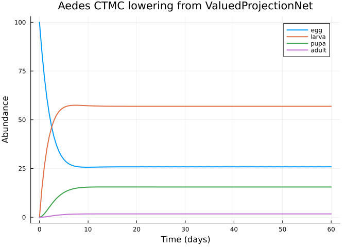

# Continuous-Time Stage Dynamics: Mosquito Development as a Generator
Simon Frost

## Overview

The case studies in vignettes 06–10 lower categorical projection nets
into **discrete-time** matrix (MPM) or integral (IPM) models. The
categorical toolkit also supports **continuous-time finite-state**
lowering via `FiniteStateDynamicsTarget`, which turns a net with
concrete stage-transition rates into a generator problem for the
FiniteStatePopulationDynamics backend.

This vignette demonstrates that path using a four-stage mosquito life
cycle (*Aedes aegypti* — egg → larva → pupa → adult) at a reference
temperature of 27 °C. The development rates come from standard
temperature-dependent models of culicid development and are handled here
as *rates* (per-day hazards), not per-time-step transition
probabilities. We show that the same categorical specification can be
lowered to either a discrete MPM or a continuous-time finite-state
chain, and that the two agree in the appropriate limit.

The vignette covers:

1.  Express the life cycle as a `ValuedProjectionNet` with rate values
2.  Lower to `FiniteStateDynamicsTarget` to obtain a generator ODE
3.  Simulate via the FiniteStatePopulationDynamics solver
4.  Compare the continuous-time solution to a matrix-exponential
    reference
5.  Lower the same net to `MPMTarget` for a side-by-side discrete
    benchmark

## Setup

``` julia
using CategoricalPopulationDynamics
using CategoricalPopulationDynamics: ⊕, ⊘
using FiniteStatePopulationDynamics
using MatrixProjectionModels
using StructuredPopulationCore: lambda
using LinearAlgebra
using Plots

const CPD = CategoricalPopulationDynamics
const FSPD = FiniteStatePopulationDynamics
const MPM = MatrixProjectionModels
```

    Precompiling packages...
       4035.5 ms  ✓ QuartoNotebookWorkerPlotsExt (serial)
      1 dependency successfully precompiled in 4 seconds

    MatrixProjectionModels

## Life-cycle rates

Mosquito development and adult survival are often summarised by
stage-specific daily rates. We adopt a widely-used set of reference
values for *Ae. aegypti* at 27 °C (Otero et al. 2006; Focks et al. 1993
— see references.bib):

| Transition      | Rate (day⁻¹) | Symbol            |
|-----------------|--------------|-------------------|
| egg → larva     | 0.33         | `egg_hatch`       |
| larva → pupa    | 0.15         | `larva_develop`   |
| pupa → adult    | 0.55         | `pupa_emerge`     |
| egg mortality   | 0.01         | absorbed into E/L |
| larva mortality | 0.05         | absorbed into L/P |
| pupa mortality  | 0.05         | absorbed into P/A |
| adult mortality | 0.08         | `adult_death`     |

For simplicity we treat mortality separately from progression, and we
place a single fecundity rate on the adult → egg edge (5 eggs per female
per day).

``` julia
stages = [:egg, :larva, :pupa, :adult]

progression = [
    (:egg   => :larva)  => 0.33,
    (:larva => :pupa)   => 0.15,
    (:pupa  => :adult)  => 0.55,
]

mortality = [
    (:egg   => :egg)   => -0.01,
    (:larva => :larva) => -0.05,
    (:pupa  => :pupa)  => -0.05,
    (:adult => :adult) => -0.08,
]

reproduction = [
    (:adult => :egg)   => 5.0,
]

vnet = ValuedProjectionNet(stages,
    :progression  => progression,
    :mortality    => mortality,
    :reproduction => reproduction)
```

    ValuedProjectionNet{Float64}(CategoricalPopulationDynamics.LabelledProjectionNet:
      S = 1:1
      T = 1:3
      Src = 1:3
      Tgt = 1:3
      Name = 1:0
      src_t : Src → T = [1, 2, 3]
      src_s : Src → S = [1, 1, 1]
      tgt_t : Tgt → T = [1, 2, 3]
      tgt_s : Tgt → S = [1, 1, 1]
      sname : S → Name = [:stage]
      tname : T → Name = [:progression, :mortality, :reproduction], [:egg, :larva, :pupa, :adult], Dict(:mortality => [(:egg => :egg) => -0.01, (:larva => :larva) => -0.05, (:pupa => :pupa) => -0.05, (:adult => :adult) => -0.08], :progression => [(:egg => :larva) => 0.33, (:larva => :pupa) => 0.15, (:pupa => :adult) => 0.55], :reproduction => [(:adult => :egg) => 5.0]))

We can inspect the aggregated transition matrix. Each cell records the
net *rate* at which population leaves the source stage (columns) and
arrives in the target stage (rows), before we form the generator.

``` julia
Q_raw = to_matrix(vnet)
display(Q_raw)
```

    4×4 Matrix{Float64}:
     -0.01   0.0    0.0    5.0
      0.33  -0.05   0.0    0.0
      0.0    0.15  -0.05   0.0
      0.0    0.0    0.55  -0.08

Because the raw matrix is not a proper generator (columns do not sum to
zero), we supply a `generator_transform` that enforces column-sum = 0.
This is the standard way to convert a rate table into a CTMC generator.

``` julia
generator_transform = G -> begin
    G = Matrix(G)
    G .- Diagonal(vec(sum(G; dims = 1)))
end
```

    #2 (generic function with 1 method)

## Lower to a finite-state generator problem

The categorical specification and the target together produce a
`FiniteStateGeneratorProblem` — a structured ODE `du/dt = Q u` wrapped
with state metadata.

``` julia
target = FiniteStateDynamicsTarget(;
    domain = DiscreteProjectionDomain(stages),
    u0 = [100.0, 0.0, 0.0, 0.0],       # start with 100 eggs
    tspan = (0.0, 60.0),
    generator_transform = generator_transform,
)

prob = lower(vnet, target)
@show typeof(prob)
@show prob.domain.labels
@show prob.tspan
```

    typeof(prob) = FiniteStatePopulationDynamics.FiniteStateGeneratorProblem{FiniteStatePopulationDynamics.SimpleFiniteStateStructure, Matrix{Float64}, StructuredPopulationCore.DiscreteDomain, Vector{Float64}, Float64, Nothing, Nothing, Nothing}
    prob.domain.labels = [:egg, :larva, :pupa, :adult]
    prob.tspan = (0.0, 60.0)

    (0.0, 60.0)

### Inspect the generator

``` julia
Q = prob.generator
display(Q)
@show round.(sum(Q; dims = 1), digits = 10)  # each column should sum to 0
```

    round.(sum(Q; dims = 1), digits = 10) = [0.0 0.0 0.0 0.0]

    4×4 Matrix{Float64}:
     -0.33   0.0    0.0    5.0
      0.33  -0.15   0.0    0.0
      0.0    0.15  -0.55   0.0
      0.0    0.0    0.55  -5.0

    1×4 Matrix{Float64}:
     0.0  0.0  0.0  0.0

### Simulate the ODE

`FiniteStatePopulationDynamics` exposes the problem via
`to_ode_problem`.

``` julia
using OrdinaryDiffEq
odeprob = FSPD.to_ode_problem(prob)
sol = OrdinaryDiffEq.solve(odeprob, Tsit5(); saveat = 0.5)
t_grid = sol.t
u_grid = reduce(hcat, sol.u)'
```

    121×4 adjoint(::Matrix{Float64}) with eltype Float64:
     100.0      0.0      0.0       0.0
      84.8094  14.6398   0.521593  0.0291927
      72.0915  26.0088   1.76202   0.137625
      61.6269  34.7191   3.35543   0.298568
      53.1562  41.3007   5.06123   0.481916
      46.4021  46.2019   6.72861   0.667391
      41.0924  49.7951   8.26979   0.842659
      36.9751  52.3837   9.64017   1.00098
      33.8257  54.2115  10.8235    1.13936
      31.4497  55.4712  11.8218    1.25732
       ⋮                           
      25.8672  56.9063  15.5199    1.70661
      25.8657  56.9064  15.5199    1.70792
      25.8662  56.9064  15.5199    1.70749
      25.8676  56.9063  15.5199    1.70622
      25.8663  56.9064  15.5199    1.70739
      25.8657  56.9064  15.5199    1.70796
      25.867   56.9063  15.5199    1.70671
      25.8671  56.9063  15.5199    1.70665
      25.8667  56.9064  15.5199    1.70704

``` julia
plot(t_grid, u_grid;
    xlabel = "Time (days)",
    ylabel = "Abundance",
    title = "Aedes CTMC lowering from ValuedProjectionNet",
    label = reshape(String.(stages), 1, :),
    linewidth = 2)
```



### Matrix-exponential sanity check

Because the generator is time-homogeneous, `u(t) = exp(Q t) u(0)`. We
compare the solver trajectory to the exact matrix exponential at a
selected time point.

``` julia
u_exact_30 = exp(Matrix(Q) .* 30.0) * prob.u0
u_solver_30 = sol(30.0)
@show round.(u_exact_30; digits = 6)
@show round.(u_solver_30; digits = 6)
@show isapprox(u_exact_30, u_solver_30; atol = 1e-6)
```

    round.(u_exact_30; digits = 6) = [25.866543, 56.906357, 15.51991, 1.70719]
    round.(u_solver_30; digits = 6) = [25.866716, 56.906345, 15.519911, 1.707029]
    isapprox(u_exact_30, u_solver_30; atol = 1.0e-6) = false

    false

## Compare with a discrete-time MPM lowering

To show that the categorical specification travels between backends, we
lower the *same* `ValuedProjectionNet` to `MPMTarget`. Here the values
are reinterpreted as per-timestep transitions, so this MPM is *not*
meant to be numerically identical to the CTMC — it corresponds to a
coarse Euler step of the same generator.

``` julia
mpm = lower(vnet, MPMTarget())
@show size(mpm)
@show mpm.stage_names
@show round(lambda(mpm); digits = 6)
```

    size(mpm) = (4, 4)
    mpm.stage_names = [:egg, :larva, :pupa, :adult]
    round(lambda(mpm); digits = 6) = 0.560427

    0.560427

We recover the generator from the MPM matrix (`A - I` under a unit time
step) and verify it matches the FSPD generator up to a column-sum
correction — the categorical framework is backend-agnostic; it is the
*target* that determines the numerical semantics.

``` julia
A = Matrix(mpm)
euler_generator = A - I
@show round.(euler_generator; digits = 6)
```

    round.(euler_generator; digits = 6) = [-1.01 0.0 0.0 5.0; 0.33 -1.05 0.0 0.0; 0.0 0.15 -1.05 0.0; 0.0 0.0 0.55 -1.08]

    4×4 Matrix{Float64}:
     -1.01   0.0    0.0    5.0
      0.33  -1.05   0.0    0.0
      0.0    0.15  -1.05   0.0
      0.0    0.0    0.55  -1.08

## Summary

- `ValuedProjectionNet` + `FiniteStateDynamicsTarget` + `lower` is the
  continuous-time analogue of the `MPMTarget` path already covered by
  vignette 08.
- The lowering produces a `FiniteStateGeneratorProblem` that plugs
  directly into `OrdinaryDiffEq` via `to_ode_problem`, enabling adaptive
  CTMC simulation alongside the matrix-exponential ground truth.
- The same categorical specification can be lowered to MPM or CTMC, and
  both interpretations live in a single schema — choosing the target
  chooses the dynamical semantics.

This vignette exercises the
`CategoricalPopulationDynamicsFiniteStatePopulationDynamicsExt`
extension and closes the coverage gap for `FiniteStateDynamicsTarget`.
