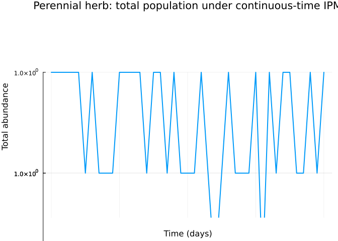
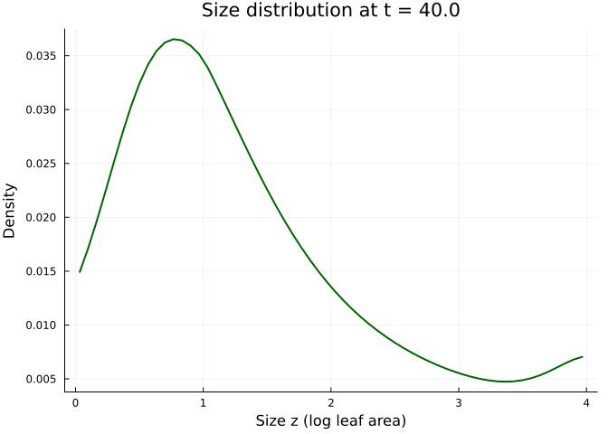
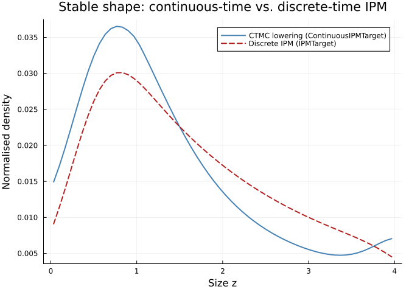

# Continuous-Time Integral Projection: Perennial Herb Size Dynamics
Simon Frost

## Overview

The classical integral projection model (IPM) in vignettes 05, 06 and 16
is a *discrete-time* map on a continuous size distribution — one
projection per census. For plants and long-lived animals with
asynchronous vital events, the continuous-time formulation `du/dt = Q u`
on a meshed size axis is often more natural: survival, growth, and
reproduction act as continuous operators, and time resolution is
decoupled from the bin width.

`ContinuousIPMTarget` is the categorical-to-continuous-time-IPM bridge
provided by the `ContinuousStatePopulationDynamics` extension. Like
`IPMTarget`, it takes one `ContinuousProjectionDomain` per state and a
dictionary of kernel functions, but it emits a
`ContinuousIPMProblem`/ODE rather than a discrete iteration.

This vignette walks through:

1.  Specifying a perennial herb life cycle as a single-state
    `LabelledProjectionNet` with three transitions (survival, growth,
    fecundity)
2.  Discretising the kernels via `left_kan_extension`
3.  Lowering to `ContinuousIPMTarget` to obtain a continuous-time
    generator
4.  Solving the resulting ODE on a size mesh
5.  Comparing the stable-state distribution to a reference discrete-time
    IPM lowering

The species is modelled on *Carduus nutans* (musk thistle), a classic
IPM system (Ellner & Rees 2006), with vital rates reparameterised to
give an interpretable continuous-time trajectory rather than a
per-census projection.

## Setup

``` julia
using CategoricalPopulationDynamics
using ContinuousStatePopulationDynamics
using IntegralProjectionModels
using StructuredPopulationCore: lambda
using LinearAlgebra
using Plots

const CPD = CategoricalPopulationDynamics
const CSPD = ContinuousStatePopulationDynamics
const IPM = IntegralProjectionModels
```

    IntegralProjectionModels

## Life-cycle kernels

Sizes are log-leaf area (dimensionless), on a bounded domain. Rates (in
day⁻¹) represent instantaneous hazards of survival loss, growth, and
fecundity. Values here are illustrative, chosen so that the CTMC
trajectory equilibrates within the simulation window.

``` julia
# Size-dependent survival hazard (lower = more likely to survive)
survival_rate(z) = 0.05 * exp(-0.4 * z)

# Growth velocity times transition kernel — individuals shift smoothly upward
growth(z_new, z) = 0.08 * exp(-0.5 * ((z_new - (z + 0.2)) / 0.3)^2) /
                    (0.3 * sqrt(2π))

# Fecundity: size-dependent reproduction to a recruit size-distribution
fecundity(z_new, z) = 0.02 * max(z - 1.0, 0.0) *
                      exp(-0.5 * ((z_new - 0.5) / 0.4)^2) /
                      (0.4 * sqrt(2π))

survival_kernel(z_new, z) = -survival_rate(z) * (z_new == z ? 1.0 : 0.0)
```

    survival_kernel (generic function with 1 method)

The survival “kernel” above is a Dirac-like diagonal; for a mesh-based
discretisation we absorb it directly into the generator via the
`generator_transform` rather than as a transition matrix, so we do not
pass a separate survival transition. Instead, we let growth and
fecundity be the two lowered transitions and apply the column-sum
correction to close the generator.

## The categorical schema

``` julia
net = LabelledProjectionNet([:size],
    :growth    => (:size => :size),
    :fecundity => (:size => :size))
```

<div class="c-set">
<span class="c-set-summary">CategoricalPopulationDynamics.LabelledProjectionNet {S:1, T:2, Src:2, Tgt:2, Name:0}</span>

|   S | sname |
|----:|------:|
|   1 |  size |

|   T |     tname |
|----:|----------:|
|   1 |    growth |
|   2 | fecundity |

| Src | src_t | src_s |
|----:|------:|------:|
|   1 |     1 |     1 |
|   2 |     2 |     1 |

| Tgt | tgt_t | tgt_s |
|----:|------:|------:|
|   1 |     1 |     1 |
|   2 |     2 |     1 |

</div>

## Domain and lowering target

``` julia
domain = ContinuousProjectionDomain(0.0, 4.0, 60)

# Column-sum closure converts a rate operator into a proper generator
generator_transform = G -> begin
    G = Matrix(G)
    G .- Diagonal(vec(sum(G; dims = 1)))
end

target = ContinuousIPMTarget(
    :size => domain;
    u0 = fill(1.0 / 60, 60),
    tspan = (0.0, 40.0),
    generator_transform = generator_transform,
)
```

    ContinuousIPMTarget{Vector{Float64}, Float64, Nothing, Nothing, var"#2#3"}(Dict{Symbol, ContinuousProjectionDomain}(:size => ContinuousProjectionDomain{Float64}(0.0, 4.0, 60)), [0.016666666666666666, 0.016666666666666666, 0.016666666666666666, 0.016666666666666666, 0.016666666666666666, 0.016666666666666666, 0.016666666666666666, 0.016666666666666666, 0.016666666666666666, 0.016666666666666666  …  0.016666666666666666, 0.016666666666666666, 0.016666666666666666, 0.016666666666666666, 0.016666666666666666, 0.016666666666666666, 0.016666666666666666, 0.016666666666666666, 0.016666666666666666, 0.016666666666666666], (0.0, 40.0), nothing, nothing, var"#2#3"(), false)

## Lower the net

``` julia
prob = lower(net, target, Dict(
    :growth    => growth,
    :fecundity => fecundity,
))

@show typeof(prob)
@show prob.domain.n_meshpoints
@show prob.tspan
```

    typeof(prob) = ContinuousStatePopulationDynamics.ContinuousIPMProblem{StructuredPopulationCore.SimpleIPM, Matrix{Float64}, StructuredPopulationCore.ContinuousDomain{Float64}, Vector{Float64}, Float64, Nothing, Nothing}
    prob.domain.n_meshpoints = 60
    prob.tspan = (0.0, 40.0)

    (0.0, 40.0)

### Inspect the generator

``` julia
Q = prob.generator
# Columns should sum to zero to machine precision
@show maximum(abs.(sum(Q; dims = 1)))
```

    maximum(abs.(sum(Q; dims = 1))) = 2.7755575615628836e-17

    2.7755575615628836e-17

## Solve the continuous-time IPM

``` julia
using OrdinaryDiffEq
odeprob = CSPD.to_ode_problem(prob)
sol = OrdinaryDiffEq.solve(odeprob, Tsit5(); saveat = 1.0)
```

    retcode: Success
    Interpolation: 1st order linear
    t: 41-element Vector{Float64}:
      0.0
      1.0
      2.0
      3.0
      4.0
      5.0
      6.0
      7.0
      8.0
      9.0
      ⋮
     32.0
     33.0
     34.0
     35.0
     36.0
     37.0
     38.0
     39.0
     40.0
    u: 41-element Vector{Vector{Float64}}:
     [0.016666666666666666, 0.016666666666666666, 0.016666666666666666, 0.016666666666666666, 0.016666666666666666, 0.016666666666666666, 0.016666666666666666, 0.016666666666666666, 0.016666666666666666, 0.016666666666666666  …  0.016666666666666666, 0.016666666666666666, 0.016666666666666666, 0.016666666666666666, 0.016666666666666666, 0.016666666666666666, 0.016666666666666666, 0.016666666666666666, 0.016666666666666666, 0.016666666666666666]
     [0.01675980747656111, 0.01693146459749651, 0.017126150404165045, 0.01732965394898435, 0.017525811784185562, 0.01769870208749741, 0.017834780144506564, 0.0179245589238728, 0.017963561215448114, 0.017952446474949865  …  0.016068608409066605, 0.016092284402261802, 0.016127871516451675, 0.016174737823105512, 0.016230375452366472, 0.01629023090725635, 0.016347954869028253, 0.016396128867638766, 0.016427393116041224, 0.016435756363650123]
     [0.016839977141063583, 0.01717230942540187, 0.01754888681852401, 0.01794269865022635, 0.01832302725527675, 0.018659519402896278, 0.0189261972810498, 0.019104668089670256, 0.019185993596317553, 0.019171004700245037  …  0.015495303634587749, 0.015539551211576531, 0.015606354112200984, 0.015694684521977947, 0.015800028953160974, 0.015913994752320304, 0.01602467748811848, 0.016117942175259563, 0.016179529890504973, 0.016197606702082586]
     [0.01690774433466165, 0.017390371428647574, 0.017936788634025494, 0.018508486189697138, 0.019061668757366385, 0.019552922268307765, 0.019944867544398483, 0.020210759916226277, 0.020337240078528784, 0.020324886508423227  …  0.014945644664967821, 0.01500766825886454, 0.015101734554640714, 0.015226613528481574, 0.015376218098150466, 0.01553894862979552, 0.015698069347027003, 0.015833392782523114, 0.015924223876970615, 0.01595306908918694]
     [0.016963673516957732, 0.01758678624825337, 0.01829169174889891, 0.019029579226180454, 0.019744930179326985, 0.0203825301426394, 0.020894556372314927, 0.02124643991440641, 0.021420460666115484, 0.021416578382392207  …  0.014418581535912878, 0.014495863095558134, 0.01461361867800824, 0.014770573814863781, 0.014959438610690606, 0.015165964992990723, 0.015369244001311061, 0.015543661290163779, 0.015662546028320592, 0.015702955801384533]
     [0.01700832285242832, 0.017762654913709975, 0.01861535871078317, 0.019508425161177116, 0.02037585458265921, 0.021151791058475637, 0.021778857465377593, 0.022215162835064133, 0.02243870390399528, 0.022448507195181863  …  0.013913117374484937, 0.01400338916526213, 0.01414160273553724, 0.014326566404345716, 0.014550104644350031, 0.014795813311537204, 0.015039207328879488, 0.01524983267207588, 0.015395496536394647, 0.015448040267405434]
     [0.01704224104471673, 0.017919043048574, 0.01890948206420026, 0.01994736446541015, 0.020957346860516528, 0.02186399654283158, 0.022601207056233037, 0.023120243321544068, 0.02339491159130756, 0.023423037738744736  …  0.01342830283211962, 0.013529526124708924, 0.01368528099115148, 0.013894558922454251, 0.014148567998116385, 0.014429180253178832, 0.014708874816281048, 0.0149529078617214, 0.01512400956375234, 0.015189055265298578]
     [0.01706596728612923, 0.01805698086405657, 0.01917568441847407, 0.020348630834670776, 0.021492173969479274, 0.02252228188857502, 0.023364884170046372, 0.023964856107553226, 0.02429191887587824, 0.024342472692429305  …  0.012963235985147306, 0.013073579840283702, 0.013244245835662716, 0.013474485830405928, 0.013755118432654216, 0.014066670024466169, 0.014379071859987144, 0.014653803964745908, 0.014848953344124274, 0.014926692911915057]
     [0.017080030192295922, 0.018177463967556193, 0.019415522072279128, 0.02071435795834796, 0.02198297433671319, 0.02312963694291126, 0.024073021095471124, 0.02475204442656012, 0.02513245916675522, 0.025209053151443894  …  0.012517058604046288, 0.012634881052133699, 0.012818089589554774, 0.013066253661358286, 0.013369991920123184, 0.013708814443592895, 0.014050543963204019, 0.014353362871970057, 0.01457113597699934, 0.014661607100187839]
     [0.017084950561245642, 0.018281454377935026, 0.01963048286919195, 0.021046573524900174, 0.022432248501209496, 0.023688895004505738, 0.02472859282641066, 0.025484712321489914, 0.025919161114287177, 0.026024961215508517  …  0.01208896034029599, 0.01221278482896443, 0.012406398118765302, 0.012669729068416038, 0.01299335501683115, 0.013356056675518833, 0.013723942992655757, 0.014052342299824694, 0.014291302127832209, 0.014394415510446994]
     ⋮
     [0.01567309335780398, 0.017862516956051403, 0.02031600798362777, 0.022930129985919628, 0.025580947690356435, 0.02813192007003312, 0.030447186535755257, 0.03240730053950085, 0.03392329087666873, 0.03494546248546596  …  0.005844047319436161, 0.005918689042150355, 0.006074903461367357, 0.006318237143457827, 0.006648001145817276, 0.0070530348610165616, 0.007506737593914057, 0.007963068813565954, 0.00835671214874156, 0.008610993899808949]
     [0.015579907086450727, 0.017779618327135222, 0.020244462236700185, 0.022872259499667404, 0.025540194787742134, 0.02811247660264613, 0.030453484092051588, 0.03244346011746359, 0.03399262200992282, 0.035050075862081496  …  0.005684538687934473, 0.005754056714777428, 0.005904123893804099, 0.006140278164092916, 0.006462062410112466, 0.006858856287343298, 0.007304914044931934, 0.007755250747077531, 0.008145547981146747, 0.008399742985189534]
     [0.015486231477883075, 0.017694812783214813, 0.020169436713588933, 0.02280921873612659, 0.025492510690878357, 0.028084335010862216, 0.03044939110686683, 0.03246769953223078, 0.03404875033517281, 0.03514051975420572  …  0.005531634182316248, 0.00559599106217197, 0.005739850747881891, 0.005968726608117336, 0.006282371501177322, 0.006670682236209091, 0.007108754107807568, 0.007552667986339534, 0.007939150213815256, 0.008192831604386736]
     [0.015392248150236933, 0.01760838657052817, 0.020091333045973558, 0.02274152760333896, 0.025438528137511254, 0.028048226945531086, 0.03043571628574683, 0.032480876176133495, 0.03409254934882116, 0.03521764979801502  …  0.005385093446777389, 0.005444262258184062, 0.005581870499608721, 0.0058033922082495, 0.006108769181654878, 0.0064883920146177705, 0.006918180903556311, 0.00735528787793974, 0.007737523689571767, 0.007990287571234074]
     [0.015298128624602728, 0.017520610484074824, 0.020010531524399182, 0.022669678815899638, 0.02537884743355379, 0.028004847535917636, 0.0304132293189603, 0.03248380783865415, 0.03412485439435434, 0.03528228689908679  …  0.005244684403216278, 0.005298648133871335, 0.005429976237369725, 0.005644089757042059, 0.005941099171661516, 0.0063118653021046, 0.006733115101534053, 0.0071630726830493084, 0.007540666247329929, 0.007792130941656342]
     [0.015204034325025399, 0.01743173986761584, 0.019927391098276515, 0.022594137894957088, 0.025314036453085727, 0.027954855389701945, 0.030382660881498814, 0.03247727270642652, 0.03414646266234283, 0.03533521723239943  …  0.005110183251233765, 0.005158934177498946, 0.005283967661927172, 0.005490639106881863, 0.005779208148786947, 0.006140982150736261, 0.006553474919437203, 0.006975979577422759, 0.007348568722092338, 0.007598374013669586]
     [0.015110116578504406, 0.01734201461367381, 0.01984224937588184, 0.022515343168213135, 0.025244630638353648, 0.02789887259297929, 0.03034470263307682, 0.032462009363235754, 0.034158133190441115, 0.03537719224233237  …  0.004981374468133177, 0.005024913534539601, 0.005143651086420476, 0.0053428651699899965, 0.0056229457480942305, 0.0059756229851108756, 0.006379176123302707, 0.006793960651397997, 0.007161214944950566, 0.007409021327381135]
     [0.015016516614993727, 0.01725165916353287, 0.01975542262435703, 0.022433705769922943, 0.025171132999770945, 0.027837484710260138, 0.030300007218131638, 0.03243871679001834, 0.03416058686338771, 0.03540892864266604  …  0.004858050808920322, 0.004896387007673547, 0.005008839436366197, 0.005200597918421762, 0.005472164562119769, 0.005815668602357993, 0.006210132027508045, 0.0066169629098963, 0.006978581743085147, 0.007224069664989583]
     [0.014923365567401845, 0.017160882507238677, 0.01966720576970952, 0.022349609640895024, 0.025094014115917797, 0.027771240784470134, 0.030249188265823436, 0.03240805436486215, 0.03415450641300513, 0.03543110841658187  …  0.004740013306303463, 0.004773163056788553, 0.004879352249658018, 0.005063672384066663, 0.005326720140873285, 0.005661000172138574, 0.006046253494771201, 0.006444928272422299, 0.006800638939765552, 0.0070435080507847666]

``` julia
t_grid = sol.t
u_mat = reduce(hcat, sol.u)
total = sum(u_mat; dims = 1)'
mesh = CPD.meshpoints(domain)

plot(t_grid, total;
    xlabel = "Time (days)",
    ylabel = "Total abundance",
    title = "Perennial herb: total population under continuous-time IPM",
    legend = false,
    linewidth = 2)
```



``` julia
plot(mesh, u_mat[:, end];
    xlabel = "Size z (log leaf area)",
    ylabel = "Density",
    title = "Size distribution at t = $(t_grid[end])",
    legend = false,
    linewidth = 2,
    color = :darkgreen)
```



## Compare with a discrete-time IPM lowering

To validate the categorical bridge, we lower the same net via the
classical `IPMTarget` path and compare the stable structure. The two
representations correspond to different time semantics (continuous
vs. discrete), so they will not coincide pointwise, but their dominant
modes should align.

``` julia
target_ipm = IPMTarget(:size => domain)
ipm_prob = lower(net, target_ipm, Dict(
    :growth    => growth,
    :fecundity => fecundity,
))
ipm_sol = IPM.solve(ipm_prob, IPM.EigenAnalysis())
λ_ipm = IPM.lambda(ipm_sol)
w_ipm = IPM.stable_distribution(ipm_sol)

@show round(λ_ipm; digits = 6)
```

    round(λ_ipm; digits = 6) = 0.090342

    0.090342

``` julia
# Normalise both to sum = 1 for shape comparison
u_ctmc = u_mat[:, end] ./ sum(u_mat[:, end])
w_ipm_norm = w_ipm ./ sum(w_ipm)

plot(mesh, u_ctmc;
    xlabel = "Size z",
    ylabel = "Normalised density",
    title = "Stable shape: continuous-time vs. discrete-time IPM",
    label = "CTMC lowering (ContinuousIPMTarget)",
    linewidth = 2,
    color = :steelblue)
plot!(mesh, w_ipm_norm;
    label = "Discrete IPM (IPMTarget)",
    linewidth = 2,
    linestyle = :dash,
    color = :firebrick)
```



## Summary

- A single `LabelledProjectionNet` can drive either a discrete-time
  `IPMTarget` (vignette 05) or a continuous-time `ContinuousIPMTarget`,
  and the two targets share the same kernel API
  (`Dict{Symbol, kernel_function}`).
- The continuous-time form emits a `ContinuousIPMProblem` whose
  generator satisfies `sum(Q; dims = 1) ≈ 0` once `generator_transform`
  is applied.
- Normalised stable distributions from the two lowerings agree in shape,
  as expected for the leading eigenmode of the semigroup generator and
  the companion discrete-time map.

This vignette exercises the
`CategoricalPopulationDynamicsContinuousStatePopulationDynamicsExt`
extension and closes the coverage gap for `ContinuousIPMTarget`.
