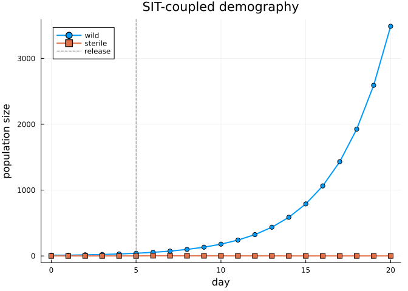

# Coupled Demographic Systems: Sterile Insect Technique as a ProjectionSystem
Simon Frost

## Overview

Many applied demographic problems involve **two or more interacting
populations** whose matrices depend on each other’s state. Sterile
Insect Technique (SIT) is the canonical example: a wild, reproductively
competent population shares a mating pool with a released, sterile
population. Every day

1.  sterile adults *dilute* the effective fertility of wild females,
2.  an operational programme *releases* additional sterile adults, and
3.  both populations are projected by their own Lefkovitch matrix.

None of the existing categorical constructs (`ValuedProjectionNet`,
`NestableVPN`, or `LabelledProjectionNet`) can carry the mutual coupling
on their own — each is a single model. `ProjectionSystemNet` is the thin
categorical wrapper that bundles several component nets into a *named
system*, and `StateDependentMPMTarget` is the lowering target that turns
the bundle into a coupled, stateful `CoupledMPMProblem` in
`MatrixProjectionModels.jl`.

This vignette closes the coverage gap for three previously unused
exports:

- [`ProjectionSystemNet`](#building-the-system)
- [`component_names`](#building-the-system)
- [`StateDependentMPMTarget`](#lowering-to-a-coupled-mpm)

## Setup

``` julia
using CategoricalPopulationDynamics
using MatrixProjectionModels
using StructuredPopulationCore: lambda
using LinearAlgebra
using Plots
```

## Two local models

We model wild (`:wild`) and sterile (`:sterile`) mosquitoes on a common
juvenile/adult stage decomposition. Survival numbers are illustrative
and on the same order used in the SIT modelling literature for *Aedes
aegypti* (Dumont & Tchuenche, 2012).

``` julia
wild = ValuedProjectionNet([:juvenile, :adult],
    :survival   => [(:juvenile => :adult) => 0.40,
                    (:adult    => :adult) => 0.70],
    :fecundity  => [(:adult    => :juvenile) => 1.50])

sterile = ValuedProjectionNet([:juvenile, :adult],
    :survival   => [(:juvenile => :adult) => 0.20,
                    (:adult    => :adult) => 0.80])

stage_names(wild), stage_names(sterile)
```

    ([:juvenile, :adult], [:juvenile, :adult])

Each component is a standalone matrix under its own right Kan extension:

``` julia
A_wild_iso = to_matrix(wild)
λ_wild_iso = lambda(A_wild_iso)
```

    1.2

``` julia
A_sterile_iso = to_matrix(sterile)
λ_sterile_iso = lambda(A_sterile_iso)
```

    0.8

In isolation the wild population grows (`λ > 1`) and the sterile
population decays. Coupling has to happen at lowering time.

## Building the system

A `ProjectionSystemNet` is a named, ordered bundle of components. The
ordering is preserved so that lowered `PopulationSystem` layouts are
reproducible.

``` julia
system = ProjectionSystemNet(:wild => wild, :sterile => sterile)
component_names(system)
```

    2-element Vector{Symbol}:
     :wild
     :sterile

Components are accessible by name, and the system participates in
dictionary protocols (`keys`, `length`, `pairs`):

``` julia
length(system), keys(system), haskey(system, :wild)
```

    (2, [:wild, :sterile], true)

``` julia
system[:wild] === wild
```

    true

## Lowering to a coupled MPM

`StateDependentMPMTarget` is the lowering target that takes a
`ProjectionSystemNet` and produces a `CoupledMPMProblem`. Its keyword
arguments describe:

- `initial_populations`: stage vectors for each component, keyed by
  component name
- `state`: a `NamedTuple` of auxiliary mutable quantities shared across
  rules, events, and observables (here, a fertility dilution factor)
- `rules`: per-step transitions that mutate stages (here, a wild
  reproduction rule that consults the fertility scale)
- `events`: scheduled perturbations (here, a single-day sterile male
  release)
- `observables`: per-day scalar summaries of the whole system
- `metadata`: per-component species/type/patch tags that survive into
  the lowered `PopulationComponent`

``` julia
target = StateDependentMPMTarget(
    Dict(:wild => [10.0, 2.0], :sterile => [0.0, 0.0]),
    (0, 20);
    state = (fertility_scale = 0.5,),
    rules = [ReproductionRule(:wild,
        (sys, day, p) -> get_state(sys, :fertility_scale) *
                         sys[:wild].population[2];
        name = :wild_births)],
    events = [SingleDayRelease(:sterile, 4.0, 5; stage_idx = 2)],
    observables = [Observable(:total,
                              (sys, day, p) -> total_population(sys))],
    metadata = Dict(
        :wild    => (species = :fly, type = :wild,    patch = :north),
        :sterile => (species = :fly, type = :sterile, patch = :north)),
)
```

    StateDependentMPMTarget{Dict{Symbol, AbstractVector}, Nothing, Vector{Union{}}, Vector{ReproductionRule{var"#3#4"}}, Vector{SingleDayRelease{Float64}}, Vector{Observable{var"#5#6"}}, Dict{Symbol, @NamedTuple{species::Symbol, type::Symbol, patch::Symbol}}, @NamedTuple{fertility_scale::Float64}, Dict{Symbol, Function}}(Dict{Symbol, AbstractVector}(:wild => [10.0, 2.0], :sterile => [0.0, 0.0]), (0, 20), nothing, Union{}[], ReproductionRule{var"#3#4"}[ReproductionRule{var"#3#4"}(:wild_births, :wild, 1, var"#3#4"())], SingleDayRelease{Float64}[SingleDayRelease{Float64}(:release_sterile, :sterile, 2, 4.0, 5)], Observable{var"#5#6"}[Observable{var"#5#6"}(:total, var"#5#6"())], Dict(:wild => (species = :fly, type = :wild, patch = :north), :sterile => (species = :fly, type = :sterile, patch = :north)), (fertility_scale = 0.5,), Dict{Symbol, Function}(), false)

The categorical step is a single `lower` call. No hand-rolled matrix
bookkeeping is needed: the extension threads the ordered components into
a `PopulationSystem`, attaches the stateful machinery, and returns a
problem object that `MatrixProjectionModels.solve` understands.

``` julia
prob = lower(system, target)
prob isa CoupledMPMProblem
```

    true

The lowered system carries the metadata we attached:

``` julia
(prob.system[:wild].species,
 prob.system[:wild].type,
 prob.system[:sterile].type,
 get_state(prob.system, :fertility_scale))
```

    (:fly, :wild, :sterile, 0.5)

## Solving

`DirectIteration` is the deterministic matrix-multiplication solver. It
applies, for each day in `tspan`: substeps → rules → events → component
projection → observables.

``` julia
sol = solve(prob, DirectIteration())
sol.retcode, length(sol[:wild]), length(sol[:sterile])
```

    (:Success, 21, 21)

## Trajectories

Stage totals over the 20-day horizon, with the sterile release on day 5
clearly visible:

``` julia
days = 0:length(sol[:wild]) - 1
wild_total    = [sum(v) for v in sol[:wild]]
sterile_total = [sum(v) for v in sol[:sterile]]

plot(days, wild_total;
     label = "wild", lw = 2, marker = :circle,
     xlabel = "day", ylabel = "population size",
     title = "SIT-coupled demography")
plot!(days, sterile_total;
      label = "sterile", lw = 2, marker = :square)
vline!([5]; label = "release", lw = 1, ls = :dash, color = :grey)
```



The `:total` observable collects the system-wide sum *after* each day’s
update, including the release:

``` julia
sol.observables[:total]
```

    21-element Vector{Any}:
       12.0
       11.100000000000001
       17.190000000000005
       22.131
       30.231900000000003
       40.48731000000001
       57.777719000000005
       75.97233310000001
      100.86573119000002
      134.621757931
        ⋮
      325.00555588391904
      436.94197993071305
      587.6806901239933
      790.6214687948218
     1063.8026637695752
     1431.5032208933833
     1926.4008508448876
     2592.475781319707
     3488.9191801132906

## Lifting a single component back to a matrix

Each component of the coupled problem still carries its base MPM, which
can be inspected with familiar matrix tooling:

``` julia
base_wild = prob.system[:wild].model
Matrix(base_wild.A), lambda(base_wild)
```

    ([0.0 1.5; 0.4 0.7], 1.2)

## Summary

| Export | Where |
|----|----|
| `ProjectionSystemNet` | `system = ProjectionSystemNet(:wild => wild, :sterile => sterile)` |
| `component_names` | iteration / TOC of the bundle |
| `StateDependentMPMTarget` | target wired with state / rules / events / observables |

Coupling is expressed once, at the lowering step. The individual
`ValuedProjectionNet`s remain pure categorical specifications — free of
any runtime, rule, or event semantics — and the coupling logic is
confined to the target’s keyword arguments. This separation is the same
Kan-extension discipline used throughout the library: *kernel is
geometry, scheduling is metadata*.

## References

- Dumont, Y. and Tchuenche, J. M. (2012). Mathematical studies on the
  sterile insect technique for the Chikungunya disease and *Aedes
  albopictus*. *Journal of Mathematical Biology* 65:809–854.
