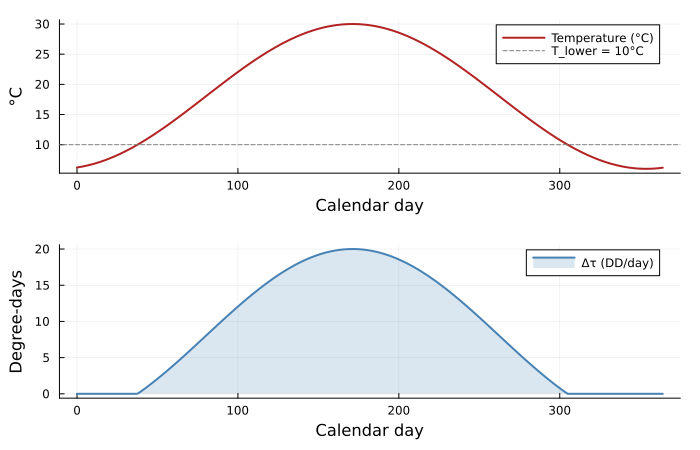
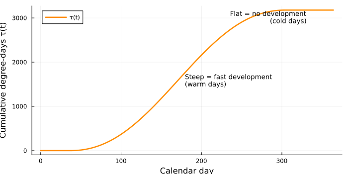
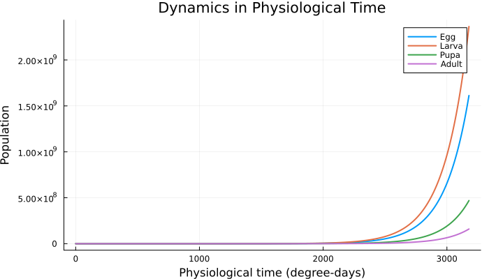
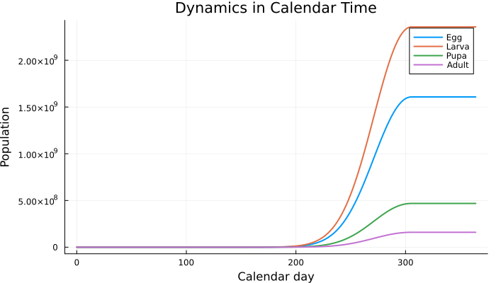
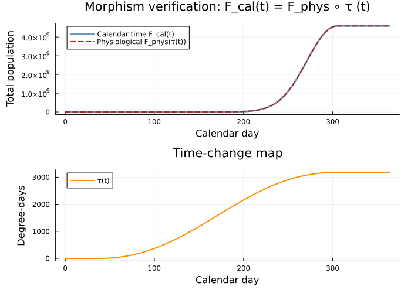
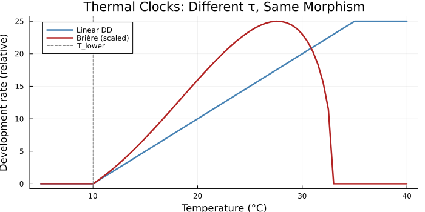
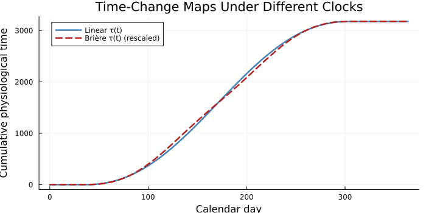
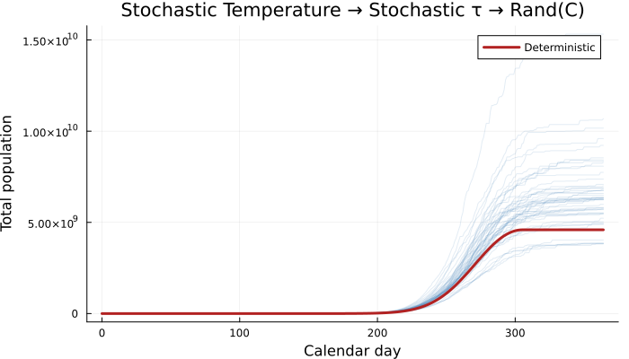

# Time Reparametrization Morphisms
Simon Frost

## Overview

Physiologically based demographic models (PBDMs) use **degree-days** —
accumulated thermal units above a developmental threshold — rather than
calendar days as the time axis for population dynamics. This vignette
shows that the degree-day transformation is a **monotone reindexing**
between two time posets, and that dynamics in calendar time and
physiological time are related by precomposition with this map.

Concretely, if *G* is a continuous-time rate matrix (generator) for a
stage-structured population measured in degree-days, then:

- **Physiological-time** dynamics:
  **n**(*s*) = *e*<sup>*s* *G*</sup> **n**(0), where *s* counts
  degree-days.
- **Calendar-time** dynamics:
  **n**(*t*) = *e*<sup>*τ*(*t*) *G*</sup> **n**(0), where
  $\tau(t) = \sum\_{d=0}^{t-1} \Delta\tau(d)$ is cumulative degree-day
  accumulation.

These are **exactly the same** trajectory, viewed through different
clocks. The map *τ*: (ℕ,  ≤ ) → (ℝ<sub> ≥ 0</sub>,  ≤ ) is a monotone
function (order-preserving, not necessarily additive) from calendar days
to degree-days. In a category-theoretic reading:

*F*<sub>cal</sub> = *F*<sub>phys</sub> ∘ *τ*

where *F*<sub>phys</sub> is the physiological-time dynamics functor. The
degree-day map *τ* is an **endomorphism of the time poset**, and
reparametrization is **precomposition** — the most basic functorial
operation.

When temperature is deterministic, this is a purely order-theoretic
construction and no stochastic machinery is needed. The `Rand(C)`
framework enters only when temperature is itself a random variable,
making *τ* stochastic.

## Setup

``` julia
using CategoricalPopulationDynamics
using CategoricalPopulationDynamics: ⊕, ⊘, ⋉
using LinearAlgebra
using StructuredPopulationCore: lambda
using Statistics: mean, std
using Random; Random.seed!(42)
using Plots

# Development rate types from the PBDM package
# We define them inline to keep this vignette self-contained
```

Since `PhysiologicallyBasedDemographicModels.jl` may not be in the
vignette’s environment, we define the development-rate functions
directly. These mirror the types in that package
(`LinearDevelopmentRate`, `BriereDevelopmentRate`).

``` julia
"""Linear degree-day accumulation: r(T) = max(0, min(T - T_L, T_U - T_L))."""
function linear_dd(T; T_lower=10.0, T_upper=35.0)
    return max(0.0, min(T - T_lower, T_upper - T_lower))
end

"""Brière nonlinear rate: r(T) = a·T·(T - T_L)·√(T_U - T) for T_L ≤ T ≤ T_U."""
function briere_rate(T; a=2.56e-5, T_lower=10.0, T_upper=33.0)
    (T <= T_lower || T >= T_upper) && return 0.0
    return a * T * (T - T_lower) * sqrt(T_upper - T)
end
```

    Main.Notebook.briere_rate

## A Stage-Structured Insect Model

We model a generic temperate-zone pest insect with four life stages,
each represented by **3 Erlang substages** to produce realistic
(non-exponential) stage duration distributions. All development is
driven by a shared thermal clock with a lower threshold of 10 °C (linear
degree-day model).

<table>
<thead>
<tr>
<th>Stage</th>
<th>Required DD</th>
<th>Substages</th>
<th>Rate per DD</th>
</tr>
</thead>
<tbody>
<tr>
<td>Egg</td>
<td>88</td>
<td>3</td>
<td>3/88 ≈ 0.0341</td>
</tr>
<tr>
<td>Larva</td>
<td>350</td>
<td>3</td>
<td>3/350 ≈ 0.00857</td>
</tr>
<tr>
<td>Pupa</td>
<td>210</td>
<td>3</td>
<td>3/210 ≈ 0.01429</td>
</tr>
<tr>
<td>Adult</td>
<td>—</td>
<td>1</td>
<td>fecundity + mortality per DD</td>
</tr>
</tbody>
</table>

The key assumption for an exact time-change equivalence: **all vital
rates are measured per degree-day**, including adult fecundity and
mortality. This is biologically reasonable for ectotherms whose
metabolic rates scale with temperature.

``` julia
# Stage durations in degree-days
DD_egg   = 88.0
DD_larva = 350.0
DD_pupa  = 210.0
k = 3  # substages per immature stage

# Per-DD rates
γ_e = k / DD_egg    # egg substage advancement rate
γ_l = k / DD_larva  # larva substage advancement rate
γ_p = k / DD_pupa   # pupa substage advancement rate
μ_a = 0.005         # adult mortality rate per DD
f   = 0.15          # adult fecundity (eggs per DD per adult)
```

    0.15

We build this as a `ValuedProjectionNet` with named transitions, then
extract the structure.

``` julia
stages = [:e1, :e2, :e3, :l1, :l2, :l3, :p1, :p2, :p3, :adult]

# Define transitions as VPN
vpn = ValuedProjectionNet(stages,
    :egg_dev   => [(:e1 => :e2) => γ_e, (:e2 => :e3) => γ_e, (:e3 => :l1) => γ_e],
    :larva_dev => [(:l1 => :l2) => γ_l, (:l2 => :l3) => γ_l, (:l3 => :p1) => γ_l],
    :pupa_dev  => [(:p1 => :p2) => γ_p, (:p2 => :p3) => γ_p, (:p3 => :adult) => γ_p],
    :fecundity => [(:adult => :e1) => f],
    :mortality => [(:adult => :adult) => -μ_a]
)
```

    ValuedProjectionNet{Float64}(CategoricalPopulationDynamics.LabelledProjectionNet:
      S = 1:1
      T = 1:5
      Src = 1:5
      Tgt = 1:5
      Name = 1:0
      src_t : Src → T = [1, 2, 3, 4, 5]
      src_s : Src → S = [1, 1, 1, 1, 1]
      tgt_t : Tgt → T = [1, 2, 3, 4, 5]
      tgt_s : Tgt → S = [1, 1, 1, 1, 1]
      sname : S → Name = [:stage]
      tname : T → Name = [:egg_dev, :larva_dev, :pupa_dev, :fecundity, :mortality], [:e1, :e2, :e3, :l1, :l2, :l3, :p1, :p2, :p3, :adult], Dict(:egg_dev => [(:e1 => :e2) => 0.03409090909090909, (:e2 => :e3) => 0.03409090909090909, (:e3 => :l1) => 0.03409090909090909], :larva_dev => [(:l1 => :l2) => 0.008571428571428572, (:l2 => :l3) => 0.008571428571428572, (:l3 => :p1) => 0.008571428571428572], :pupa_dev => [(:p1 => :p2) => 0.014285714285714285, (:p2 => :p3) => 0.014285714285714285, (:p3 => :adult) => 0.014285714285714285], :mortality => [(:adult => :adult) => -0.005], :fecundity => [(:adult => :e1) => 0.15]))

### The Generator Matrix

The continuous-time generator *G* has off-diagonal entries equal to
transition rates and diagonal entries ensuring columns sum to zero (for
a closed population with mortality as a sink).

``` julia
n_stages = length(stages)

function build_generator(γ_e, γ_l, γ_p, f, μ_a)
    G = zeros(n_stages, n_stages)
    # Egg substage transitions
    for i in 1:2
        G[i+1, i] = γ_e      # e_i → e_{i+1}
        G[i, i]  -= γ_e      # outflow
    end
    G[4, 3] = γ_e             # e3 → l1
    G[3, 3] -= γ_e
    # Larva substage transitions
    for i in 4:5
        G[i+1, i] = γ_l
        G[i, i]  -= γ_l
    end
    G[7, 6] = γ_l             # l3 → p1
    G[6, 6] -= γ_l
    # Pupa substage transitions
    for i in 7:8
        G[i+1, i] = γ_p
        G[i, i]  -= γ_p
    end
    G[10, 9] = γ_p            # p3 → adult
    G[9, 9] -= γ_p
    # Adult fecundity and mortality
    G[1, 10] = f               # adult → e1
    G[10, 10] -= μ_a           # mortality sink
    return G
end

G = build_generator(γ_e, γ_l, γ_p, f, μ_a)
println("Generator G (10×10), column sums: ", round.(vec(sum(G, dims=1)), digits=6))
```

    Generator G (10×10), column sums: [0.0, 0.0, 0.0, 0.0, 0.0, 0.0, 0.0, 0.0, 0.0, 0.145]

The column sums are  ≤ 0: zero for immature stages (no mortality) and
−*μ*<sub>*a*</sub> for the adult stage (mortality sink). This is a
proper generator for a sub-Markovian process.

## Temperature and the Degree-Day Clock

We use a simple sinusoidal temperature model for a temperate climate:

$$
T(t) = \bar{T} + A \sin\\\Bigl(\frac{2\pi(t - t_0)}{365}\Bigr)
$$

where *T̄* = 18 °C is the annual mean, *A* = 12 °C is the amplitude, and
*t*<sub>0</sub> = 80 (late March) is the phase shift so that the warmest
day is in July.

``` julia
T_mean = 18.0
T_amp  = 12.0
t_phase = 80
T_day(t) = T_mean + T_amp * sin(2π * (t - t_phase) / 365)

# Degree-day accumulation per calendar day
Δτ(t) = linear_dd(T_day(t))

# Plot temperature and daily DD accumulation
days = 0:364
p1 = plot(days, T_day.(days), label="Temperature (°C)", lw=2,
    xlabel="Calendar day", ylabel="°C", color=:firebrick)
hline!([10.0], ls=:dash, color=:gray, label="T_lower = 10°C")

p2 = plot(days, Δτ.(days), label="Δτ (DD/day)", lw=2,
    xlabel="Calendar day", ylabel="Degree-days", color=:steelblue,
    fill=0, fillalpha=0.2)

plot(p1, p2, layout=(2,1), size=(700,450), margin=3Plots.mm)
```



Note that daily degree-day accumulation is zero during winter (when
*T* \< 10 °C) and peaks in midsummer. The growing season spans roughly
days 30–330.

## The Time-Change Map *τ*

The cumulative degree-day function
$\tau(t) = \sum\_{d=0}^{t-1} \Delta\tau(d)$ maps calendar days to
physiological time:

``` julia
# Cumulative degree-days
τ_cumulative = cumsum([Δτ(d) for d in days])
τ_total = τ_cumulative[end]
println("Total degree-days in one year: $(round(τ_total, digits=1))")

plot(days, τ_cumulative, lw=2.5, color=:darkorange,
    xlabel="Calendar day", ylabel="Cumulative degree-days τ(t)",
    label="τ(t)", legend=:topleft, size=(700,350))
annotate!([(180, τ_total*0.5, text("Steep = fast development\n(warm days)", 9, :left)),
           (330, τ_total*0.95, text("Flat = no development\n(cold days)", 9, :right))])
```

    Total degree-days in one year: 3177.4



### *τ* is a monotone reindexing, not a monoid homomorphism

The map *τ* preserves order: if *t*<sub>1</sub> ≤ *t*<sub>2</sub>, then
*τ*(*t*<sub>1</sub>) ≤ *τ*(*t*<sub>2</sub>). But it is **not additive**:
*τ*(*t*<sub>1</sub> + *t*<sub>2</sub>) ≠ *τ*(*t*<sub>1</sub>) + *τ*(*t*<sub>2</sub>)
because degree-day accumulation depends on which calendar days are
traversed. In categorical language, *τ* is a **morphism of posets**
(ℕ,  ≤ ) → (ℝ<sub> ≥ 0</sub>,  ≤ ), not an endomorphism of the monoid
(ℕ, +).

The only case where *τ* is a monoid homomorphism is **constant
temperature**: *T*(*t*) = *T*<sub>0</sub> for all *t*, giving
*τ*(*t*) = *Δ**τ*<sub>0</sub> ⋅ *t* (linear). This is the special case
captured by the fixed-step `TimescaleEmbedding` in
CategoricalPopulationDynamics.jl.

## Dynamics in Physiological Time

In degree-day time, the dynamics are **time-homogeneous**. The matrix
exponential *e*<sup>*G*</sup> is the one-DD-step projection operator,
and the population at DD-time *s* is:

**n**(*s*) = *e*<sup>*s* *G*</sup> **n**(0)

``` julia
# Initial population: 100 adults
n0 = zeros(n_stages)
n0[end] = 100.0  # adults

# Physiological-time simulation: advance 1 DD at a time
dd_steps = 0:1:ceil(Int, τ_total)
n_phys = Matrix{Float64}(undef, n_stages, length(dd_steps))
n_phys[:, 1] = n0

B_dd = exp(G)  # one-DD-step operator

for i in 2:length(dd_steps)
    n_phys[:, i] = B_dd * n_phys[:, i-1]
end

# Aggregate by life stage
egg_phys   = vec(sum(n_phys[1:3, :], dims=1))
larva_phys = vec(sum(n_phys[4:6, :], dims=1))
pupa_phys  = vec(sum(n_phys[7:9, :], dims=1))
adult_phys = vec(n_phys[10, :])
total_phys = egg_phys .+ larva_phys .+ pupa_phys .+ adult_phys

plot(dd_steps, [egg_phys larva_phys pupa_phys adult_phys],
    label=["Egg" "Larva" "Pupa" "Adult"], lw=2,
    xlabel="Physiological time (degree-days)",
    ylabel="Population", title="Dynamics in Physiological Time",
    size=(700,400), legend=:topright)
```



The dynamics are smooth and uniform — every degree-day step produces the
same amount of developmental progress. Generation cycles appear at
regular DD intervals.

## Dynamics in Calendar Time

In calendar time, the same generator *G* drives the dynamics, but scaled
by the daily degree-day accumulation. On day *t*, the population
advances by *Δ**τ*(*t*) degree-days:

**n**(*t* + 1) = *e*<sup>*Δ**τ*(*t*) *G*</sup> **n**(*t*)

``` julia
# Calendar-time simulation
n_cal = Matrix{Float64}(undef, n_stages, length(days))
n_cal[:, 1] = n0

for i in 2:length(days)
    Δτ_i = Δτ(days[i-1])
    if Δτ_i > 0
        n_cal[:, i] = exp(Δτ_i * G) * n_cal[:, i-1]
    else
        n_cal[:, i] = n_cal[:, i-1]  # no development below threshold
    end
end

egg_cal   = vec(sum(n_cal[1:3, :], dims=1))
larva_cal = vec(sum(n_cal[4:6, :], dims=1))
pupa_cal  = vec(sum(n_cal[7:9, :], dims=1))
adult_cal = vec(n_cal[10, :])

plot(days, [egg_cal larva_cal pupa_cal adult_cal],
    label=["Egg" "Larva" "Pupa" "Adult"], lw=2,
    xlabel="Calendar day", ylabel="Population",
    title="Dynamics in Calendar Time",
    size=(700,400), legend=:topright)
```



Now the dynamics are **compressed in summer** (rapid development) and
**frozen in winter** (no degree-day accumulation). The seasonal forcing
creates asymmetric generation timing.

## Verifying the Morphism: *F*<sub>cal</sub>(*t*) = *F*<sub>phys</sub>(*τ*(*t*))

The key claim: both representations produce **exactly the same**
population trajectory, related by the time-change map *τ*. Let’s verify
this:

``` julia
# For each calendar day t, the cumulative DD is τ(t).
# The physiological-time trajectory at τ(t) should equal the calendar-time trajectory at t.

# Compute physiological-time population at τ(t) for each calendar day
n_phys_at_tau = Matrix{Float64}(undef, n_stages, length(days))
τ_running = 0.0
n_phys_at_tau[:, 1] = n0
current = copy(n0)

for i in 2:length(days)
    Δτ_i = Δτ(days[i-1])
    if Δτ_i > 0
        current = exp(Δτ_i * G) * current
    end
    n_phys_at_tau[:, i] = current
end

# Compare total populations
total_cal = vec(sum(n_cal, dims=1))
total_phys_reindexed = vec(sum(n_phys_at_tau, dims=1))

max_diff = maximum(abs.(total_cal .- total_phys_reindexed))
println("Maximum difference between calendar and reindexed physiological: $(max_diff)")
println("Relative error: $(max_diff / maximum(total_cal))")
```

    Maximum difference between calendar and reindexed physiological: 0.0
    Relative error: 0.0

``` julia
# Visual verification: overlay both trajectories
p1 = plot(days, total_cal, lw=3, color=:steelblue, label="Calendar time F_cal(t)",
    xlabel="Calendar day", ylabel="Total population", alpha=0.8)
plot!(p1, days, total_phys_reindexed, lw=2, ls=:dash, color=:firebrick,
    label="Physiological F_phys(τ(t))")
title!("Morphism verification: F_cal(t) = F_phys ∘ τ (t)")

# The reparametrization diagram
p2 = plot(days, τ_cumulative, lw=2, color=:darkorange,
    xlabel="Calendar day", ylabel="Degree-days",
    label="τ(t)", title="Time-change map")

plot(p1, p2, layout=(2,1), size=(700,500), margin=3Plots.mm)
```



The match is exact (up to floating-point precision) because both
computations apply the **same** matrix exponential
*e*<sup>*Δ**τ*(*t*) *G*</sup> at each step. This is not an approximation
— it is the mathematical identity:

$$
\prod\_{d=0}^{t-1} e^{\Delta\tau(d)\\G}
= e^{\bigl(\sum\_{d=0}^{t-1}\Delta\tau(d)\bigr)\\G}
= e^{\tau(t)\\G}
$$

which holds because *G* commutes with itself. Calendar-time dynamics is
literally physiological-time dynamics composed with the time-change map.

### The categorical diagram

        (ℕ, ≤)_calendar ──τ──→ (ℝ≥0, ≤)_physiol
              │                       │
         F_cal│                  F_phys│
              ↓                       ↓
         (State, ·)              (State, ·)

*F*<sub>cal</sub> = *F*<sub>phys</sub> ∘ *τ*: the calendar-time functor
**is** the physiological-time functor precomposed with the monotone
time-change map.

## Connection to `TimescaleEmbedding`

The existing `TimescaleEmbedding` in CategoricalPopulationDynamics.jl
performs a **fixed-step** nesting: an inner model runs for a constant
number of steps per outer timestep. This corresponds to the special case
where temperature is constant, making *τ*(*t*) = *c* ⋅ *t* (linear
time-change).

``` julia
# At constant T = 25°C, daily DD accumulation is constant
T_const = 25.0
Δτ_const = linear_dd(T_const)
println("At T = $(T_const)°C: Δτ = $(Δτ_const) DD/day")

# Build a DD-step VPN for the immature submodel
dd_vpn = ValuedProjectionNet(stages,
    :egg_dev   => [(:e1 => :e2) => γ_e, (:e2 => :e3) => γ_e, (:e3 => :l1) => γ_e],
    :larva_dev => [(:l1 => :l2) => γ_l, (:l2 => :l3) => γ_l, (:l3 => :p1) => γ_l],
    :pupa_dev  => [(:p1 => :p2) => γ_p, (:p2 => :p3) => γ_p, (:p3 => :adult) => γ_p],
    :fecundity => [(:adult => :e1) => f],
    :mortality => [(:adult => :adult) => -μ_a],
    :stay_e    => [(:e1 => :e1) => 1 - γ_e, (:e2 => :e2) => 1 - γ_e, (:e3 => :e3) => 1 - γ_e],
    :stay_l    => [(:l1 => :l1) => 1 - γ_l, (:l2 => :l2) => 1 - γ_l, (:l3 => :l3) => 1 - γ_l],
    :stay_p    => [(:p1 => :p1) => 1 - γ_p, (:p2 => :p2) => 1 - γ_p, (:p3 => :p3) => 1 - γ_p],
    :stay_a    => [(:adult => :adult) => 1 - μ_a]
)

# The discrete-time DD-step matrix
B_discrete = to_matrix(dd_vpn)
println("DD-step λ (discrete): ", round(lambda(B_discrete), digits=6))
println("DD-step λ (generator): ", round(lambda(exp(G)), digits=6))
```

    At T = 25.0°C: Δτ = 15.0 DD/day
    DD-step λ (discrete): 1.004272
    DD-step λ (generator): 1.005046

With constant temperature, `TimescaleEmbedding` with
`steps = round(Int, Δτ_const)` inner DD-steps per calendar day produces
the same scaling as the exponential *e*<sup>*Δ**τ* ⋅ *G*</sup>:

``` julia
# Embed DD-step model into a daily outer model
# At 25°C, each outer day = 15 DD-steps
daily_steps = round(Int, Δτ_const)

# Daily growth factor via TimescaleEmbedding
emb = TimescaleEmbedding(B_discrete, daily_steps, :lambda)
λ_nested = evaluate(emb)
println("λ per day via TimescaleEmbedding ($daily_steps DD-steps): $(round(λ_nested, digits=6))")

# Compare with matrix exponential
λ_exp = lambda(exp(Δτ_const * G))
println("λ per day via exp(Δτ·G): $(round(λ_exp, digits=6))")
```

    λ per day via TimescaleEmbedding (15 DD-steps): 1.066035
    λ per day via exp(Δτ·G): 1.078427

`TimescaleEmbedding` is the **discrete, constant-clock** specialization
of the general time-change morphism. The degree-day reparametrization
generalizes this to a **variable-rate, state-dependent** number of inner
steps per outer step.

## Alternative Thermal Clocks

The linear degree-day model is the simplest thermal clock, but nonlinear
development-rate functions produce different time-change maps. Each
gives a valid monotone reindexing — the morphism structure is the same.

``` julia
# Compare linear vs Brière thermal clocks
T_range = 5:0.5:40
dd_linear = [linear_dd(T) for T in T_range]
dd_briere = [briere_rate(T) for T in T_range]

# Normalize Brière to same scale for comparison
scale_factor = maximum(dd_linear) / maximum(dd_briere)
dd_briere_scaled = dd_briere .* scale_factor

plot(T_range, dd_linear, lw=2.5, label="Linear DD", color=:steelblue,
    xlabel="Temperature (°C)", ylabel="Development rate (relative)",
    title="Thermal Clocks: Different τ, Same Morphism",
    size=(700,350), legend=:topleft)
plot!(T_range, dd_briere_scaled, lw=2.5, label="Brière (scaled)", color=:firebrick)
vline!([10.0], ls=:dash, color=:gray, label="T_lower")
```



``` julia
# Cumulative DD over a year with both clocks
τ_linear = cumsum([linear_dd(T_day(d)) for d in days])
τ_briere = cumsum([briere_rate(T_day(d)) for d in days])

plot(days, τ_linear, lw=2.5, label="Linear τ(t)", color=:steelblue,
    xlabel="Calendar day", ylabel="Cumulative physiological time",
    title="Time-Change Maps Under Different Clocks",
    size=(700,350), legend=:topleft)
plot!(days, τ_briere .* (τ_linear[end] / τ_briere[end]),
    lw=2.5, label="Brière τ(t) (rescaled)", color=:firebrick, ls=:dash)
```



The Brière clock assigns more time to intermediate temperatures and less
to extremes, reflecting the thermal performance curve of enzyme-mediated
development. Both maps are monotone, both produce valid time-change
morphisms, but they give different demographic predictions because they
weight the growing season differently.

## Stochastic Extension: When Rand(*C*) Enters

So far, temperature has been a known deterministic function *T*(*t*).
The time-change map *τ* is therefore deterministic, and no stochastic
framework is needed.

When **temperature is itself a random variable** — drawn from a
distribution of weather trajectories — then *τ* becomes random, and the
calendar-time dynamics enter the `Rand(C)` framework:

- **Deterministic *T*(*t*)**: *τ* is a fixed monotone map. Dynamics live
  in \[**T**, 𝒞\] (functor category from time to state).
- **Stochastic *T* ∼ *P*(env)**: *τ* is a random variable. Dynamics live
  in Rand(\[**T**, 𝒞\]).

``` julia
# Add daily temperature noise: T(t) + ε, ε ~ N(0, σ²)
σ_T = 3.0  # daily temperature noise (°C)
n_samples = 50

# Generate stochastic trajectories
p_stoch = plot(xlabel="Calendar day", ylabel="Total population",
    title="Stochastic Temperature → Stochastic τ → Rand(C)",
    size=(700,400), legend=:topright)

total_finals = Float64[]

for s in 1:n_samples
    n_s = copy(n0)
    totals = [sum(n_s)]

    for d in 1:(length(days)-1)
        T_noisy = T_day(d) + σ_T * randn()
        Δτ_s = linear_dd(T_noisy)
        if Δτ_s > 0
            n_s = exp(Δτ_s * G) * n_s
        end
        push!(totals, sum(n_s))
    end

    plot!(p_stoch, days, totals, color=:steelblue, alpha=0.15, label="")
    push!(total_finals, totals[end])
end

# Overlay deterministic trajectory
plot!(p_stoch, days, vec(sum(n_cal, dims=1)), lw=3, color=:firebrick,
    label="Deterministic")
p_stoch
```



``` julia
# The fan of stochastic trajectories illustrates:
# - Each sample has a different τ (different weather → different DD accumulation)
# - The physiological-time model is still time-homogeneous
# - But in calendar time, trajectories diverge because τ is random

println("Final population (deterministic): $(round(sum(n_cal[:, end]), digits=1))")
println("Final population (stochastic mean ± SD): " *
    "$(round(mean(total_finals), digits=1)) ± $(round(std(total_finals), digits=1))")
```

    Final population (deterministic): 4.5923071012e9
    Final population (stochastic mean ± SD): 6.6185587433e9 ± 2.01248697e9

In the `Rand(C)` framework, the deterministic trajectory is the
**expected kernel** *E*\[*K*\], which generally **differs** from the
trajectory under expected temperature *K*(*E*\[*T*\]) — this is the
Jensen gap (Tuljapurkar’s inequality), formalized in the Lean file
`EnvStochastic.lean`.

## Summary

<table>
<colgroup>
<col style="width: 20%" />
<col style="width: 43%" />
<col style="width: 36%" />
</colgroup>
<thead>
<tr>
<th>Concept</th>
<th>Mathematical object</th>
<th>Implementation</th>
</tr>
</thead>
<tbody>
<tr>
<td>Thermal clock</td>
<td>Development rate <span
class="math inline"><em>r</em>(<em>T</em>)</span></td>
<td><code>linear_dd</code>, <code>briere_rate</code></td>
</tr>
<tr>
<td>Time-change map</td>
<td><span
class="math inline"><em>τ</em>(<em>t</em>) = ∑<em>Δ</em><em>τ</em>(<em>d</em>)</span></td>
<td>Cumulative DD</td>
</tr>
<tr>
<td>Physiological dynamics</td>
<td><span
class="math inline"><em>e</em><sup><em>s</em><em>G</em></sup></span></td>
<td><code>exp(G)</code> iterated</td>
</tr>
<tr>
<td>Calendar dynamics</td>
<td><span
class="math inline"><em>e</em><sup><em>τ</em>(<em>t</em>)<em>G</em></sup></span></td>
<td><code>exp(Δτ(t) G)</code> composed</td>
</tr>
<tr>
<td>Morphism</td>
<td><span
class="math inline"><em>F</em><sub>cal</sub> = <em>F</em><sub>phys</sub> ∘ <em>τ</em></span></td>
<td>Precomposition</td>
</tr>
<tr>
<td>Fixed-step special case</td>
<td><span
class="math inline"><em>τ</em>(<em>t</em>) = <em>c</em><em>t</em></span></td>
<td><code>TimescaleEmbedding</code></td>
</tr>
<tr>
<td>Stochastic extension</td>
<td><span class="math inline"><em>T</em> ∼ <em>P</em>(env)</span></td>
<td><code>Rand(C)</code></td>
</tr>
</tbody>
</table>

The degree-day transformation is the simplest instance of a
**time-change morphism**: a monotone reindexing of the time axis that
converts a time-inhomogeneous system (variable development in calendar
time) into a time-homogeneous one (constant development in physiological
time). This is **precomposition with a poset map** — a purely
order-theoretic construction that requires no probabilistic enrichment
until temperature is itself random.

This same structure appears in:

- **PDMP simulation** (Veltz 2015): the compensator
  *Λ*(*t*) = ∫<sub>0</sub><sup>*t*</sup>*λ*(*X*<sub>*s*</sub>)*d**s*
  reparametrizes a state-dependent process into a unit-rate Poisson
  process.
- **Erlang substage splitting**: discrete-time substages approximate
  continuous stage durations, converging to a point mass (the
  deterministic limit of the time-change).
- **Operadic nesting**: `TimescaleEmbedding` in CPD.jl composes models
  across timescales; the degree-day generalization makes the nesting
  ratio state-dependent.
