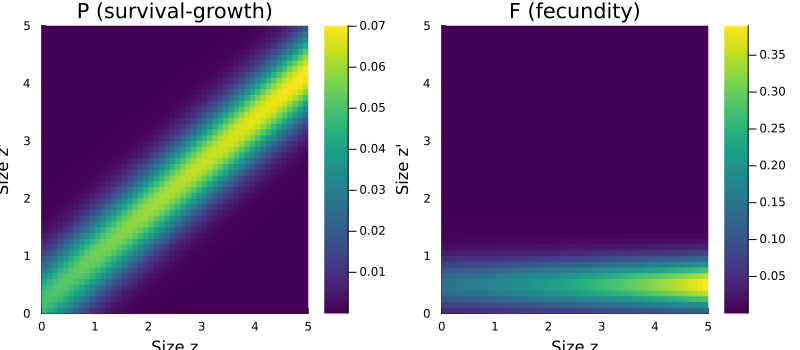

# Introduction to Categorical Projection Models
Simon Frost

## Overview

CategoricalProjectionModels.jl provides a **category-theoretic
framework** for constructing, composing, and transforming structured
population models. It sits above IntegralProjectionModels.jl (IPMs) and
MatrixProjectionModels.jl (MPMs), providing:

1.  **Abstract model specification** via ACSet schemas (projection nets)
2.  **Kan extension functors** to move between continuous kernels (IPMs)
    and discrete matrices (MPMs)
3.  **Compositional construction** via undirected wiring diagrams (UWDs)
4.  **Spatial extension** via stratification and **resolution change**
    via coarsening
5.  **Lowering/lifting** to concrete IPMProblem or MatrixProjectionModel
    objects

The mathematical foundation is the adjunction chain
$\text{Lan}_D \dashv D^* \dashv \text{Ran}_D$ between the category of
continuous kernels and the category of discrete matrices, verified by
Lean 4 proofs.

This introductory vignette demonstrates the core abstractions using a
simple perennial plant model.

## Setup

``` julia
using CategoricalProjectionModels
using Catlab
using Catlab.CategoricalAlgebra
using Catlab.WiringDiagrams
using Catlab.Programs: @relation
using LinearAlgebra
using ProjectionModels: lambda
using Plots
```

## Projection Nets: Abstract Model Specification

A **projection net** is an ACSet (attributed C-set) — a labelled
bipartite graph connecting *states* (population variables) to
*transitions* (demographic processes). This follows the pattern of
AlgebraicPetri.jl but with **additive** composition semantics
(kernels/matrices sum) rather than multiplicative (mass-action).

### A Simple One-State Model

Consider a perennial plant with a single continuous state variable (body
size) and two demographic processes: survival/growth and fecundity.

``` julia
net = LabelledProjectionNet([:size],
    :survive_grow => (:size => :size),
    :reproduce => (:size => :size))

println("States:      ", sname(net))
println("Transitions: ", tname(net))
println("n_states:    ", n_states(net))
println("n_transitions: ", n_transitions(net))
```

    States:      [:size]
    Transitions: [:survive_grow, :reproduce]
    n_states:    1
    n_transitions: 2

The projection net captures the *structure* of the model — which
processes connect which states — without specifying any numerical
details (vital rates, kernel shapes, or matrix entries).

### A Two-State Model

A juvenile-adult life cycle with three demographic processes:

``` julia
net2 = LabelledProjectionNet([:juvenile, :adult],
    :growth => (:juvenile => :adult),
    :survival => (:adult => :adult),
    :reproduction => (:adult => :juvenile))

println("States:      ", sname(net2))
println("Transitions: ", tname(net2))
for t in 1:n_transitions(net2)
    src = sources(net2, t)
    tgt = targets(net2, t)
    println("  ", tname(net2, t), ": state ", src, " → state ", tgt)
end
```

    States:      [:juvenile, :adult]
    Transitions: [:growth, :survival, :reproduction]
      growth: state [1] → state [2]
      survival: state [2] → state [2]
      reproduction: state [2] → state [1]

## Domains: Discretisation Specification

Domains specify how continuous state variables are discretised. A
`ContinuousProjectionDomain` defines the bounds and mesh resolution for
the midpoint rule.

``` julia
domain = ContinuousProjectionDomain(0.0, 5.0, 50)

println("Bounds: [", domain.lower, ", ", domain.upper, "]")
println("Mesh points: ", n_meshpoints(domain))
println("Step size h: ", step_size(domain))
println("First 5 midpoints: ", round.(meshpoints(domain)[1:5], digits=3))
```

    Bounds: [0.0, 5.0]
    Mesh points: 50
    Step size h: 0.1
    First 5 midpoints: [0.05, 0.15, 0.25, 0.35, 0.45]

For discrete state variables (e.g., seed bank, reproductive status):

``` julia
disc_domain = DiscreteProjectionDomain([:dormant, :active])
println("Discrete domain: ", disc_domain.labels, " (", n_meshpoints(disc_domain), " classes)")
```

    Discrete domain: [:dormant, :active] (2 classes)

## Vital Rate Functions

Now we attach biological meaning to the abstract transitions. Define
vital rate functions for our perennial plant:

``` julia
# Survival probability (logistic function of size)
s(z) = 1.0 / (1.0 + exp(-(0.5 + 0.3 * z)))

# Growth kernel (Gaussian, conditional on survival)
g(z_new, z) = exp(-0.5 * ((z_new - (0.2 + 0.8 * z)) / 0.5)^2) / (0.5 * sqrt(2π))

# Fecundity rate (exponential function of size)
f_rate(z) = exp(0.1 + 0.2 * z)

# Recruit size distribution (Gaussian)
recruit_dist(z_new) = exp(-0.5 * ((z_new - 0.5) / 0.3)^2) / (0.3 * sqrt(2π))

# Sub-kernels: the biological building blocks
P_kernel(z_new, z) = s(z) * g(z_new, z)   # survival-growth
F_kernel(z_new, z) = f_rate(z) * recruit_dist(z_new)  # fecundity
```

    F_kernel (generic function with 1 method)

## Left Kan Extension: Kernel → Matrix

The **left Kan extension** $\text{Lan}_D$ is the fundamental
discretisation functor. It converts a continuous kernel $K(z', z)$ into
a matrix $\mathbf{A}$ using the midpoint rule:

$$A_{ij} = h \cdot K(z_i, z_j)$$

where $h$ is the bin width and $z_i$ are the midpoints.

``` julia
A_P = left_kan_extension(P_kernel, domain)
A_F = left_kan_extension(F_kernel, domain)
A_full = A_P + A_F

println("Survival-growth matrix: ", size(A_P))
println("Fecundity matrix:       ", size(A_F))
println("λ(P) = ", round(lambda(A_P), digits=4), " (survival only)")
println("λ(A) = ", round(lambda(A_full), digits=4), " (full model)")
```

    Survival-growth matrix: (50, 50)
    Fecundity matrix:       (50, 50)
    λ(P) = 0.6929 (survival only)
    λ(A) = 1.7923 (full model)

``` julia
z = meshpoints(domain)
p1 = heatmap(z, z, A_P, title="P (survival-growth)",
    xlabel="Size z", ylabel="Size z'", color=:viridis)
p2 = heatmap(z, z, A_F, title="F (fecundity)",
    xlabel="Size z", ylabel="Size z'", color=:viridis)
plot(p1, p2, layout=(1, 2), size=(800, 350))
```



## Right Kan Extension: Matrix → Kernel

The **right Kan extension** $\text{Ran}_D$ goes the other direction —
from a matrix back to a piecewise-constant kernel:

$$K_{pw}(z', z) = \frac{A_{ij}}{h} \quad \text{where } z \in B_j,\; z' \in B_i$$

``` julia
K_pw = right_kan_extension(A_P, domain)

# The piecewise kernel reconstructs the matrix at midpoints
h = step_size(domain)
println("K_pw(z₁, z₁) = ", round(K_pw(z[1], z[1]), digits=6))
println("A[1,1] / h   = ", round(A_P[1, 1] / h, digits=6))
println("Match: ", K_pw(z[1], z[1]) ≈ A_P[1, 1] / h)
```

    K_pw(z₁, z₁) = 0.464668
    A[1,1] / h   = 0.464668
    Match: true

### Adjunction Round-Trip

The unit of the adjunction
$\eta: \text{Id} \Rightarrow \text{Lan}_D \circ \text{Ran}_D$ should be
the identity — discretising a piecewise-constant kernel recovers the
original matrix exactly:

``` julia
A_roundtrip = left_kan_extension(K_pw, domain)
println("Round-trip error ‖A' - A‖/‖A‖ = ", round(norm(A_roundtrip - A_P) / norm(A_P), digits=15))
```

    Round-trip error ‖A' - A‖/‖A‖ = 0.0

## Additive Composition

The fundamental composition operation for projection models is
**additive**: the full projection kernel is the sum of sub-kernels.

### Catlab-Free Composition

The simplest approach — directly sum discretised sub-matrices:

``` julia
A_composed = compose_transitions(Dict(:P => A_P, :F => A_F))
println("λ(composed) = ", round(lambda(A_composed), digits=6))
println("λ(direct)   = ", round(lambda(A_full), digits=6))
println("Match: ", lambda(A_composed) ≈ lambda(A_full))
```

    λ(composed) = 1.79232
    λ(direct)   = 1.79232
    Match: true

### Composition via Undirected Wiring Diagram

For more complex models, we specify the composition pattern as a UWD
using Catlab’s `@relation` macro:

``` julia
uwd = @relation (z, z_new) begin
    survive_grow(z, z_new)
    reproduce(z, z_new)
end

# Compose using ProjectionSharers
ps_P = ProjectionSharer(A_P)
ps_F = ProjectionSharer(A_F)
result = oapply(uwd, [ps_P, ps_F])

println("Composed matrix size: ", size(result.matrix))
println("λ(oapply) = ", round(lambda(result.matrix), digits=6))
```

    Composed matrix size: (50, 50)
    λ(oapply) = 1.79232

### Dictionary-Based Composition

We can also look up sharers by name from the UWD:

``` julia
sharers = Dict(
    :survive_grow => ProjectionSharer(A_P),
    :reproduce => ProjectionSharer(A_F))
result_dict = oapply(uwd, sharers)
println("λ(dict) = ", round(lambda(result_dict.matrix), digits=6))
```

    λ(dict) = 1.79232

All three composition methods produce identical results — the UWD simply
provides a formal specification of the composition pattern.

## Putting It Together

The categorical workflow connects abstract specification to concrete
analysis:

``` julia
# 1. Abstract specification (projection net)
net = LabelledProjectionNet([:size],
    :survive_grow => (:size => :size),
    :reproduce => (:size => :size))

# 2. Domain (discretisation resolution)
domain = ContinuousProjectionDomain(0.0, 5.0, 50)

# 3. Transition data (kernel functions)
kernels = Dict(
    :survive_grow => P_kernel,
    :reproduce => F_kernel)

# 4. Compose and discretise
uwd = @relation (z, z_new) begin
    survive_grow(z, z_new)
    reproduce(z, z_new)
end
K = compose_from_uwd(uwd, kernels, domain)

# 5. Analyse
println("Growth rate λ = ", round(lambda(K), digits=4))
println("Population is ", lambda(K) > 1 ? "growing" : "declining")
```

    Growth rate λ = 1.7923
    Population is growing

## Summary

In this vignette we introduced the core abstractions of
CategoricalProjectionModels.jl:

1.  **Projection nets** — ACSet schemas for abstract model specification
2.  **Domains** — continuous and discrete state variable discretisation
3.  **Left Kan extension** — discretise continuous kernels into matrices
    ($\text{Lan}_D$)
4.  **Right Kan extension** — reconstruct piecewise kernels from
    matrices ($\text{Ran}_D$)
5.  **Additive composition** — via `compose_transitions`, `oapply`
    (UWD), or `compose_from_uwd`

The next vignette explores the adjunction chain
$\text{Lan}_D \dashv D^* \dashv \text{Ran}_D$ in depth, with convergence
analysis and diagnostic tools.
