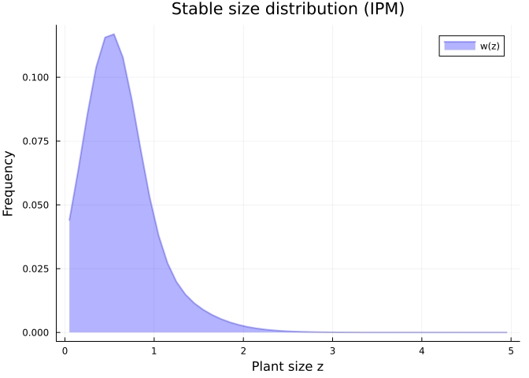
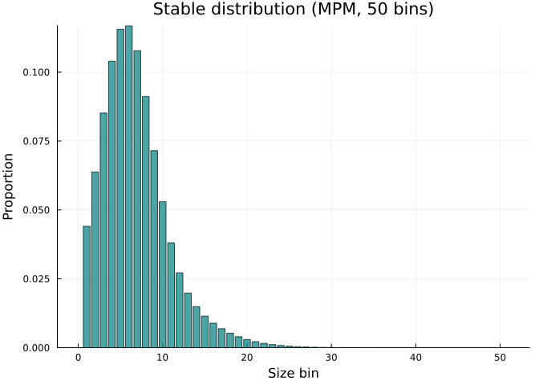
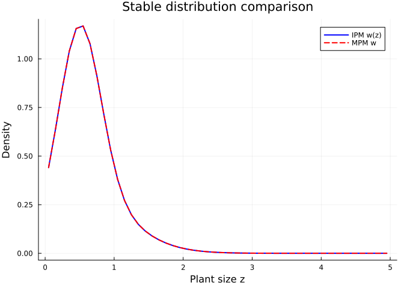
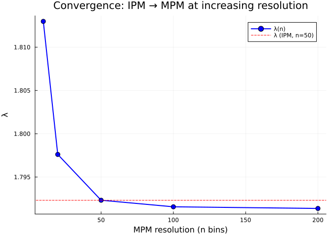

# Lowering and Lifting: Connecting IPMs, MPMs, and Categorical Nets
Simon Frost

## Overview

CategoricalProjectionModels.jl sits above IntegralProjectionModels.jl
and MatrixProjectionModels.jl, providing a unified abstract layer.
**Lowering** converts a categorical specification (projection net +
transition data) into a concrete model object. **Lifting** goes the
other direction — extracting a projection net from a concrete model.

This vignette demonstrates the full workflow: define a model
categorically, lower it to both an IPM and an MPM, analyse both
representations, and verify that they agree.

## Setup

``` julia
using CategoricalProjectionModels
import IntegralProjectionModels
import MatrixProjectionModels
using Catlab
using Catlab.CategoricalAlgebra
using Catlab.WiringDiagrams
using Catlab.Programs: @relation
using LinearAlgebra
using ProjectionModels: lambda
using Plots

const IPM = IntegralProjectionModels
const MPM = MatrixProjectionModels
```

    MatrixProjectionModels

## Step 1: Abstract Model Specification

We model a perennial herb with a single continuous state (plant size)
and two transitions:

``` julia
net = LabelledProjectionNet([:size],
    :survive_grow => (:size => :size),
    :reproduce => (:size => :size))

println("Abstract model:")
println("  States:      ", sname(net))
println("  Transitions: ", tname(net))
```

    Abstract model:
      States:      [:size]
      Transitions: [:survive_grow, :reproduce]

## Step 2: Define Vital Rates

The transition data provides the biological content — kernel functions
for each transition:

``` julia
# Survival probability (logistic)
s(z) = 1.0 / (1.0 + exp(-(0.5 + 0.3 * z)))

# Growth kernel (Gaussian)
g(z_new, z) = exp(-0.5 * ((z_new - (0.2 + 0.8 * z)) / 0.5)^2) / (0.5 * sqrt(2π))

# Fecundity
f_rate(z) = exp(0.1 + 0.2 * z)
recruit_dist(z_new) = exp(-0.5 * ((z_new - 0.5) / 0.3)^2) / (0.3 * sqrt(2π))

# Sub-kernels
P_kernel(z_new, z) = s(z) * g(z_new, z)
F_kernel(z_new, z) = f_rate(z) * recruit_dist(z_new)

transition_kernels = Dict(
    :survive_grow => P_kernel,
    :reproduce => F_kernel)
```

    Dict{Symbol, Function} with 2 entries:
      :reproduce    => F_kernel
      :survive_grow => P_kernel

## Step 3: Lower to IPM

The `IPMTarget` specifies domain information needed to construct an
`IPMProblem`:

``` julia
ipm_domain = ContinuousProjectionDomain(0.0, 5.0, 50)
target_ipm = IPMTarget(:size => ipm_domain)

ipm_prob = lower(net, target_ipm, transition_kernels)
println("IPM Problem type: ", typeof(ipm_prob))
```

    IPM Problem type: IntegralProjectionModels.IPMProblem{IntegralProjectionModels.SimpleIPM, ProjectionModels.DensityIndependent, ProjectionModels.Deterministic, IntegralProjectionModels.CustomKernel{CategoricalProjectionModelsIPMExt.var"#composed_kernel#composed_kernel##0"{Dict{Symbol, Function}, Vector{Symbol}}, IntegralProjectionModels.ContinuousDomain{Float64}}, IntegralProjectionModels.ContinuousDomain{Float64}, Vector{Float64}, Nothing, Nothing}

### Solve and Analyse the IPM

``` julia
ipm_sol = IPM.solve(ipm_prob, IPM.EigenAnalysis())
λ_ipm = IPM.lambda(ipm_sol)
println("λ (IPM) = ", round(λ_ipm, digits=6))
```

    λ (IPM) = 1.79232

``` julia
# Stable size distribution from IPM
w_ipm = IPM.stable_distribution(ipm_sol)
z_ipm = IPM.meshpoints(ipm_prob.domain)
plot(z_ipm, w_ipm,
    xlabel="Plant size z", ylabel="Frequency",
    title="Stable size distribution (IPM)",
    label="w(z)", linewidth=2, color=:blue, fill=true, alpha=0.3)
```



## Step 4: Lower to MPM

The `MPMTarget` produces a `MatrixProjectionModel`. We provide
transition data as pre-computed matrices:

``` julia
domain = ContinuousProjectionDomain(0.0, 5.0, 50)
A_P = left_kan_extension(P_kernel, domain)
A_F = left_kan_extension(F_kernel, domain)

transition_matrices = Dict(
    :survive_grow => A_P,
    :reproduce => A_F)

target_mpm = MPMTarget()
mpm = lower(net, target_mpm, transition_matrices)
println("MPM type: ", typeof(mpm))
println("Matrix size: ", size(Matrix(mpm)))
```

    MPM type: MatrixProjectionModels.MatrixProjectionModel{Float64, Matrix{Float64}}
    Matrix size: (50, 50)

### Analyse the MPM

``` julia
λ_mpm = MPM.lambda(mpm)
println("λ (MPM) = ", round(λ_mpm, digits=6))
```

    λ (MPM) = 1.79232

``` julia
# Stable stage distribution from MPM
w_mpm = MPM.stable_distribution(mpm)
bar(1:length(w_mpm), w_mpm,
    xlabel="Size bin", ylabel="Proportion",
    title="Stable distribution (MPM, 50 bins)",
    legend=false, color=:teal, alpha=0.7)
```



## Step 5: Verify Agreement

The IPM and MPM should give the same $\lambda$ when discretised at the
same resolution:

``` julia
println("λ (IPM): ", round(λ_ipm, digits=8))
println("λ (MPM): ", round(λ_mpm, digits=8))
println("Agreement: ", isapprox(λ_ipm, λ_mpm; atol=1e-6))
```

    λ (IPM): 1.79231987
    λ (MPM): 1.79231987
    Agreement: true

``` julia
# Compare stable distributions
plot(z_ipm, w_ipm ./ step_size(domain),
    label="IPM w(z)", linewidth=2, color=:blue)
plot!(z_ipm, w_mpm ./ step_size(domain),
    label="MPM w", linewidth=2, color=:red, linestyle=:dash)
xlabel!("Plant size z")
ylabel!("Density")
title!("Stable distribution comparison")
```



## Step 6: Lift MPM Back to Projection Net

The `lift` operation extracts a projection net from a concrete model.
Since a `MatrixProjectionModel` stores only the aggregated matrix
$\mathbf{A}$, the original sub-transition decomposition is not
recoverable — the lifted net has a single transition:

``` julia
lifted_net = CategoricalProjectionModels.lift(mpm, ProjectionNetTarget())
println("Lifted net:")
println("  States:      ", sname(lifted_net))
println("  Transitions: ", tname(lifted_net))
```

    Lifted net:
      States:      [:population]
      Transitions: [:projection]

## Kan Extensions as Morphisms Between IPM and MPM

The left and right Kan extensions provide **functorial morphisms**
between the IPM and MPM categories. We can use them to move between
representations at different resolutions:

### IPM → MPM at Multiple Resolutions

``` julia
resolutions = [10, 20, 50, 100, 200]
lambdas = Float64[]

for n in resolutions
    dom = ContinuousProjectionDomain(0.0, 5.0, n)
    A = left_kan_extension(
        (z_new, z) -> P_kernel(z_new, z) + F_kernel(z_new, z), dom)
    push!(lambdas, lambda(A))
end

plot(resolutions, lambdas,
    xlabel="MPM resolution (n bins)", ylabel="λ",
    title="Convergence: IPM → MPM at increasing resolution",
    marker=:circle, markersize=5,
    label="λ(n)", linewidth=2, color=:blue)
hline!([λ_ipm], label="λ (IPM, n=50)", linestyle=:dash, color=:red)
```



### MPM → IPM via Right Kan Extension

``` julia
# Start from an MPM (matrix)
dom_coarse = ContinuousProjectionDomain(0.0, 5.0, 15)
A_coarse = left_kan_extension(
    (z_new, z) -> P_kernel(z_new, z) + F_kernel(z_new, z), dom_coarse)

# Lift to piecewise kernel via right Kan extension
K_pw = right_kan_extension(A_coarse, dom_coarse)

# Re-discretise at finer resolution
dom_fine = ContinuousProjectionDomain(0.0, 5.0, 100)
A_refined = left_kan_extension(K_pw, dom_fine)

println("Original coarse (n=15): λ = ", round(lambda(A_coarse), digits=6))
println("Re-discretised (n=100): λ = ", round(lambda(A_refined), digits=6))
println("Direct fine (n=100):    λ = ", round(lambda(left_kan_extension(
    (z_new, z) -> P_kernel(z_new, z) + F_kernel(z_new, z), dom_fine)), digits=6))
```

    Original coarse (n=15): λ = 1.802431
    Re-discretised (n=100): λ = 1.779078
    Direct fine (n=100):    λ = 1.791561

The re-discretised matrix has the same $\lambda$ as the original coarse
matrix — no information is gained by re-discretising a
piecewise-constant kernel at finer resolution. To get a better
approximation, one must start from the original smooth kernel.

### Adjunction Diagnostics

``` julia
full_K(z_new, z) = P_kernel(z_new, z) + F_kernel(z_new, z)

for n in [10, 20, 50, 100]
    dom = ContinuousProjectionDomain(0.0, 5.0, n)
    errs = adjunction_errors(full_K, dom; n_quad=500)
    println("n=", lpad(n, 3),
        ": unit=", round(errs.unit, digits=12),
        "  counit=", round(errs.counit, digits=4),
        "  λ=", round(errs.lambda_matrix, digits=6))
end
```

    n= 10: unit=0.0  counit=0.3284  λ=1.81298
    n= 20: unit=0.0  counit=0.157  λ=1.797609
    n= 50: unit=0.0  counit=0.0632  λ=1.79232
    n=100: unit=0.0  counit=0.032  λ=1.791561

## Complete Workflow: From Abstract to Analysis

Here is the full categorical workflow in one place:

``` julia
# 1. SPECIFY (abstract projection net)
model_net = LabelledProjectionNet([:body_size],
    :survival_growth => (:body_size => :body_size),
    :sexual_reproduction => (:body_size => :body_size))

# 2. PARAMETERISE (kernel functions)
kernels = Dict(
    :survival_growth => P_kernel,
    :sexual_reproduction => F_kernel)

# 3. DISCRETISE (choose resolution)
domain = ContinuousProjectionDomain(0.0, 5.0, 50)

# 4. COMPOSE (via UWD)
uwd = @relation (z, z_new) begin
    survival_growth(z, z_new)
    sexual_reproduction(z, z_new)
end
K = compose_from_uwd(uwd, kernels, domain)

# 5. ANALYSE (as MPM)
println("=== Analysis Results ===")
println("Growth rate λ = ", round(lambda(K), digits=4))
println("Population ", lambda(K) > 1 ? "GROWING" : "DECLINING")

# 6. COARSEN (for fast computation)
coarse_dom = ContinuousProjectionDomain(0.0, 5.0, 10)
K_coarse = coarsen(K, domain, coarse_dom)
println("Coarse λ (n=10) = ", round(lambda(K_coarse), digits=4))

# 7. STRATIFY (spatial extension)
D = [0.9 0.1; 0.1 0.9]
K_spatial = stratify(K_coarse, D)
println("Spatial λ (2 patches) = ", round(lambda(K_spatial), digits=4))

# 8. DIAGNOSE (adjunction quality)
errs = adjunction_errors(
    (z_new, z) -> P_kernel(z_new, z) + F_kernel(z_new, z), domain)
println("Adjunction unit error: ", round(errs.unit, digits=12))
println("Adjunction counit error: ", round(errs.counit, digits=4))
```

    === Analysis Results ===
    Growth rate λ = 1.7923
    Population GROWING
    Coarse λ (n=10) = 1.7945
    Spatial λ (2 patches) = 1.7945
    Adjunction unit error: 0.0
    Adjunction counit error: 0.0629

## Summary

In this vignette we demonstrated the full lowering/lifting workflow:

1.  **Abstract specification** — projection net with named states and
    transitions
2.  **Lowering to IPM** — `lower(net, IPMTarget, kernel_functions)` →
    `IPMProblem`
3.  **Lowering to MPM** — `lower(net, MPMTarget, matrices)` →
    `MatrixProjectionModel`
4.  **Agreement verification** — IPM and MPM give identical $\lambda$ at
    the same resolution
5.  **Lifting from MPM** — `lift(mpm, ProjectionNetTarget)` →
    `LabelledProjectionNet`
6.  **Kan extensions as morphisms** — move between representations at
    different resolutions
7.  **Adjunction diagnostics** — unit and counit errors measure
    information loss
8.  **Complete workflow** — specify → parameterise → compose → analyse →
    coarsen → stratify → diagnose

The categorical framework provides a principled way to work across the
IPM-MPM spectrum, with formal guarantees about the relationship between
representations.
