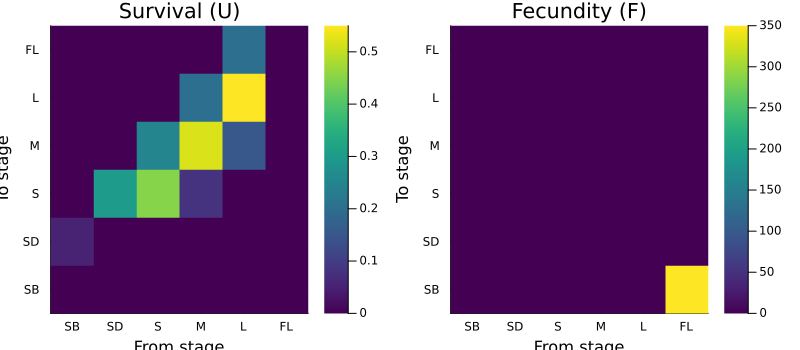
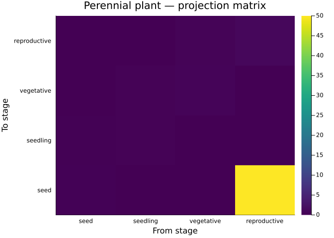

# Valued Projection Nets
Simon Frost

## Overview

A `LabelledProjectionNet` captures the **topology** of a population
model — which demographic processes connect which state variables — but
carries no numeric data. A `ValuedProjectionNet` extends this by
associating **sparse numeric entries** with each transition, following
the pattern of AlgebraicPetri.jl’s `LabelledReactionNet` (which bundles
structure with reaction rates).

This vignette shows how to construct valued projection nets from sparse
transition specifications, materialize them to matrices, and lower them
to concrete `MatrixProjectionModel` objects for analysis.

## Setup

``` julia
using CategoricalProjectionModels
import MatrixProjectionModels
using Catlab
using Catlab.CategoricalAlgebra
using LinearAlgebra
using ProjectionModels: lambda
using Plots

const MPM = MatrixProjectionModels
```

    Precompiling packages...
       2941.0 ms  ✓ ArrayInterface
        663.8 ms  ✓ ArrayInterface → ArrayInterfaceStaticArraysCoreExt
        833.8 ms  ✓ ArrayInterface → ArrayInterfaceGPUArraysCoreExt
        899.9 ms  ✓ ArrayInterface → ArrayInterfaceSparseArraysExt
       1056.7 ms  ✓ PreallocationTools
       1307.6 ms  ✓ SciMLStructures
       2079.1 ms  ✓ SciMLOperators
       1774.7 ms  ✓ SymbolicIndexingInterface
        698.7 ms  ✓ SciMLOperators → SciMLOperatorsStaticArraysCoreExt
        861.3 ms  ✓ SciMLOperators → SciMLOperatorsSparseArraysExt
       4909.2 ms  ✓ Plots → FileIOExt
       3337.3 ms  ✓ RecursiveArrayTools
       1117.0 ms  ✓ RecursiveArrayTools → RecursiveArrayToolsSparseArraysExt
       1186.9 ms  ✓ RecursiveArrayTools → RecursiveArrayToolsStatisticsExt
       9285.2 ms  ✓ SciMLBase
       3210.2 ms  ✓ SciMLBase → SciMLBaseDistributionsExt
       3497.3 ms  ✓ MatrixProjectionModels
      17 dependencies successfully precompiled in 35 seconds. 239 already precompiled.
    Precompiling packages...
        701.5 ms  ✓ SymbolicIndexingInterface → SymbolicIndexingInterfacePrettyTablesExt
      1 dependency successfully precompiled in 2 seconds. 40 already precompiled.
    Precompiling packages...
        538.6 ms  ✓ RecursiveArrayTools → RecursiveArrayToolsTablesExt
      1 dependency successfully precompiled in 1 seconds. 36 already precompiled.
    Precompiling packages...
       1118.6 ms  ✓ SciMLBase → SciMLBaseMLStyleExt
      1 dependency successfully precompiled in 2 seconds. 58 already precompiled.
    Precompiling packages...
       2760.6 ms  ✓ IntegralProjectionModels
       5905.0 ms  ✓ IntegralProjectionModels → IntegralProjectionModelsCatlabExt
       3794.1 ms  ✓ CategoricalProjectionModels → CategoricalProjectionModelsIPMExt
       3800.8 ms  ✓ CategoricalProjectionModels → CategoricalProjectionModelsMPMExt
      4 dependencies successfully precompiled in 21 seconds. 292 already precompiled.

    MatrixProjectionModels

## Motivation: From Life Cycle Graphs to Models

Ecologists describe population dynamics as **life cycle graphs** —
directed graphs where nodes are stages and edges are demographic
transitions with associated rates or probabilities. A valued projection
net captures exactly this information:

- **Stage names**: the nodes (e.g., seed, seedling, adult)
- **Transitions**: named demographic processes (e.g., survival,
  fecundity)
- **Sparse entries**: the nonzero `(from => to) => value` entries for
  each transition

This is more structured than a raw matrix: transitions are named and
grouped, so you can extract or modify individual processes.

## Constructing a ValuedProjectionNet

### Pitcher’s Thistle

The pitcher’s thistle (*Cirsium pitcheri*) model from COMPADRE has 6
stages and two demographic processes — survival/growth and fecundity.

``` julia
thistle = ValuedProjectionNet(
    [:seed_bank, :seedling, :small, :medium, :large, :flowering],
    :survival => [
        (:seed_bank => :seedling)  => 0.05,
        (:seedling  => :small)     => 0.30,
        (:small     => :small)     => 0.45,
        (:small     => :medium)    => 0.25,
        (:medium    => :small)     => 0.08,   # retrogression
        (:medium    => :medium)    => 0.52,
        (:medium    => :large)     => 0.20,
        (:large     => :medium)    => 0.15,   # retrogression
        (:large     => :large)     => 0.55,
        (:large     => :flowering) => 0.20],
    :fecundity => [
        (:flowering => :seed_bank) => 350.0])
```

    ValuedProjectionNet{Float64}(CategoricalProjectionModels.LabelledProjectionNet:
      S = 1:1
      T = 1:2
      Src = 1:2
      Tgt = 1:2
      Name = 1:0
      src_t : Src → T = [1, 2]
      src_s : Src → S = [1, 1]
      tgt_t : Tgt → T = [1, 2]
      tgt_s : Tgt → S = [1, 1]
      sname : S → Name = [:stage]
      tname : T → Name = [:survival, :fecundity], [:seed_bank, :seedling, :small, :medium, :large, :flowering], Dict(:survival => [(:seed_bank => :seedling) => 0.05, (:seedling => :small) => 0.3, (:small => :small) => 0.45, (:small => :medium) => 0.25, (:medium => :small) => 0.08, (:medium => :medium) => 0.52, (:medium => :large) => 0.2, (:large => :medium) => 0.15, (:large => :large) => 0.55, (:large => :flowering) => 0.2], :fecundity => [(:flowering => :seed_bank) => 350.0]))

### Inspecting the Net

``` julia
println("Stage names:      ", stage_names(thistle))
println("Transition names: ", transition_names(thistle))
println("Underlying net:   ", n_states(thistle.net), " state(s), ",
    n_transitions(thistle.net), " transition(s)")
```

    Stage names:      [:seed_bank, :seedling, :small, :medium, :large, :flowering]
    Transition names: [:survival, :fecundity]
    Underlying net:   1 state(s), 2 transition(s)

The underlying `LabelledProjectionNet` has a single abstract state
`:stage` (all stages are bins within one state dimension) and two
transitions. The `ValuedProjectionNet` adds the stage names and sparse
numeric data on top.

## Materializing Matrices

### Individual Transition Matrices

Each named transition can be materialized to a dense matrix
independently:

``` julia
U = transition_matrix(thistle, :survival)
F = transition_matrix(thistle, :fecundity)

p1 = heatmap(["SB","SD","S","M","L","FL"], ["SB","SD","S","M","L","FL"],
    U, title="Survival (U)", color=:viridis,
    xlabel="From stage", ylabel="To stage")

p2 = heatmap(["SB","SD","S","M","L","FL"], ["SB","SD","S","M","L","FL"],
    F, title="Fecundity (F)", color=:viridis,
    xlabel="From stage", ylabel="To stage")

plot(p1, p2, layout=(1,2), size=(800, 350))
```



### Full Projection Matrix

The `to_matrix` function additively sums all transition matrices to
produce the full projection matrix $\mathbf{A}$:

``` julia
A = to_matrix(thistle)
println("A = U + F: ", A ≈ U + F)
println("λ = ", round(lambda(A), digits=4))
```

    A = U + F: true
    λ = 0.9476

## Lowering to MatrixProjectionModel

The `lower` function converts a `ValuedProjectionNet` to a concrete
`MatrixProjectionModel` from MatrixProjectionModels.jl:

``` julia
mpm = lower(thistle, MPMTarget())
println("Type:        ", typeof(mpm))
println("Stages:      ", mpm.stage_names)
println("λ:           ", round(MPM.lambda(mpm), digits=4))
```

    Type:        MatrixProjectionModels.MatrixProjectionModel{Float64, Matrix{Float64}}
    Stages:      [:seed_bank, :seedling, :small, :medium, :large, :flowering]
    λ:           0.9476

The lowered MPM is a standard `MatrixProjectionModel` — all analysis
functions from MatrixProjectionModels.jl work directly:

``` julia
println("Damping ratio:  ", round(MPM.damping_ratio(Matrix(mpm)), digits=4))
U = transition_matrix(thistle, :survival)
F = transition_matrix(thistle, :fecundity)
println("Net repro rate: ", round(MPM.net_repro_rate(U, F), digits=2))
println("Generation time: ", round(MPM.gen_time(U, F), digits=2))
```

    Damping ratio:  1.2721
    Net repro rate: 0.0
    Generation time: Inf

Note that the U/F decomposition is not preserved through lowering (the
lowered MPM sets U=A), so we extract the survival and fecundity matrices
from the `ValuedProjectionNet` directly.

## Example: Loggerhead Sea Turtle

The loggerhead sea turtle model (Crouse, Crowder & Caswell 1987)
demonstrates how a more detailed transition decomposition can separate
stasis from progression:

``` julia
turtle = ValuedProjectionNet(
    [:egg_hatch, :sm_juv, :lg_juv, :subadult, :adult],
    :stasis => [
        (:sm_juv   => :sm_juv)   => 0.7370,
        (:lg_juv   => :lg_juv)   => 0.6610,
        (:subadult => :subadult) => 0.6907,
        (:adult    => :adult)    => 0.8091],
    :progression => [
        (:egg_hatch => :sm_juv)   => 0.6747,
        (:sm_juv    => :lg_juv)   => 0.0486,
        (:lg_juv    => :subadult) => 0.0147,
        (:subadult  => :adult)    => 0.0518],
    :reproduction => [
        (:adult => :egg_hatch) => 127.0])
```

    ValuedProjectionNet{Float64}(CategoricalProjectionModels.LabelledProjectionNet:
      S = 1:1
      T = 1:3
      Src = 1:3
      Tgt = 1:3
      Name = 1:0
      src_t : Src → T = [1, 2, 3]
      src_s : Src → S = [1, 1, 1]
      tgt_t : Tgt → T = [1, 2, 3]
      tgt_s : Tgt → S = [1, 1, 1]
      sname : S → Name = [:stage]
      tname : T → Name = [:stasis, :progression, :reproduction], [:egg_hatch, :sm_juv, :lg_juv, :subadult, :adult], Dict(:progression => [(:egg_hatch => :sm_juv) => 0.6747, (:sm_juv => :lg_juv) => 0.0486, (:lg_juv => :subadult) => 0.0147, (:subadult => :adult) => 0.0518], :stasis => [(:sm_juv => :sm_juv) => 0.737, (:lg_juv => :lg_juv) => 0.661, (:subadult => :subadult) => 0.6907, (:adult => :adult) => 0.8091], :reproduction => [(:adult => :egg_hatch) => 127.0]))

With three named transitions, we can examine each process separately:

``` julia
println("Stasis matrix:")
display(transition_matrix(turtle, :stasis))
println()
println("Progression matrix:")
display(transition_matrix(turtle, :progression))
println()
println("Reproduction matrix:")
display(transition_matrix(turtle, :reproduction))
```

    Stasis matrix:

    Progression matrix:

    Reproduction matrix:

    5×5 Matrix{Float64}:
     0.0  0.0    0.0    0.0     0.0
     0.0  0.737  0.0    0.0     0.0
     0.0  0.0    0.661  0.0     0.0
     0.0  0.0    0.0    0.6907  0.0
     0.0  0.0    0.0    0.0     0.8091

    5×5 Matrix{Float64}:
     0.0     0.0     0.0     0.0     0.0
     0.6747  0.0     0.0     0.0     0.0
     0.0     0.0486  0.0     0.0     0.0
     0.0     0.0     0.0147  0.0     0.0
     0.0     0.0     0.0     0.0518  0.0

    5×5 Matrix{Float64}:
     0.0  0.0  0.0  0.0  127.0
     0.0  0.0  0.0  0.0    0.0
     0.0  0.0  0.0  0.0    0.0
     0.0  0.0  0.0  0.0    0.0
     0.0  0.0  0.0  0.0    0.0

``` julia
A_turtle = to_matrix(turtle)
println("λ = ", round(lambda(A_turtle), digits=4))
```

    λ = 0.9706

### Elasticity by Process

Because transitions are named, we can compute the elasticity
contribution of each process:

``` julia
mpm_turtle = lower(turtle, MPMTarget())
E = MPM.elasticity(Matrix(mpm_turtle))

# Sum elasticity entries corresponding to each transition
stage_idx = Dict(s => i for (i, s) in enumerate(stage_names(turtle)))
process_elasticity = Dict{Symbol, Float64}()

for tname in transition_names(turtle)
    entries = turtle.transition_values[tname]
    e_sum = 0.0
    for ((from, to), _) in entries
        e_sum += E[stage_idx[to], stage_idx[from]]
    end
    process_elasticity[tname] = e_sum
end

for (proc, e) in sort(Base.collect(process_elasticity), by=last, rev=true)
    println("  ", rpad(proc, 15), round(e, digits=4))
end
```

      stasis         0.7186
      progression    0.2251
      reproduction   0.0563

## Comparison with LabelledProjectionNet + Dict

The `lower` function also accepts a `LabelledProjectionNet` with sparse
transition data passed as a `Dict`. This is useful when you already have
a categorical net from a composition workflow:

``` julia
net = LabelledProjectionNet([:stage],
    :survival => (:stage => :stage),
    :fecundity => (:stage => :stage))

transition_data = Dict(
    :survival => [
        (:seed_bank => :seedling)  => 0.05,
        (:seedling  => :small)     => 0.30,
        (:small     => :small)     => 0.45,
        (:small     => :medium)    => 0.25,
        (:medium    => :small)     => 0.08,
        (:medium    => :medium)    => 0.52,
        (:medium    => :large)     => 0.20,
        (:large     => :medium)    => 0.15,
        (:large     => :large)     => 0.55,
        (:large     => :flowering) => 0.20],
    :fecundity => [
        (:flowering => :seed_bank) => 350.0])

stage_list = [:seed_bank, :seedling, :small, :medium, :large, :flowering]

mpm_from_net = lower(net, MPMTarget(), transition_data, stage_list)
println("λ from net + data: ", round(MPM.lambda(mpm_from_net), digits=4))
println("Matches VNet:      ", mpm_from_net.A ≈ mpm.A)
```

    λ from net + data: 0.9476
    Matches VNet:      true

## Workflow: Categorical Specification to Population Analysis

Here is a complete workflow combining valued nets with
MatrixProjectionModels analysis:

``` julia
# 1. SPECIFY — define the model as a valued projection net
plant = ValuedProjectionNet(
    [:seed, :seedling, :vegetative, :reproductive],
    :establishment => [
        (:seed     => :seedling) => 0.10],
    :growth => [
        (:seedling    => :vegetative)    => 0.25,
        (:vegetative  => :reproductive)  => 0.40],
    :stasis => [
        (:seedling    => :seedling)      => 0.30,
        (:vegetative  => :vegetative)    => 0.50,
        (:reproductive => :reproductive) => 0.85],
    :seed_production => [
        (:reproductive => :seed) => 50.0],
    :seed_bank => [
        (:seed => :seed) => 0.20])

# 2. MATERIALIZE — convert to matrix
A_plant = to_matrix(plant)

# 3. LOWER — create MPM for full analysis
mpm_plant = lower(plant, MPMTarget())

# 4. ANALYSE
println("=== Perennial Plant Model ===")
println("Stages: ", stage_names(plant))
println("Transitions: ", transition_names(plant))
println("λ = ", round(MPM.lambda(mpm_plant), digits=4))
println("Population ", MPM.lambda(mpm_plant) > 1 ? "GROWING" : "DECLINING")
println()

# Build U from survival-related transitions for life history analysis
U_plant = transition_matrix(plant, :establishment) +
          transition_matrix(plant, :growth) +
          transition_matrix(plant, :stasis) +
          transition_matrix(plant, :seed_bank)
println("Life expectancy (reproductive): ",
    round(MPM.life_expect_mean(U_plant)[end], digits=2), " years")

# 5. VISUALIZE
heatmap(String.(stage_names(plant)), String.(stage_names(plant)),
    A_plant, title="Perennial plant — projection matrix",
    color=:viridis, xlabel="From stage", ylabel="To stage")
```

    === Perennial Plant Model ===
    Stages: [:seed, :seedling, :vegetative, :reproductive]
    Transitions: [:growth, :seed_bank, :establishment, :stasis, :seed_production]
    λ = 1.3448
    Population GROWING

    Life expectancy (reproductive): 1.25 years



## Summary

Valued projection nets extend the categorical framework with sparse
numeric data:

1.  **`ValuedProjectionNet`** — bundles a `LabelledProjectionNet` with
    stage names and sparse `(from => to) => value` entries per named
    transition
2.  **`transition_matrix(vnet, name)`** — materializes a single
    transition to a dense matrix
3.  **`to_matrix(vnet)`** — sums all transitions into the full
    projection matrix $\mathbf{A}$
4.  **`lower(vnet, MPMTarget())`** — converts to a
    `MatrixProjectionModel` for downstream analysis
5.  **Named transitions** — enable process-level decomposition (stasis
    vs progression vs reproduction) while maintaining full compatibility
    with matrix-based analyses

The key insight is that valued nets occupy a middle ground between raw
matrices and fully categorical specifications: they carry enough
structure to track individual demographic processes, while remaining
easy to construct from the sparse transition data that ecologists work
with.
